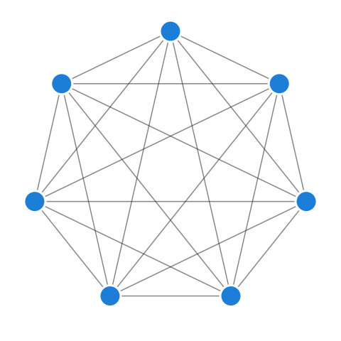

〔本篇辑录现代软件工程与计算机科学中最著名的48条核心定律、效应与理论模型，涵盖系统架构、工程管理、性能并发与认知工程。〕

# 1、 90-9-1 法则 (90–9–1 Principle or 1% Rule)

〔90-9-1法则指出：在诸如维基百科、开源社区与社交网络中，90%的用户只消费内容，9%的用户会参与互动与编辑，仅有1%的用户会主动创造核心内容。〕

[1% Rule on Wikipedia](https://en.wikipedia.org/wiki/1%25_rule_(Internet_culture))

The 90-9-1 principle suggests that within an internet community such as a wiki, 90% of participants only consume content, 9% edit or modify content and 1% of participants add content.

Real-world examples:

- A 2014 study of four digital health social networks found the top 1% created 73% of posts, the next 9% accounted for an average of ~25% and the remaining 90% accounted for an average of 2% ([Reference](https://www.jmir.org/2014/2/e33/))

See Also:

- [Pareto principle](#the-pareto-principle-the-8020-rule)

> 本条目为《黑客定律与工程哲学》（hacker-laws）最新收录的重要前沿定律与工程哲学原则。涵盖现代复杂系统架构、团队认知边界与软件可靠性实践。

---

# 2、 九九定律 (90–90 Rule)

〔九九定律指出：前90%的代码消耗了前90%的开发时间；剩下10%的代码则消耗了另外90%的开发时间。它以幽默而深刻的方式指出了软件工程最后收尾阶段的巨大不确定性。〕

[90-90 Rule on Wikipedia](https://en.wikipedia.org/wiki/Ninety%E2%80%93ninety_rule)

> The first 90 percent of the code accounts for the first 90 percent of the development time. The remaining 10 percent of the code accounts for the other 90 percent of the development time.

A wry reinterpretation of the [Pareto Principle (or 80-20 rule)](#the-pareto-principle-the-8020-rule) that highlights the real-world challenges of completing engineering work. This sentiment is also echoed in [Hofstadter's Law](#hofstadters-law).

See also:

- [Hofstadter's Law](#hofstadters-law)
- [The Pareto Principle](#the-pareto-principle-the-8020-rule)

> 本条目为《黑客定律与工程哲学》（hacker-laws）最新收录的重要前沿定律与工程哲学原则。涵盖现代复杂系统架构、团队认知边界与软件可靠性实践。

---

# 3、 阿姆达尔定律 (Amdahl's Law)

〔阿姆达尔定律指出：系统通过增加计算资源所获得的加速比，严格受限于程序中无法并行化的串行部分比例。〕

- [英文维基百科](https://en.wikipedia.org/wiki/Amdahl%27s_law)
- [中文维基百科](https://zh.wikipedia.org/wiki/%E9%98%BF%E5%A7%86%E8%BE%BE%E5%B0%94%E5%AE%9A%E5%BE%8B)

> 阿姆达尔定律显示了计算任务通过增加系统资源可以获得的**加速潜力**。该公式通常用于并行计算中。它可以预测增加处理器数量的实际收益，该收益受到程序可并行比例的限制。

举例说明：如果程序由 A、B 两个部分组成，A 部分必须由单个处理器执行，B 部分可以并行运行。那么向执行程序的系统添加多个处理器只能获得有限的好处。它可以极大地提升 B 部分的运行速度，但 A 部分的运行速度将保持不变。

下图展示了一些运行速度的提升潜能的例子：

_(图片来源：By Daniels220 at English Wikipedia, Creative Commons Attribution-Share Alike 3.0 Unported, https://en.wikipedia.org/wiki/File:AmdahlsLaw.svg)_

可以看出，50％ 并行化的程序在使用大于 10 个处理单元之后的速度提升收效甚微，而 95％ 并行化的程序在使用超过一千个处理单元之后仍然可以显著提升速度。

随着[摩尔定律](#%E6%91%A9%E5%B0%94%E5%AE%9A%E5%BE%8B-moores-law)减慢，单个处理器的速度增加缓慢，并行化是提高性能的关键。图形编程是一个极好的例子，现代着色器可以并行渲染单个像素或片段。这也是现代显卡通常具有数千个处理核心（GPU 或着色器单元）的原因。

参见：

- [布鲁克斯法则](#%E5%B8%83%E9%B2%81%E5%85%8B%E6%96%AF%E6%B3%95%E5%88%99-brookss-law)
- [摩尔定律](#%E6%91%A9%E5%B0%94%E5%AE%9A%E5%BE%8B-moores-law)

---

# 4、 破窗理论 / 破窗效应 (The Broken Windows Theory)

〔破窗理论表明：环境中微小未被修复的破损（如脏代码或未修复的Bug）会向团队传递放任信号，迅速引发蔓延性的质量劣变与技术债务失控。〕

- [英文维基百科](https://en.wikipedia.org/wiki/Broken_windows_theory)
- [中文维基百科](https://zh.wikipedia.org/wiki/%E7%A0%B4%E7%AA%97%E6%95%88%E5%BA%94)

在破窗理论中认为，一些明显的犯罪迹象(或缺乏环保意识)会导致进一步的、更严重的犯罪(或环境的进一步恶化)。

破窗理论已应用于软件开发中，它表明劣质代码(或 [Technical Debt](#TODO))可能会影响后续优化的效率，从而进一步造成代码劣化；随着时间的推移，这种效应将会导致代码质量大幅下降。

参见：

- [Technical Debt](#TODO)

例子：

- [《程序员修炼之道：软件熵》(The Pragmatic Programming: Software Entropy)](https://pragprog.com/the-pragmatic-programmer/extracts/software-entropy)
- [《Coding Horror：破窗效应》(Coding Horror: The Broken Window Theory)](https://blog.codinghorror.com/the-broken-window-theory/)
- [《开源：编程之乐 - 破窗效应》(OpenSource: Joy of Programming - The Broken Window Theory)](https://opensourceforu.com/2011/05/joy-of-programming-broken-window-theory/)

---

# 5、 布鲁克斯法则 (Brooks' Law)

〔布鲁克斯法则断言：向一个已经延期的软件项目增加人手，只会让项目延期更加严重。沟通开销随人员数量呈二次方剧增。〕

- [英文维基百科](https://en.m.wikipedia.org/wiki/Brooks%27s_law)

> 软件开发后期，添加人力只会使项目开发得更慢。

这个定律表明，在许多情况下，试图通过增加人力来加速已延期项目的交付，将会使项目交付得更晚。布鲁克斯也明白，这是一种过度简化。但一般的论据是，新资源的时间增加和通信开销，会在短期内使开发速度减慢。而且，许多任务是密不可分的，换句话说，这样可以使更多的资源之间能轻易分配，这也意味着潜在的速度增长也更低。

谚语 **九个女人不能在一个月内生一个孩子** 与布鲁克斯法则同出一辙，特别是某些不可分割或者并行的工作。

这是[《人月神话》](#%E9%98%85%E8%AF%BB%E6%B8%85%E5%8D%95)的中心主题。

参见：

- [Death March](#todo)
- [阅读清单：《人月神话》](#%E9%98%85%E8%AF%BB%E6%B8%85%E5%8D%95)

---

# 6、 CAP 定理 / 布鲁尔定理 (CAP Theorem)

〔CAP定理断言：在分布式网络必然存在网络分区（P）的前提下，任何分布式计算系统都不可能同时保证一致性（C）与可用性（A），必须在二者之间做出权衡。〕

- [英文维基百科](https://en.wikipedia.org/wiki/CAP_theorem)
- [中文维基百科](https://zh.wikipedia.org/wiki/CAP%E5%AE%9A%E7%90%86)

CAP 定理由 Eric Brewer 所定义，它指出对于分布式数据存储来说，不可能同时满足以下三点：

- 一致性 (Consistency)：在读取数据时，每个请求都会接收到 _最新的_ 数据，或者返回错误。
- 可用性 (Availability): 在读取数据时，每个请求都会接收到一个 _非错误的响应_，但不能保证该数据是 _最新的_ 数据。
- 分区容错性 (Partition Tolerance)：当节点之间任意数量的网络请求失败时，系统能按预期继续运行。

核心论证如下：因为无法保证不会存在网络分区（参见[分布式计算的谬论 (The Fallacies of Distributed Computing)](#分布式计算的谬论-the-fallacies-of-distributed-computing)），所以在分区的情况下，我们可以选择取消当前操作（增加一致性并降低可用性），或者选择继续进行该操作（增加可用性降低一致性）。

该定理的名字来源于一致性 (Consistency)、可用性 (Availability)、分区容错性 (Partition Tolerance) 的首字母。请注意，这与 [_ACID_](#TODO) 没有任何关系，因为其对一致性有另一种定义。最近发展出来的 [PACELC](#TODO) 定理与 CAP 定理相比，增加了对网络 _未_ 分区时（即系统按预期操作时）的延迟和一致性的约束。

大多数的现代数据库平台会通过向数据库用户提供选项的方式，来选择是需要高度可用的操作（比如“脏读 (dirty read)”），还是高度一致的操作(比如“法定确认写写入 (quorum acknowledged write)”)——这间接地承认了这一定理。

现实世界的例子：

- [Inside Google Cloud Spanner and the CAP Theorem](https://cloud.google.com/blog/products/gcp/inside-cloud-spanner-and-the-cap-theorem) - 该文详细介绍了 Cloud Spanner 是如何工作的，表面上该平台似乎能够保证 CAP 三者，但实际上依然是一个 CP 系统，即只有一致性和分区容错性。

参见：

- [ACID](#TODO)
- [分布式计算的谬论 (The Fallacies of Distributed Computing)](#分布式计算的谬论-the-fallacies-of-distributed-computing)
- [PACELC](#TODO)

---

# 7、 克拉克三大定律 (Clarke's Three Laws)

〔克拉克第三定律指出：任何足够先进的科技，都与魔法无异。在软件中，极度成熟的封装与抽象往往给使用者呈现出黑盒般的神秘体验。〕

[Clarke's three laws on Wikipedia](https://en.wikipedia.org/wiki/Clarke's_three_laws)

Arthur C. Clarke, an british science fiction writer, formulated three adages that are known as Clarke's three laws. The third law is the best known and most widely cited.  

These so-called laws are:

- When a distinguished but elderly scientist states that something is possible, they are almost certainly right. When they state that something is impossible, they are very probably wrong.
- The only way of discovering the limits of the possible is to venture a little way past them into the impossible.
- Any sufficiently advanced technology is indistinguishable from magic.

> 本条目为《黑客定律与工程哲学》（hacker-laws）最新收录的重要前沿定律与工程哲学原则。涵盖现代复杂系统架构、团队认知边界与软件可靠性实践。

---

# 8、 康威定律 (Conway's Law)

〔康威定律指出：任何设计系统的组织，其所交付的设计方案在结构上都将不可避免地映射出该组织的沟通结构。〕

- [英文维基百科](https://en.wikipedia.org/wiki/Conway%27s_law)
- [中文维基百科](https://zh.wikipedia.org/wiki/%E5%BA%B7%E5%A8%81%E5%AE%9A%E5%BE%8B)

这个定律说明了系统的技术边界可以反应一个组织的结构，它通常会在改进组织时被提及。康威定律表明，如果一个组织被分散成许多小而无联系的单元，那么它开发的软件也是小而分散的。如果组织是更多地围绕以功能或服务为导向的**垂直**结构，那么软件系统也会反映这一点。

参见：

- [The Spotify Model](#spotify-%E6%A8%A1%E5%9E%8B-the-spotify-model)

---

# 9、 坎宁汉姆定律 (Cunningham's Law)

〔坎宁汉姆定律断言：在互联网上获得正确答案的最佳方法不是提出问题，而是发布一个错误的答案。人们纠正错误的动力远大于回答提问。〕

- [英文维基百科](https://en.wikipedia.org/wiki/Ward_Cunningham#Cunningham's_Law)

> 在网络上想得到正确答案的最好方法不是提问题，而是发布一个错误的答案。

据史蒂芬·麦克基迪说，沃德·坎宁汉姆早在 20 世纪 80 年代早期的时候建议他，在互联网上获得正确答案的最好方法不是提问题，而是发布一个错误的答案。麦克基迪称这为坎宁汉姆定律，而坎宁汉姆不以为然，并觉得这是“错误的引用”。最初这条定律只是用于描述 Usenet 上的社交行为，但后来也渐渐用于其他的在线社区（如 Wikipedia、Reddit、Twitter、Facebook 等）。

参见：

- [XKCD 386: "Duty Calls"](https://xkcd.com/386/)

---

# 10、 邓巴数 (Dunbar's Number)

〔邓巴数提出：受限于人类大脑新皮质的认知处理能力，一个人能够维持稳定紧密社交关系的上限约为150人。当工程组织超过此规模时必须进行官僚化或分治解耦。〕

- [英文维基百科](https://en.wikipedia.org/wiki/Dunbar%27s_number)

邓巴数字是对一个人能够保持稳定社会关系的人数的认知极限——在这种关系中，一个人知道每个人是谁，也知道每个人与其他人的关系如何。而对这一数字的确切值则有着一些不同意见。邓巴指出，人仅能轻松地维持 150 个稳定的关系。这样的关系在一个更社会化的背景中，便是当你碰巧在酒吧里碰到这些人时候，你不会因为加入他们而感到尴尬。邓巴数字的估计值一般在 100 至 250 之间。

和人与人之间稳定的关系一样，开发人员与代码库的关系也需要努力维护。当面对大型、复杂的项目，或许多项目的归属权时，我们会依赖于约定、策略和建模过程来进行扩展。邓巴数字不仅在办公室规模的扩大的过程中举足轻重，而且在设置团队工作范围，或决定系统何时应该注重于辅助建模和组织管理开销自动化的工具时，也是非常重要的。将邓巴数字放入工程内容中进行类比，那就是您能加入并有信心随叫随到进行轮换的项目数(亦或是单个项目的规范化复杂性)。

参见：

- [康威定律](#%e5%ba%b7%e5%a8%81%e5%ae%9a%e5%be%8b-conways-law)

---

# 11、 邓宁-克鲁格效应 / 达克效应 (The Dunning-Kruger Effect)

〔邓宁-克鲁格效应指出：能力欠缺的人往往无法客观评估自身的无能，导致盲目自大；而真正精通的人则倾向于低估自己的能力。〕

- [英文维基百科](https://en.wikipedia.org/wiki/Dunning%E2%80%93Kruger_effect)
- [中文维基百科](https://zh.wikipedia.org/wiki/%E9%84%A7%E5%AF%A7-%E5%85%8B%E9%AD%AF%E6%A0%BC%E6%95%88%E6%87%89)

> 无能的人往往不会意识到自己的无能。而得出正确答案所需要的技能，正是你认识到何为正确答案所需要的技能。
>
> ([大卫·邓宁 (David Dunning)](https://en.wikipedia.org/wiki/David_Dunning))

邓宁-克鲁格效应是一种理论上的认知偏差，大卫·邓宁和贾斯汀·克鲁格在 1999 年的一项心理学研究和论文中对此进行了描述。研究表明，在一项任务中能力水平较低的人会更容易高估自己的能力。之所以会产生这种偏向，是因为一个人对问题或领域的复杂性有足够的*认识*时，才能够针对自己在该领域的工作能力提出明智的意见。

邓宁-克鲁格效应也有另一个类似的，更显式的描述，即“一个人对某个领域的了解越少，他就越容易轻视这个领域的难度，从而更倾向于相信自己可以轻易地解决该领域的问题”。该效应与技术高度相关，具体表现为不太熟悉某个领域的个人(如非技术团队成员或经验较少的团队成员)会更有可能低估解决该领域问题所需的工作量。

随着对某一领域的理解和经验的增长，人们很可能会遇到另一种效应-[虚幻的优越性 (Illusory superiority)](https://en.wikipedia.org/wiki/Illusory_superiority)，即特定领域内的丰富经验使得他们更容易高估他人的能力，或低估自己的能力。总而言之，这些影响都归咎于认知偏差。当意识到偏差存在时，我们可以尽量提出意见来消除这些偏差，这样往往可以避免异议。

真实案例:

* [苹果公司 vs 联邦调查局：为什么这个反恐鹰派改变了立场 (Apple vs. FBI: Why This Anti-Terror Hawk Switched Sides)](https://fortune.com/2016/03/10/apple-fbi-lindsay-graham/) - 2016 年，参议员林赛·格雷厄姆改变了他对苹果在设备加密中创建“后门”的立场。起初，格雷厄姆曾批评苹果公司反对创建“后门”，因为他认为这对调查潜在的恐怖计划是必要的。然而，随着他对这个领域的技术复杂性有了更多的了解，格雷厄姆意识到这比他原先想的要困难很多，并可能会产生严重的负面后果。这便是邓宁-克鲁格效应的真实案例--网络安全专家会更清楚如何利用这样的后门，因为他们对该领域有深刻的理解；而外行人士可能会简单地将设备安全类比于物理上的安全，执法时可以使用“万能钥匙”，但这显然与网络安全中的现代加密不可同日而语。

---

# 12、 费茨法则 (Fitts' Law)

〔费茨法则建立了到达目标所需时间的数学模型：移动到目标的时间由到目标的距离和目标的尺寸共同决定。目标越大、距离越近，操作耗时越短。〕

- [英文维基百科](https://en.wikipedia.org/wiki/Fitts%27s_law)
- [中文维基百科](https://zh.wikipedia.org/wiki/%E8%B4%B9%E8%8C%A8%E6%B3%95%E5%88%99)

该法则指出，移动到目标区域所需的时间是到目标的距离除以目标宽度的函数。

*(图片来源：By Foobar628 at English Wikipedia, Creative Commons Attribution-Share Alike 3.0 Unported, https://en.wikipedia.org/wiki/Fitts%27s_law#/media/File:Fitts_Law.svg)*

费茨法则决定了在设计 UX 或 UI 时，交互元素应该尽可能大，而用户注意力区域和交互元素之间的距离应该尽可能小。这会对设计产生影响，例如将相近的任务进行归类分组等。

同时它还将“魔角 (Magic Corners)”这一概念正式化，即在角落放置关键的 UI 元素，从而使得用户可以通过移动鼠标轻松点击到。Windows 的开始按钮便位于魔角处便于选择，而有趣的是 MacOS 恰恰相反，它的“关闭窗口”按钮 _不处于_ 魔角处，从而能有效减小被误点击的概率。

参见：

- [The information capacity of the human motor system in controlling the amplitude of movement.](https://www.semanticscholar.org/paper/The-information-capacity-of-the-human-motor-system-Fitts/634c9fde5f1c411e4487658ac738dcf18d98ea8d)

---

# 13、 盖尔定律 (Gall's Law)

〔盖尔定律断言：一个能正常工作的复杂系统，必定是从一个能正常工作的简单系统演化而来的。从零开始全新设计的复杂系统绝不可能正常工作。〕

- [英文维基百科](<https://en.wikipedia.org/wiki/John_Gall_(author)#Gall's_law>)

> 一个切实可行的复杂系统势必是从一个切实可行的简单系统发展而来的。从头开始设计的复杂系统根本不切实可行，无法修修补补让它切实可行。你必须由一个切实可行的简单系统重新开始。
>
> [约翰·盖尔](<https://en.wikipedia.org/wiki/John_Gall_(author)>) (John Gall)

盖尔定律说明了设计高度复杂的系统很可能会失败。它们很难一蹴而就，更多是从简单的系统逐渐演变而来。

最典型的例子便是互联网。如今的互联网是一个高度复杂的系统，而它最早只是被定义为一种在学术机构之间共享内容的方式。互联网成功实现了最初的目标，并且随着时间不断演化，最终成就了如今的复杂繁荣。

参见：

- [KISS 原则 (保持简单和直白)](#kiss-%e5%8e%9f%e5%88%99-the-kiss-principle)

---

# 14、 古德哈特定律 (Goodhart's Law)

〔古德哈特定律指出：当一个指标变成目标时，它就不再是一个好的指标。人们会操纵指标本身而背离最初的业务初衷。〕

- [英文维基百科](https://en.wikipedia.org/wiki/Goodhart's_law)
- [中文维基百科](https://zh.wikipedia.org/wiki/%E5%8F%A4%E5%BE%B7%E5%93%88%E7%89%B9%E5%AE%9A%E5%BE%8B)

> 当压力施于其上以进行控制时，任何观测到的统计恒性都倾向消散。
>
> _查尔斯·古德哈特 (Charles Goodhart)_

另见：

> 当一个措施本身成为目标时，它就不再是一个好的措施。
>
> _玛丽莲·斯特拉腾 (Marilyn Strathern)_

根据这一定律，由测量驱动的优化反而可能导致测量结果本身的说服力下降。盲目使用一些过度严格筛选的方法 ([KPIs](https://zh.wikipedia.org/wiki/%E9%97%9C%E9%8D%B5%E7%B8%BE%E6%95%88%E6%8C%87%E6%A8%99)) 可能会产生一些不良的影响。人们会倾向于用“钻空子”的行为去做局部优化，从而满足一些特定的度量标准，而不会在意整体的结果。

现实中的例子：

- Assert-free 测试可以达到代码覆盖率的预期，但度量的目的应该是创造经过良好测试的软件。
- 由 commits 的行数来评价开发人员的表现，从而导致了不合理的代码库扩增。

参见

- [古德哈特定律：错误的测量如何导致不道德的行为](https://coffeeandjunk.com/goodharts-campbells-law/)
- [呆伯特与无 bug 软件](https://dilbert.com/strip/1995-11-13)

---

# 15、 汉隆剃刀 (Hanlon's Razor)

〔汉隆剃刀断言：能够用愚蠢或疏忽充分解释的行为，永远不要归咎于恶意。在系统故障或排查协作中保持善意假设能极大降低内耗。〕

- [英文维基百科](https://en.wikipedia.org/wiki/Hanlon%27s_razor)
- [中文维基百科](https://zh.wikipedia.org/wiki/%E6%B1%89%E9%9A%86%E7%9A%84%E5%89%83%E5%88%80)

> 能解释为愚蠢的，就不要解释为恶意的。
>
> _罗伯特·汉隆 (Robert J. Hanlon)_

这一原则表明，一个行为所产生的消极结果并不是恶意。相反，消极结果更有可能归咎于这些没有得到充分理解的行动或影响。

---

# 16、 席克定律 / 席克-海曼定律 (Hick's Law)

〔席克定律表明：一个人做出决策所需的时间随着选项数量和复杂性的增加而对数增长。减少用户选择路径能显著提升交互吞吐效率。〕

- [英文维基百科](https://en.wikipedia.org/wiki/Hick%27s_law)

> 决策时间和可供选择的选项数量呈对数增长关系。
>
> _William Edmund Hick and Ray Hyman_

在下方的等式中，`T` 是做出决定所花费的时间，`n` 是选项的数量，`b` 是一个由数据分析所确定的常数。

*(图片参考：Creative Commons Attribution-Share Alike 3.0 Unported, https://en.wikipedia.org/wiki/Hick%27s_law)*

该定律仅适用于选项 _按顺序排列_ 的情况，例如 ABCD。这隐含在以二为底的对数中，也就是说决策者本质上在进行 _二分法查找_。实验表明，如果选项不是按顺序排列的，那么所花费时间与选项个数将会呈线性增长关系。

这在 UI 设计中，该定律也可以有效地确保用户在搜索选项时更轻松愉快地做出决策。

在 [Speed of Information Processing: Developmental Change and Links to Intelligence](https://www.sciencedirect.com/science/article/pii/S0022440599000369) 一文中可见，智商和反应时间之间的相关性也满足席克定律。

参见：

- [费茨法则 (Fitts's Law)](#费茨法则-fittss-law)

---

# 17、 侯世达定律 (Hofstadter's Law)

〔侯世达定律阐明：完成一件事实际花费的时间总是比你预期的要长，即使你把侯世达定律本身考虑进去也依然如此。〕

- [英文维基百科](https://en.wikipedia.org/wiki/Hofstadter%27s_law)
- [中文维基百科](https://zh.wikipedia.org/wiki/%E4%BE%AF%E4%B8%96%E8%BE%BE%E5%AE%9A%E5%BE%8B)

> 即使考虑到侯世达定律，它也总是比你预期的要长。
>
> 侯世达 (Douglas Hofstadter)

在估计需要多长时间开发时，你可能会听到此定律。软件开发似乎有这样一条定理，即我们往往不能准确地估计需要多长时间才能完成。

语出[《哥德尔、艾舍尔、巴赫：集异璧之大成》](#%E9%98%85%E8%AF%BB%E6%B8%85%E5%8D%95)。

参见：

- [阅读清单：《哥德尔、艾舍尔、巴赫：集异璧之大成》](#%E9%98%85%E8%AF%BB%E6%B8%85%E5%8D%95)

---

# 18、 哈伯特定律 (Hutber's Law)

〔哈伯特定律指出：“改善意味着恶化”（Improvement means deterioration）。软件更新中打着改善旗号的所谓优化，往往以牺牲原有核心稳定性与便利性为代价。〕

- [英文维基百科](https://en.wikipedia.org/wiki/Hutber%27s_law)

> 改善即恶化。
>
> [帕特里克·哈特伯](https://en.wikipedia.org/wiki/Patrick_Hutber) (Patrick Hutber)

这个定律说明了对一个系统的改进会导致其他部分的恶化；或者它会将其他的恶化隐藏起来，并导致系统整体状态的退化。

例如，某个端点的响应延迟减少，就可能导致请求流中的吞吐量和容量问题进一步增加，并影响到另一个完全不同的子系统。

---

# 19、 技术成熟度曲线与阿马拉定律 (The Hype Cycle & Amara's Law)

〔阿马拉定律指出：我们往往高估一项技术的短期效益，而低估其长期深远影响；Gartner技术成熟度曲线生动刻画了技术从泡沫破灭到平稳落地的全过程。〕

- [英文维基百科](https://en.wikipedia.org/wiki/Hype_cycle)
- [中文维基百科](https://zh.wikipedia.org/wiki/%E6%8A%80%E6%9C%AF%E6%88%90%E7%86%9F%E5%BA%A6%E6%9B%B2%E7%BA%BF)

> 我们倾向于过高估计技术在短期内的影响，并低估长期效应。
>
> _罗伊·阿马拉 (Roy Amara)_

技术成熟度曲线是[高德纳咨询公司](https://zh.wikipedia.org/wiki/%E9%AB%98%E5%BE%B7%E7%BA%B3%E5%92%A8%E8%AF%A2%E5%85%AC%E5%8F%B8)对技术最初兴起和发展的视觉展现。一图顶千言：

_(图片来源: By Jeremykemp at English Wikipedia, CC BY-SA 3.0, https://commons.wikimedia.org/w/index.php?curid=10547051)_

简而言之，这个周期表明，新技术及其潜在影响通常会引发一阵浪潮。团队快速使用这些新技术，有时会对结果感到失望。这可能是因为该技术还不够成熟，或者现实应用还没有完全实现。经过一段时间后，技术的能力提高了，使用它的实际机会会增加，最终团队也可以提高工作效率。罗伊·阿马拉简洁地总结了这一点：我们倾向于高估技术短期内的影响，并低估长期效应。

---

# 20、 海勒姆定律 / 隐式接口定律 (Hyrum's Law)

〔海勒姆定律指出：当一个API的用户足够多时，在接口规范中未承诺的所有系统实现细节与观察行为，最终都会被某些调用方依赖。〕

- [英文在线地址](http://www.hyrumslaw.com/)

> 当 API 有足够多的用户时，你在合同中的承诺已不重要：你系统的所有可观察行为都将被某些人所依赖。
>
> _海勒姆·赖特 (Hyrum Wright)_

隐式接口定律表明，当你的 API 有足够多的用户时，API 的所有行为（包括那些未囊括在公共说明中的一部分）最终都会被其他人所依赖。 一个简单的例子是 API 的响应时间这种非功能性因素；还有一个更微妙的例子是：用户使用正则表达式匹配错误提示来判断 API 的错误类型，即使 API 文档中没有任何关于错误提示的内容，而是指导用户应该使用相应的错误代码。一些用户依然会使用错误提示内容（而非错误代码），这种情况下变更 API 错误提示信息，实际上会破坏 API 的使用。

参见：

- [抽象泄漏定律](#%E6%8A%BD%E8%B1%A1%E6%B3%84%E6%BC%8F%E5%AE%9A%E5%BE%8B-the-law-of-leaky-abstractions)
- [XKCD 1172](https://xkcd.com/1172/)

---

# 21、 杰文斯悖论 (Jevons' Paradox)

〔杰文斯悖论指出：提高资源利用效率的举措，最终不会减少该资源的总消耗量，反而会因为使用门槛降低导致整体需求呈爆发式增长。在计算体系中表现为性能越高，软件占用越多。〕

[Jevons' Paradox on Wikipedia](https://en.wikipedia.org/wiki/Jevons_paradox)

> It is wholly a confusion of ideas to suppose that the economical use of fuel is equivalent to a diminished consumption. The very contrary is the truth.
>
> _William Stanley Jevons (1865)_

Named after economist William Stanley Jevons, who observed in 1865 that improvements in coal-burning engine efficiency led to *increased* coal consumption, not decreased. More efficient engines made coal economically attractive for more applications, driving overall demand higher.

In software and technology:

- Faster CPUs enable more resource-intensive software
- Better compression algorithms lead to larger files being shipped
- Faster networks result in heavier web pages

The paradox suggests efficiency gains don't reduce resource usage, but in fact can lead in time to increased consumption. [Wirth's Law](https://en.wikipedia.org/wiki/Wirth%27s_law) and [Andy and Bill's Law](https://en.wikipedia.org/wiki/Andy_and_Bill%27s_law) are also examples of Jevon's Paradox applied to computing.

See also:

- [Moore's Law](#moores-law)
- [Koomey's Law](#koomeys-law)

> 本条目为《黑客定律与工程哲学》（hacker-laws）最新收录的重要前沿定律与工程哲学原则。涵盖现代复杂系统架构、团队认知边界与软件可靠性实践。

---

# 22、 输入-处理-输出模型 (Input-Process-Output / IPO)

〔IPO模型是系统工程与软件设计的经典基础范式：任何计算单元都应清晰划分为输入、处理逻辑与输出三层，保持单向数据流与无状态处理边界。〕

[Input–Process–Output on Wikipedia](https://en.wikipedia.org/wiki/IPO_model)

Systems can be incredibly complex, but can typically be broken down into smaller parts that follow a simple pattern:

1. Input is provided
2. Some kind of processing or transformation is performed
3. Output is returned

A sort function in a programming language or system could be a classic example of the IPO pattern; where arbitrary input is sorted based on a predicate and returned back. A web server could be modelled as an IPO system, where HTTP requests are transformed into HTTP responses. A highly complex Generative AI system could likewise be modelled in this way, with user input being passed through a complex model and a response being generated.

The IPO pattern is present in different forms across almost all technological domains, from [functional programming](https://en.wikipedia.org/wiki/Functional_programming) languages that explicitly follow IPO patterns to [The Unix Philosophy](#the-unix-philosophy), which suggests that highly complex systems can be built by chaining together many simple IPO programs.

See also:

- [The Unix Philosophy](#the-unix-philosophy)

> 本条目为《黑客定律与工程哲学》（hacker-laws）最新收录的重要前沿定律与工程哲学原则。涵盖现代复杂系统架构、团队认知边界与软件可靠性实践。

---

# 23、 柯林汉定律 (Kernighan's Law)

〔柯林汉定律断言：调试代码的难度是初次编写代码的两倍。因此，如果你在写代码时用尽了全部聪明才智，根据定义你将没有足够的能力去调试它。〕

> 调试在一开始就比编写程序困难一倍。因此，按照定义，如果你的代码写得非常巧妙，那么你就没有足够的能力来调试它。
>
> _布莱恩·柯林汉 (Brian Kernighan)_

柯林汉定律是以[布莱恩·柯林汉](https://zh.wikipedia.org/wiki/%E5%B8%83%E8%90%8A%E6%81%A9%C2%B7%E6%9F%AF%E6%9E%97%E6%BC%A2) ([Brian Kernighan](https://en.wikipedia.org/wiki/Brian_Kernighan)) 的名字命名的，引述自柯林汉和普劳格 (P.J. Plauger) 的《[编程格调](https://book.douban.com/subject/26335120/)》 ([The Elements of Programming Style](https://en.wikipedia.org/wiki/The_Elements_of_Programming_Style)) 一书中的一句话：

> 每个人都知道，调试在一开始就比编写程序困难一倍。那么，如果您在编写它时尽可能地巧妙，又如何来调试它？

尽管这有些夸张，但它提出的论点是，简单的代码会比复杂的代码更可取，因为调试复杂代码的过程中出现的任何问题都会十分棘手，甚至无法解决。

参见：

- [KISS 原则 (The KISS Principle)](#kiss-%e5%8e%9f%e5%88%99-the-kiss-principle)
- [Unix 哲学 (The Unix Philosophy)](#unix-%e5%93%b2%e5%ad%a6-the-unix-philosophy)
- [奥卡姆剃刀 (Occam's Razor)](#%e5%a5%a5%e5%8d%a1%e5%a7%86%e5%89%83%e5%88%80-occams-razor)

---

# 24、 库米定律 (Koomey's Law)

〔库米定律描述：每计算一次所消耗的焦耳能量大约每1.57年就会减半。在移动互联网与边缘计算时代，电池续航与能效取代单纯主频成为核心驱动力。〕

[Koomey's Law on Wikipedia](https://en.wikipedia.org/wiki/Koomey%27s_law)

> ...at a fixed computing load, the amount of battery you need will fall by a factor of two every year and a half.
>
> (Jonathan Koomey)

In 2010 Professor Jonathan Koomey discovered that the trend in number of computations per joule of energy dissipated had been remarkably stable. This trend became known as Koomey's Law - that the amount of battery needed for a given computing load would half each 2.5 years.

Koomey performed a follow-up analysis in 2010 and found that this trend had slowed, similar to how [Moore's Law](#moores-law) had slowed. This seemed to be related to limitations around how small transistors can be made, as well as [Dennard Scaling](https://en.wikipedia.org/wiki/Dennard_scaling).

See also:

- [Moore's Law](#moores-law)
- [Dennard Scaling](https://en.wikipedia.org/wiki/Dennard_scaling)

> 本条目为《黑客定律与工程哲学》（hacker-laws）最新收录的重要前沿定律与工程哲学原则。涵盖现代复杂系统架构、团队认知边界与软件可靠性实践。

---

# 25、 林纳斯定律 (Linus's Law)

〔林纳斯定律阐述：“目光所及，万虫显形”（Given enough eyeballs, all bugs are shallow）。当有足够多的人审查与使用代码时，几乎所有潜在Bug都会被快速暴露并解决。〕

- [英文维基百科](https://en.wikipedia.org/wiki/Linus%27s_law)
- [中文维基百科](https://zh.wikipedia.org/wiki/%E6%9E%97%E7%BA%B3%E6%96%AF%E5%AE%9A%E5%BE%8B)

> 足够多的眼睛，就可让所有问题浮现。
>
> _Eric S. Raymond_

简单地说，能够看到问题的人越多，有人解决过相关的问题或事情的可能性就越高。

最初该定律是用来描述开源模型对于项目的价值的，并适用于任意的软件项目。同时它也可以扩展到开发流程之中——更多的代码审查、更多的静态分析和多重测试可以让问题更加明显和容易识别。

林纳斯定律的一个更正式的说法如下：

> 如果有足够大的测试员和联合开发人员基础，那么几乎每个问题都能很快被特征化，从而让以前遇到过类似问题的人解决。

这条定律最早出现在 Eric S. Raymond 所著书 "[The Cathedral and the Bazaar](https://en.wikipedia.org/wiki/The_Cathedral_and_the_Bazaar)" 中，并以 [Linus Torvalds](https://en.wikipedia.org/wiki/Linus_Torvalds) 的名字命名以作纪念。

---

# 26、 梅特卡夫定律 (Metcalfe's Law)

〔梅特卡夫定律指出：电信或计算网络的综合价值与其联网用户数（或节点数）的平方（$N^2$）成正比。〕

- [英文维基百科](https://en.wikipedia.org/wiki/Metcalfe's_law)
- [中文维基百科](https://zh.wikipedia.org/wiki/%E6%A2%85%E7%89%B9%E5%8D%A1%E5%A4%AB%E5%AE%9A%E5%BE%8B)

> 在网络理论中，系统的价值约等于系统用户数的平方。

这个定律基于一个系统中可能的连接对数量，并且与[里德定律 (Reed's Law)](#%e9%87%8c%e5%be%b7%e5%ae%9a%e5%be%8b-reeds-law) 十分相近。奥德利兹科 (Odlyzko) 和其他人认为，里德定律和梅特卡夫定律夸大了系统本身的价值，因为它们没有考虑到网络效应中人类认知的限制。

参见:

- [里德定律](#%e9%87%8c%e5%be%b7%e5%ae%9a%e5%be%8b-reeds-law)
- [邓巴数字](#%e9%82%93%e5%b7%b4%e6%95%b0%e5%ad%97-dunbars-number)

---

# 27、 摩尔定律 (Moore's Law)

〔摩尔定律观察到：集成电路上可容纳的晶体管数目约每18至24个月增加一倍，计算性能翻倍且成本减半。这塑造了过去六十年来整个信息技术的底色。〕

- [英文维基百科](https://en.wikipedia.org/wiki/Moore%27s_law)
- [中文维基百科](https://zh.wikipedia.org/wiki/%E6%91%A9%E5%B0%94%E5%AE%9A%E5%BE%8B)

> 集成电路中的晶体管数量大约每两年翻一番。

这条定律通常用于说明半导体和芯片技术提高的绝对速度。从 20 世纪 70 年代到 21 世纪前十年，摩尔的预测被证明是高度准确的。 近年来，这种趋势略有变化，部分原因受到[量子隧穿效应](https://zh.wikipedia.org/wiki/%E9%87%8F%E5%AD%90%E7%A9%BF%E9%9A%A7%E6%95%88%E6%87%89)影响。然而，并行化计算的进步以及半导体技术和量子计算潜在的革命性变化，可能意味着摩尔定律在未来几十年内继续保持正确。

---

# 28、 墨菲定律 / 索德定律 (Murphy's Law / Sod's Law)

〔墨菲定律警示：凡是可能出错的事，必定会出错（Anything that can go wrong, will go wrong）。在生产系统设计中必须贯彻防御性容错思想。〕

- [英文维基百科](https://en.wikipedia.org/wiki/Murphy%27s_law)
- [中文维基百科](https://zh.wikipedia.org/wiki/%E6%91%A9%E8%8F%B2%E5%AE%9A%E7%90%86)

> 凡是可能出错的事就一定会出错。

出自 [爱德华·A·墨菲](https://en.wikipedia.org/wiki/Edward_A._Murphy_Jr.) ， _墨菲定律_ 说明了如果一件事有可能出错，那么就一定会出错。

这是一句开发人员间的俗语，在开发、测试甚至在生产中都有可能会发生一些令人意想不到的事情。而这一定律也可以参考在英式英语中更为常见的 _索德定理_ ：

> 如果某件事可能出错，那么它一定会在最糟糕的时候发生。

这些定律常常用于幽默嘲弄。但是，类似于 [_Confirmation Bias_](#TODO) 和 [_Selection Bias_](#TODO) 的现象很容易导致人们过分强调这些定律（即在大部分情况下，一件事的成功会显得司空见惯；而失败才会引起更多的注意和讨论）。

参见:

- [Confirmation Bias](#TODO)
- [Selection Bias](#TODO)

---

# 29、 奥卡姆剃刀 (Occam's Razor)

〔奥卡姆剃刀法则申明：“如无必要，勿增实体”（Entities should not be multiplied without necessity）。在解释现象或设计系统架构时，最简单的方案通常是最有效可控的。〕

- [英文维基百科](https://en.wikipedia.org/wiki/Hanlon%27s_razor)
- [中文维基百科](https://zh.wikipedia.org/wiki/%E6%B1%89%E9%9A%86%E7%9A%84%E5%89%83%E5%88%80)

> 能解释为愚蠢的，就不要解释为恶意的。
>
> _罗伯特·汉隆 (Robert J. Hanlon)_

这一原则表明，一个行为所产生的消极结果并不是恶意。相反，消极结果更有可能归咎于这些没有得到充分理解的行动或影响。

---

# 30、 帕金森定律 (Parkinson's Law)

〔帕金森定律指出：工作会自动膨胀，直到占满所有可用的时间与资源。给软件项目分配过宽裕的时间或内存，软件就会无限度消耗这些资源。〕

- [英文维基百科](https://en.wikipedia.org/wiki/Parkinson%27s_law)
- [中文维基百科](https://zh.wikipedia.org/wiki/%E5%B8%95%E9%87%91%E6%A3%AE%E5%AE%9A%E7%90%86)

> 在工作能够完成的时限内，工作量会一直增加，直到所有可用时间都被填满为止。

基于官僚机构的研究背景，该定律被应用于软件开发中。该理论认为，团队在截止日期之前效率低下，然后在截止日期前赶紧完成工作，从而使实际截止日期变得随意。

将这个定理与[侯世达定律](#%E4%BE%AF%E4%B8%96%E8%BE%BE%E5%AE%9A%E5%BE%8B-hofstadters-law)相结合，则会获得更加悲观的观点：为了在规定时间内完成工作，工作将增多，花费比预期更长的时间。

参见：

- [侯世达定律](#%E4%BE%AF%E4%B8%96%E8%BE%BE%E5%AE%9A%E5%BE%8B-hofstadters-law)

---

# 31、 过早优化效应 (Premature Optimization Effect)

〔高德纳名言指出：过早优化是万恶之源（Premature optimization is the root of all evil）。应当首先编写清晰正确的代码，再基于实际性能基准数据进行有针对性的瓶颈优化。〕

- [英文在线网站](http://wiki.c2.com/?PrematureOptimization)

> 过早优化是万恶之源。
>
> [高德纳 (唐纳德克努特的中文名)](https://twitter.com/realdonaldknuth?lang=en)

在高德纳的[《goto 语句的结构化编程》](http://wiki.c2.com/?StructuredProgrammingWithGoToStatements)论文中，他写到：“程序员们浪费了大量的时间去思考或者担心他们的程序中的非关键部分的速度。而在考虑调试和维护的时候，这些所谓提高效率的做法实际上十分不妥。我们应该放弃小的效率点，并且要在 97% 的时间提醒自己，**过早优化是万恶之源**。而且连那关键的 3% 也不能够放过。”

然而，_过早优化_ （简而言之）可以定义为在我们知道需要做什么之前进行优化。

---

# 32、 普特定律 (Putt's Law)

〔普特定律幽默指出：技术由不懂管理的人领导，管理由不懂技术的人进行。科技组织必须建立懂业务的技术专家管理路径以规避决策脱节。〕

- [英文维基百科](https://en.wikipedia.org/wiki/Putt%27s_Law_and_the_Successful_Technocrat)

> 技术由两类人主导，一类是纯粹的管理人员， 一类是纯粹的技术人员。

普特定律常常遵循普特推论：

> 每一个技术层次，假以时日，能力将逆转。

这些结论表明，由于各种选择标准和群体组织的趋势，技术组织的工作层面将有一些技术人员，以及一些不了解复杂性和挑战的管理人员。这种现象可能是由于 [彼得原理 (The Peter Principle)](#%e5%bd%bc%e5%be%97%e5%8e%9f%e7%90%86-the-peter-principle) 或 [呆伯特法则 (The Dilbert Principle)](#%e5%91%86%e4%bc%af%e7%89%b9%e6%b3%95%e5%88%99-the-dilbert-principle) 造成的。

但是，应该强调的是，诸如此类的定律是一种广泛的概括，可能适用于某些类型的组织，而不适用于其他组织。

参见：

- [彼得原理 (The Peter Principle)](#%e5%bd%bc%e5%be%97%e5%8e%9f%e7%90%86-the-peter-principle)
- [呆伯特法则 (The Dilbert Principle)](#%e5%91%86%e4%bc%af%e7%89%b9%e6%b3%95%e5%88%99-the-dilbert-principle)

---

# 33、 里德定律 (Reed's Law)

〔里德定律揭示：支持创建子群组的网络效用随着网络规模呈指数级（$2^N$）增长，其增长速度与网络价值甚至远超过梅特卡夫定律的平方律。〕

- [英文维基百科](https://en.wikipedia.org/wiki/Reed's_law)

> 大型网络，尤其是社交网络的效用会随着网络的大小呈指数级扩增。

这一定律基于图论，图论中的效用与可能的子组数量呈正比，并且该增长速度会比参与者的数量和可能的连接对数量要快。奥德利兹科 (Odlyzko) 和其他人认为，里德定律夸大了系统本身的价值，因为它们没有考虑到网络效应中人类认知的限制。

参见:

- [梅特卡夫定律 (Metcalfe's Law)](#%e6%a2%85%e7%89%b9%e5%8d%a1%e5%a4%ab%e5%ae%9a%e5%be%8b-metcalfes-law)
- [邓巴数字](#%e9%82%93%e5%b7%b4%e6%95%b0%e5%ad%97-dunbars-number)

---

# 34、 苦涩的教训 (The Bitter Lesson)

〔理查德·萨顿在《苦涩的教训》中深刻阐明：七十年来人工智能研究最根本的经验是，依赖通用计算与大规模搜索学习的方法，最终无一例外彻底击败融入人类专家先验知识的手工方法。〕

[The Bitter Lesson by Richard S. Sutton](http://www.incompleteideas.net/IncIdeas/BitterLesson.html)

> The biggest lesson that can be read from 70 years of AI research is that general methods that leverage computation are ultimately the most effective, and by a large margin.
>
> Richard S. Sutton (2019)

The "Bitter Lesson", stated by [Rich S. Sutton](https://en.wikipedia.org/wiki/Richard_S._Sutton), says that scale (in terms of both data and computational power) has driven the most significant advancements in AI research, rather than the intricacies of the research methods themselves.

He goes on to suggest that this indicates we should stop trying to build simplified (or even complex) models of the mind as history has shown that these have always in the long term been failures compared to (as an example) scaling the capacity of neural networks and applying existing methods such as convolution.

> 本条目为《黑客定律与工程哲学》（hacker-laws）最新收录的重要前沿定律与工程哲学原则。涵盖现代复杂系统架构、团队认知边界与软件可靠性实践。

---

# 35、 林格曼效应 / 社会惰化 (The Ringelmann Effect)

〔林格曼效应揭示：随着群体成员人数的增加，每个人在团队中所付出的个体平均努力程度反而呈现下降趋势。避免责任分散是保持敏捷团队高产出的核心。〕

[The Ringelmann effect on Wikipedia](https://en.wikipedia.org/wiki/Ringelmann_effect)

The Ringelmann Effect is the tendency of an individual to become increasingly inefficient as more and more people are involved in a task. In other words, as more individuals are added to a team, the more the average individual performance decreases. Multiple causes are believed to be at work, including loss of motivation ("[social loafing](https://en.wikipedia.org/wiki/Social_loafing)") and challenges related to coordination.

See also:
- [Brooks' Law](#brooks-law)

> 本条目为《黑客定律与工程哲学》（hacker-laws）最新收录的重要前沿定律与工程哲学原则。涵盖现代复杂系统架构、团队认知边界与软件可靠性实践。

---

# 36、 复杂性守恒定律 / 泰斯勒定律 (The Law of Conservation of Complexity)

〔泰斯勒定律断言：任何系统都存在无法被消除的固有内在复杂度。问题仅在于这部分复杂度由开发者在底层消化承担，还是转移给最终用户去承受。〕

- [英文维基百科](https://en.wikipedia.org/wiki/Law_of_conservation_of_complexity)

该定律表明系统中存在着一定程度的复杂性，并且不能减少。

系统中的某些复杂性是**无意的**。这是由于结构不良，错误或者糟糕的建模造成的。这种无意的复杂性可以减少或者消除。然而，由于待解决问题固有的复杂性，某些复杂性是**内在的**。这种复杂性可以转移，但不能消除。

该定律有趣的一点是，即使简化整个系统，内在的复杂性也不会降低。它会**转移到用户**，并且用户必须以更复杂的方式行事。

---

# 37、 得墨忒耳定律 / 最少知识原则 (The Law of Demeter)

〔得墨忒耳定律强调：一个对象应当对其他对象有尽可能少的了解，只与你的直接朋友交谈（Don't talk to strangers），严禁通过长链方法调用探测陌生对象的内部结构。〕

- [英文维基百科](https://en.wikipedia.org/wiki/Law_of_Demeter)
- [中文维基百科](https://zh.wikipedia.org/wiki/%E5%BE%97%E5%A2%A8%E5%BF%92%E8%80%B3%E5%AE%9A%E5%BE%8B)

> 别和陌生人讲话。

得墨忒耳定律又称最少知识原则，是一条与面向对象语言有关的软件设计原则。

该定律表明，软件的一个单元应该只与其直接合作者交谈。比如对象 `A` 引用了对象 `B`，对象 `B` 引用了对象 `C`，则 `A` 可以直接调用 `B` 的方法，但不应直接调用 `C` 的方法。所以如果 `C` 有一个 `dothing()` 的方法，`A` 不应该直接调用，而是使用 `B.getC().doThis()`。

遵循这一定律可以限制代码更改的范围，使其以后更容易维护、更安全。

---

# 38、 抽象泄漏定律 (The Law of Leaky Abstractions)

〔乔尔·斯波尔斯基指出：所有重大的抽象机制，在某种程度上都是有漏洞的（All non-trivial abstractions, to some degree, are leaky）。一旦发生故障，开发者依然必须精通其底层机制。〕

- [英文在线地址](https://www.joelonsoftware.com/2002/11/11/the-law-of-leaky-abstractions/)

> 在某种程度上，所有非平凡的抽象都是有泄漏的。
>
> [乔尔斯·波尔斯基](https://twitter.com/spolsky) (Joel Spolsky)

该定律指出，通常用于简化复杂系统的抽象，在某些情况下将底层系统泄漏出来，使得抽象表现出意外的行为。

例如加载文件并读取其内容。文件系统 API 是较低级别内核系统的抽象，它们本身是与磁盘（或 SSD 的闪存）上的数据更改相关的物理过程的抽象。在大多数情况下，处理文件（如二进制数据流）的抽象将起作用。但是，对于磁盘驱动器，顺序读取数据将比随机访问快得多（由于页面错误的开销增加）。但对于 SSD 驱动器，此开销不会出现。需要理解基础细节来处理这种情况（例如，数据库索引文件的良好结构可以减少随机访问的开销），开发人员需要合理的抽象，来处理不同的细节。

当引入更多的抽象时，上面的例子会变得更复杂。Linux 操作系统允许通过网络访问文件，但在本地表示为**普通**文件。如果存在网络故障，这种抽象将会**泄漏**。如果开发人员将这些文件视为**普通**文件，而不考虑它们可能会受到网络延迟和故障的影响，那么解决方案就会出错。

描述该定律的文章表明，过度依赖抽象，加上对底层过程的理解不足，实际上使得问题在某些情况下更加复杂。

参见：

- [隐式接口定律](#%E9%9A%90%E5%BC%8F%E6%8E%A5%E5%8F%A3%E5%AE%9A%E5%BE%8B-hyrums-law-or-the-law-of-implicit-interfaces)

真实的例子：

- [Photoshop 启动缓慢](https://forums.adobe.com/thread/376152)：我过去遇到过一个问题，就是 Photoshop 启动缓慢，有时需要几分钟。问题好像是 Photoshop 启动时，会读取当前默认打印机的一些信息。但是，如果该打印机实际上是一台网络打印机，则可能需要很长的时间。将网络打印机与本地打印机当作同样的抽象，导致连接不良的情况下出现问题。

---

# 39、 工具定律 / 马斯洛之锤 (The Law of the Instrument / Maslow's Hammer)

〔工具定律形象地总结为：如果你手里唯一的工具是一把锤子，那么你看所有的东西都会像是一颗钉子。警惕在技术选型中因为熟悉某种技术而盲目滥用于不契合的场景。〕

[The Law of the Instrument](https://en.wikipedia.org/wiki/Law_of_the_instrument)

> I call it the law of the instrument, and it may be formulated as follows: Give a small boy a hammer, and he will find that everything he encounters needs pounding.
>
> _Abraham Kaplan_

> If all you have is a hammer, everything looks like a nail.
>
> _Abraham Maslow_

In the context of computer programming, this law suggests that people tend to use tools that are familiar with, rather than the best possible tool. This over-reliance on a familiar tool is an anti-pattern referred to as 'the golden hammer'.

See also:

- [Avoiding the law of the instrument](https://web.archive.org/web/20210224172007/https://josemdev.com/avoiding-the-law-of-the-instrument/)
- [Anti-Pattern - The Golden Hammer](https://archive.org/details/antipatternsrefa0000unse/page/111/mode/2up)

> 本条目为《黑客定律与工程哲学》（hacker-laws）最新收录的重要前沿定律与工程哲学原则。涵盖现代复杂系统架构、团队认知边界与软件可靠性实践。

---

# 40、 帕金森琐碎定理 / 鸭棚效应 (The Law of Triviality / Bikeshedding)

〔帕金森琐碎定理指出：组织对一个议题花费的讨论时间，与该议题的实际客观重要性往往成反比。团队常常就微不足道的表面细节争论不休，而对核心复杂架构全盘通过。〕

- [英文维基百科](https://en.wikipedia.org/wiki/Law_of_triviality)
- [中文维基百科](https://zh.wikipedia.org/wiki/%E5%B8%95%E9%87%91%E6%A3%AE%E7%91%A3%E7%A2%8E%E5%AE%9A%E7%90%86)

该定理显示，群体将给予更多的时间和注意力来处理琐碎的问题，而不是用来处理严肃而实质性的问题。

常见的虚构例子是委员会批准核电站的计划，他们大部分时间都在讨论自行车棚的结构，而不是电厂本身等更为重要的设计。如果没有大量的专业知识或者准备，很难给非常大的复杂主题讨论提供宝贵的意见。但是，人们希望看到更多意见。因此，他们倾向于将大量时间集中在很容易推敲，但不一定被看重的小细节上。

由上面的虚构例子产生了 **Bike Shedding** 的说法，以形容在琐碎细节上浪费时间这一行为。

---

# 41、 Unix 哲学 (The Unix Philosophy)

〔Unix哲学核心思想是：做好一件事，且只做好这一件事；让程序协同工作；让程序处理文本流，因为这是最通用的接口。〕

- [英文维基百科](https://en.wikipedia.org/wiki/Unix_philosophy)
- [中文维基百科](https://zh.wikipedia.org/wiki/Unix%E5%93%B2%E5%AD%A6)

Unix 哲学指软件组件应该很小，并专注于做一件特定的事情。将小而简单以及定义良好的单元组合在一起，而不是使用大而复杂的多用途程序，可以更轻松地构建系统。

像**微服务架构**这种现代实践可以认为是这种哲学的应用，其中服务很小，集中于做一件特定的事情，由简单的构建块组成复杂的行为。

---

# 42、 童子军法则 (The Scout Rule)

〔童子军法则借用到软件工程中：离开营地时，让营地比你刚来时更加干净整洁。提交代码时，顺手让被修改的代码比检出时更干净，从而自发杜绝代码腐化。〕

[The Scout Rule on O'Reilly](https://www.oreilly.com/library/view/97-things-every/9780596809515/ch08.html)

> Always leave the code better than you found it.
>
> (Robert C. Martin (Uncle Bob))

Based on the "Scout Rule", which is "always leave the campground cleaner than you found it", the Scout Rule in programming is simply "always leave the code cleaner than you found it".

This was introduced in the first chapter of the book [Clean Code](https://www.goodreads.com/book/show/3735293-clean-code) by Bob Martin. The rule suggests that developers should perform 'optimistic refactoring', which means to endeavour to improve the overall quality of the code when you work on it. If you see a mistake, attempt to fix it or clean it up. However, when making changes to code which seems incorrect, it may be worth remembering [Chesterton's Fence](#chestertons-fence)!

See also:

- [Reading List: Clean Code](#reading-list)
- [Chesterton's Fence](#chestertons-fence)
- [The Broken Windows Theory](#broken-windows-theory)

https://www.amazon.sg/Clean-Code-Handbook-Software-Craftsmanship/dp/0132350882

> 本条目为《黑客定律与工程哲学》（hacker-laws）最新收录的重要前沿定律与工程哲学原则。涵盖现代复杂系统架构、团队认知边界与软件可靠性实践。

---

# 43、 第二系统效应 (The Second-System Effect)

〔布鲁克斯指出：在设计第二个系统时，由于在第一个系统受限的压抑野心爆发，设计师往往试图把所有未能实现的想法全部塞入，导致第二系统变得极度臃肿、复杂甚至夭折。〕

[The Second-System Effect on Wikipedia](https://en.wikipedia.org/wiki/Second-system_effect)

[The Second-System Effect in _The Mythical Man-Month_](https://pages.cs.wisc.edu/~param/quotes/man-month.html)

> The second is the most dangerous system a man ever designs.
>
> (Frederick P. Brooks Jr.)

The Second-System Effect describes the tendency for a successful first system to be followed by an over-engineered or bloated second system. Frederick P. Brooks Jr. introduced the phrase in _The Mythical Man-Month_, where he argued that a first system is often built conservatively because its designers are still learning and proceed with restraint.

After that initial success, deferred ideas and increased confidence can make the second system more ambitious. This is relevant to rewrites, major version 2 projects and platform rebuilds: a replacement system can be useful when the first version has taught the team what the real problem is, but it can also become harder to build, understand and maintain if it attempts to solve too many speculative future needs at once.

See also:

- [Brooks' Law](#brooks-law)
- [Gall's Law](#galls-law)
- [The KISS principle](#the-kiss-principle)
- [YAGNI](#yagni)

Real-world examples:

- [OS/360](https://en.wikipedia.org/wiki/OS/360) - Brooks used IBM's OS/360 as a key example of the Second-System Effect in _The Mythical Man-Month_, contrasting its ambitious scope with earlier, simpler IBM operating systems.

> 本条目为《黑客定律与工程哲学》（hacker-laws）最新收录的重要前沿定律与工程哲学原则。涵盖现代复杂系统架构、团队认知边界与软件可靠性实践。

---

# 44、 Spotify 敏捷组织模型 (The Spotify Model)

〔Spotify模型通过分队（Squads）、分部（Chapters）、部落（Tribes）和行会（Guilds）四维矩阵，追求高度自治与高度对齐的统一，以支持大规模工程敏捷创新。〕

- [英文在线地址](https://labs.spotify.com/2014/03/27/spotify-engineering-culture-part-1/)

Spotify 模型是团队和组织结构的一种方法，已被 Spotify 实验室推广开来。在此模型中，团队围绕功能而非技术进行组织。

Spotify 模型还普及了部落、行会以及章节的概念，这些是组织结构的其他组成部分。

---

# 45、 两张披萨团队原则 (The Two Pizza Rule)

〔亚马逊创始人贝索斯提出：一个高产的工程团队规模，不应该超过两张大披萨能吃饱的人数（通常为6到10人）。这极大削减了团队内部的沟通开销，促进独立自治交付。〕

> If you can't feed a team with two pizzas, it's too large.
>
> (Jeff Bezos)

This rule suggests that regardless of the size of the company, teams should be small enough to be fed by two pizzas. Attributed to Jeff Bezos and Amazon, this belief suggests that large teams are inherently inefficient. This is supported by the fact that as the team size increases linearly, the links between people increases quadratically; thus the cost of coordinating and communicating also grows quadratically. If this cost of coordination is essentially overhead, then smaller teams should be preferred.

The number of links between people can be expressed as `n(n-1)/2` where n = number of people.

> 本条目为《黑客定律与工程哲学》（hacker-laws）最新收录的重要前沿定律与工程哲学原则。涵盖现代复杂系统架构、团队认知边界与软件可靠性实践。

---

# 46、 特威曼定律 (Twyman's Law)

〔特威曼定律断言：任何看起来特别有趣或不同寻常的数据结果，通常都是错误的。在进行A/B测试与系统监控时，异常令人惊喜的暴增往往是埋点或统计口径缺陷。〕

[Twyman's Law on Wikipedia](https://en.wikipedia.org/wiki/Twyman%27s_law)

> The more unusual or interesting the data, the more likely they are to have been the result of an error of one kind or another.

This law suggests that when there are particularly unusual data points, it is more likely that they are the result of errors or manipulation. For example, if a dataset of long-jump results from a sporting event showed a maximum value of 20 meters (more than twice the world record), it is more likely to be due to an error (such as recording a value in feet rather than meters) than due to an unusually long jump. It is also more likely in this case that the results could have been manipulated.

See also:

- [Sagan Standard](#TODO)

> 本条目为《黑客定律与工程哲学》（hacker-laws）最新收录的重要前沿定律与工程哲学原则。涵盖现代复杂系统架构、团队认知边界与软件可靠性实践。

---

# 47、 沃德勒定律 (Wadler's Law)

〔沃德勒定律观察到：在编程语言设计中，对某项特性讨论所耗费的精力和争议程度，与其语义的重要性成反比。团队会就变量命名或符号语法争辩数月，而几分钟草率通过核心类型系统。〕

- [英文在线地址](https://wiki.haskell.org/Wadler's_Law)

> 任何语言设计中，讨论下面列表中某个要素所花费的总时间与其位置成正比。
>
> 0. 语义 (Semantics)
> 1. 语法 (Syntax)
> 1. 词法 (Lexical syntax)
> 1. 注释语法 (Lexical syntax of comments)
>
> （简而言之，在语义上花费一个小时，就要在注释语法上花费八个小时）。

与 [帕金森琐碎定理](#%E5%B8%95%E9%87%91%E6%A3%AE%E7%90%90%E7%A2%8E%E5%AE%9A%E7%90%86-the-law-of-triviality) 类似, 沃德勒定律指出，在设计语言时，与这些特征的重要性相比，花在语言结构上的时间过多。

参见：

- [帕金森琐碎定理](#%E5%B8%95%E9%87%91%E6%A3%AE%E7%90%90%E7%A2%8E%E5%AE%9A%E7%90%86-the-law-of-triviality)

---

# 48、 惠顿法则 (Wheaton's Law)

〔惠顿法则用最简练直接的语言表达了人际与开源社区行为底线：“别当混蛋”（Don't be a jerk / Don't be a dick）。它是营造开放、心理安全与高效协作团队的道德基石。〕

- [网站链接](http://www.wheatonslaw.com/)
- [官方节日](https://dontbeadickday.com/)

> 不要像个傻子一样。
>
> _威尔·惠顿 (Wil Wheaton)_

这条定律由威尔 · 惠顿（曾出演过星际迷航：下一代、生活大爆炸）创造，这个简洁而有力的定律旨在专业组织内营造和谐和尊重的环境。它可以在与同事交谈、代码审查、反驳观点和批评的时候派上用场。而且通常情况下，人们之间的专业交互也同样适用。

---
