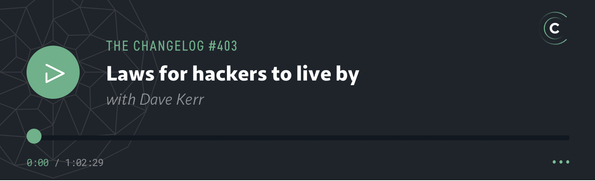

〔本篇辑录全球开发者公认的计算机科学与软件工程经典必读书籍、播客频道与在线高价值技术资源。〕

# 一、 经典必读书单 (Classic Reading List)

If you have found these concepts interesting, you may enjoy the following books.

- [Clean Code - Robert C. Martin](https://www.goodreads.com/book/show/3735293-clean-code) - One of the most well respected books on how to write clean, maintainable code.
- [Extreme Programming Installed - Ron Jeffries, Ann Anderson, Chet Hendrikson](https://www.goodreads.com/en/book/show/67834) - Covers the core principles of Extreme Programming.
- [Gödel, Escher, Bach: An Eternal Golden Braid - Douglas R. Hofstadter.](https://www.goodreads.com/book/show/24113.G_del_Escher_Bach) - This book is difficult to classify. [Hofstadter's Law](#hofstadters-law) is from the book.
- [Structure and Interpretation of Computer Programs - Harold Abelson, Gerald Jay Sussman, Julie Sussman](https://www.goodreads.com/book/show/43713) - If you were a comp sci or electical engineering student at MIT or Cambridge this was your intro to programming. Widely reported as being a turning point in people's lives.
- [The Cathedral and the Bazaar - Eric S. Raymond](https://en.wikipedia.org/wiki/The_Cathedral_and_the_Bazaar) - a collection of essays on open source. This book was the source of [Linus's Law](#linuss-law).
- [The Dilbert Principle - Scott Adams](https://www.goodreads.com/book/show/85574.The_Dilbert_Principle) - A comic look at corporate America, from the author who created the [Dilbert Principle](#the-dilbert-principle).
- [The Mythical Man Month - Frederick P. Brooks Jr.](https://www.goodreads.com/book/show/13629.The_Mythical_Man_Month) - A classic volume on software engineering. [Brooks' Law](#brooks-law) is a central theme of the book.
- [The Peter Principle - Lawrence J. Peter](https://www.goodreads.com/book/show/890728.The_Peter_Principle) - Another comic look at the challenges of larger organisations and people management, the source of [The Peter Principle](#the-peter-principle).

## Online Resources

Some useful resources and reading.

- [CB Insights: 8 Laws Driving Success In Tech: Amazon's 2-Pizza Rule, The 80/20 Principle, & More](https://www.cbinsights.com/research/report/tech-laws-success-failure) - an interesting write up of some laws which have been highly influential in technology.

## Podcast

Hacker Laws has been featured in [The Changelog](https://changelog.com/podcast/403), you can check out the Podcast episode with the link below:

## Contributors

Thanks goes to these wonderful people ([emoji key](https://allcontributors.org/docs/en/emoji-key)):

<!-- ALL-CONTRIBUTORS-LIST:START - Do not remove or modify this section -->
<!-- prettier-ignore-start -->
<!-- markdownlint-disable -->
<table>
  <tbody>
      <tr>
        <td align="center" valign="top" width="14.29%"><a href="https://github.com/1t1e1"> <b>Talha Baris</b></a> <a href="https://github.com/dwmkerr/hacker-laws/commits?author=1t1e1" title="Documentation">&#128214;</a></td>
        <td align="center" valign="top" width="14.29%"><a href="https://github.com/a0m0rajab"> <b>Abdurrahman Rajab</b></a> <a href="https://github.com/dwmkerr/hacker-laws/commits?author=a0m0rajab" title="Documentation">&#128214;</a></td>
        <td align="center" valign="top" width="14.29%"><a href="https://github.com/aaasko"> <b>Alexander K</b></a> <a href="https://github.com/dwmkerr/hacker-laws/commits?author=aaasko" title="Documentation">&#128214;</a></td>
        <td align="center" valign="top" width="14.29%"><a href="https://github.com/acevif"> <b>acevif</b></a> <a href="https://github.com/dwmkerr/hacker-laws/commits?author=acevif" title="Documentation">&#128214;</a><a href="https://github.com/dwmkerr/hacker-laws/commits?author=acevif" title="Translation">&#127757;</a></td>
        <td align="center" valign="top" width="14.29%"><a href="https://github.com/adambricelis"> <b>Adam Lis</b></a> <a href="https://github.com/dwmkerr/hacker-laws/commits?author=adambricelis" title="Documentation">&#128214;</a></td>
        <td align="center" valign="top" width="14.29%"><a href="https://github.com/adiabatic"> <b>adiabatic</b></a> <a href="https://github.com/dwmkerr/hacker-laws/commits?author=adiabatic" title="Documentation">&#128214;</a></td>
        <td align="center" valign="top" width="14.29%"><a href="https://github.com/aetiusflavius"> <b>aetiusflavius</b></a> <a href="https://github.com/dwmkerr/hacker-laws/commits?author=aetiusflavius" title="Documentation">&#128214;</a></td>
      </tr>
      <tr>
        <td align="center" valign="top" width="14.29%"><a href="https://github.com/akashchandwani"> <b>Akash Chandwani</b></a> <a href="https://github.com/dwmkerr/hacker-laws/commits?author=akashchandwani" title="Documentation">&#128214;</a></td>
        <td align="center" valign="top" width="14.29%"><a href="https://github.com/akbarali1"> <b>Akbarali</b></a> <a href="https://github.com/dwmkerr/hacker-laws/commits?author=akbarali1" title="Documentation">&#128214;</a></td>
        <td align="center" valign="top" width="14.29%"><a href="https://github.com/allingeek"> <b>Jeff Nickoloff</b></a> <a href="https://github.com/dwmkerr/hacker-laws/commits?author=allingeek" title="Documentation">&#128214;</a></td>
        <td align="center" valign="top" width="14.29%"><a href="https://github.com/aloisdg"> <b>Aloïs de Gouvello</b></a> <a href="https://github.com/dwmkerr/hacker-laws/commits?author=aloisdg" title="Documentation">&#128214;</a></td>
        <td align="center" valign="top" width="14.29%"><a href="https://github.com/AmaiSaeta"> <b>天井冴太</b></a> <a href="https://github.com/dwmkerr/hacker-laws/commits?author=AmaiSaeta" title="Documentation">&#128214;</a></td>
        <td align="center" valign="top" width="14.29%"><a href="https://github.com/arywidiantara"> <b>Ary Widiantara</b></a> <a href="https://github.com/dwmkerr/hacker-laws/commits?author=arywidiantara" title="Documentation">&#128214;</a><a href="https://github.com/dwmkerr/hacker-laws/commits?author=arywidiantara" title="Translation">&#127757;</a></td>
        <td align="center" valign="top" width="14.29%"><a href="https://github.com/BoltzmannBrain"> <b>Alexander Lavin</b></a> <a href="https://github.com/dwmkerr/hacker-laws/commits?author=BoltzmannBrain" title="Documentation">&#128214;</a></td>
      </tr>
      <tr>
        <td align="center" valign="top" width="14.29%"><a href="https://github.com/brunns"> <b>Simon Brunning</b></a> <a href="https://github.com/dwmkerr/hacker-laws/commits?author=brunns" title="Documentation">&#128214;</a></td>
        <td align="center" valign="top" width="14.29%"><a href="https://github.com/caretak3r"> <b>Rohit Gudi</b></a> <a href="https://github.com/dwmkerr/hacker-laws/commits?author=caretak3r" title="Documentation">&#128214;</a></td>
        <td align="center" valign="top" width="14.29%"><a href="https://github.com/csparpa"> <b>Claudio Sparpaglione</b></a> <a href="https://github.com/dwmkerr/hacker-laws/commits?author=csparpa" title="Documentation">&#128214;</a><a href="https://github.com/dwmkerr/hacker-laws/commits?author=csparpa" title="Translation">&#127757;</a></td>
        <td align="center" valign="top" width="14.29%"><a href="https://github.com/darekkay"> <b>Darek Kay</b></a> <a href="https://github.com/dwmkerr/hacker-laws/commits?author=darekkay" title="Documentation">&#128214;</a></td>
        <td align="center" valign="top" width="14.29%"><a href="https://github.com/dathanb"> <b>Dathan Bennett</b></a> <a href="https://github.com/dwmkerr/hacker-laws/commits?author=dathanb" title="Documentation">&#128214;</a></td>
        <td align="center" valign="top" width="14.29%"><a href="https://github.com/dbrusilovsky"> <b>Dan</b></a> <a href="https://github.com/dwmkerr/hacker-laws/commits?author=dbrusilovsky" title="Documentation">&#128214;</a></td>
        <td align="center" valign="top" width="14.29%"><a href="https://github.com/DillonAd"> <b>Dillon Adams</b></a> <a href="https://github.com/dwmkerr/hacker-laws/commits?author=DillonAd" title="Documentation">&#128214;</a></td>
      </tr>
      <tr>
        <td align="center" valign="top" width="14.29%"><a href="https://github.com/domdomegg"> <b>adam jones</b></a> <a href="https://github.com/dwmkerr/hacker-laws/commits?author=domdomegg" title="Documentation">&#128214;</a></td>
        <td align="center" valign="top" width="14.29%"><a href="https://github.com/douglasnaphas"> <b>Douglas Naphas</b></a> <a href="https://github.com/dwmkerr/hacker-laws/commits?author=douglasnaphas" title="Documentation">&#128214;</a></td>
        <td align="center" valign="top" width="14.29%"><a href="https://github.com/duongductrong"> <b>Trong Duong</b></a> <a href="https://github.com/dwmkerr/hacker-laws/commits?author=duongductrong" title="Documentation">&#128214;</a><a href="https://github.com/dwmkerr/hacker-laws/commits?author=duongductrong" title="Translation">&#127757;</a></td>
        <td align="center" valign="top" width="14.29%"><a href="https://github.com/emmanuelbernard"> <b>Emmanuel Bernard</b></a> <a href="https://github.com/dwmkerr/hacker-laws/commits?author=emmanuelbernard" title="Documentation">&#128214;</a><a href="https://github.com/dwmkerr/hacker-laws/commits?author=emmanuelbernard" title="Translation">&#127757;</a></td>
        <td align="center" valign="top" width="14.29%"><a href="https://github.com/enzoferraribf"> <b>Enzo Ferrari</b></a> <a href="https://github.com/dwmkerr/hacker-laws/commits?author=enzoferraribf" title="Documentation">&#128214;</a><a href="https://github.com/dwmkerr/hacker-laws/commits?author=enzoferraribf" title="Translation">&#127757;</a></td>
        <td align="center" valign="top" width="14.29%"><a href="https://github.com/eugenioamn"> <b>Eugênio Moreira</b></a> <a href="https://github.com/dwmkerr/hacker-laws/commits?author=eugenioamn" title="Documentation">&#128214;</a><a href="https://github.com/dwmkerr/hacker-laws/commits?author=eugenioamn" title="Translation">&#127757;</a></td>
        <td align="center" valign="top" width="14.29%"><a href="https://github.com/FaycalKhe"> <b>Faycel</b></a> <a href="https://github.com/dwmkerr/hacker-laws/commits?author=FaycalKhe" title="Documentation">&#128214;</a></td>
      </tr>
      <tr>
        <td align="center" valign="top" width="14.29%"><a href="https://github.com/felipeMinetto"> <b>Felipe S. Minetto</b></a> <a href="https://github.com/dwmkerr/hacker-laws/commits?author=felipeMinetto" title="Documentation">&#128214;</a></td>
        <td align="center" valign="top" width="14.29%"><a href="https://github.com/FellerAilton"> <b>Feller Ailton</b></a> <a href="https://github.com/dwmkerr/hacker-laws/commits?author=FellerAilton" title="Documentation">&#128214;</a><a href="https://github.com/dwmkerr/hacker-laws/commits?author=FellerAilton" title="Translation">&#127757;</a></td>
        <td align="center" valign="top" width="14.29%"><a href="https://github.com/franciscogaluppo"> <b>Francisco Galuppo Azevedo</b></a> <a href="https://github.com/dwmkerr/hacker-laws/commits?author=franciscogaluppo" title="Documentation">&#128214;</a></td>
        <td align="center" valign="top" width="14.29%"><a href="https://github.com/freddiefujiwara"> <b>Fumikazu Fujiwara | Freddie</b></a> <a href="https://github.com/dwmkerr/hacker-laws/commits?author=freddiefujiwara" title="Documentation">&#128214;</a><a href="https://github.com/dwmkerr/hacker-laws/commits?author=freddiefujiwara" title="Translation">&#127757;</a></td>
        <td align="center" valign="top" width="14.29%"><a href="https://github.com/germangamboa95"> <b>German Gamboa Gonzalez</b></a> <a href="https://github.com/dwmkerr/hacker-laws/commits?author=germangamboa95" title="Documentation">&#128214;</a></td>
        <td align="center" valign="top" width="14.29%"><a href="https://github.com/GGuinea"> <b>Kamil Zielinski</b></a> <a href="https://github.com/dwmkerr/hacker-laws/commits?author=GGuinea" title="Documentation">&#128214;</a><a href="https://github.com/dwmkerr/hacker-laws/commits?author=GGuinea" title="Translation">&#127757;</a></td>
        <td align="center" valign="top" width="14.29%"><a href="https://github.com/Ghost---Shadow"> <b>Souradeep Nanda</b></a> <a href="https://github.com/dwmkerr/hacker-laws/commits?author=Ghost---Shadow" title="Documentation">&#128214;</a></td>
      </tr>
      <tr>
        <td align="center" valign="top" width="14.29%"><a href="https://github.com/gmw"> <b>Magnus Wissler</b></a> <a href="https://github.com/dwmkerr/hacker-laws/commits?author=gmw" title="Documentation">&#128214;</a></td>
        <td align="center" valign="top" width="14.29%"><a href="https://github.com/gponsu"> <b>Vicente Pons</b></a> <a href="https://github.com/dwmkerr/hacker-laws/commits?author=gponsu" title="Documentation">&#128214;</a><a href="https://github.com/dwmkerr/hacker-laws/commits?author=gponsu" title="Translation">&#127757;</a></td>
        <td align="center" valign="top" width="14.29%"><a href="https://github.com/guettli"> <b>Thomas Güttler</b></a> <a href="https://github.com/dwmkerr/hacker-laws/commits?author=guettli" title="Documentation">&#128214;</a></td>
        <td align="center" valign="top" width="14.29%"><a href="https://github.com/gurjeet"> <b>Gurjeet Singh</b></a> <a href="https://github.com/dwmkerr/hacker-laws/commits?author=gurjeet" title="Documentation">&#128214;</a></td>
        <td align="center" valign="top" width="14.29%"><a href="https://github.com/gustavothecoder"> <b>Gustavo Ribeiro</b></a> <a href="https://github.com/dwmkerr/hacker-laws/commits?author=gustavothecoder" title="Documentation">&#128214;</a></td>
        <td align="center" valign="top" width="14.29%"><a href="https://github.com/hemmatt"> <b>Amir Hemmati</b></a> <a href="https://github.com/dwmkerr/hacker-laws/commits?author=hemmatt" title="Documentation">&#128214;</a><a href="https://github.com/dwmkerr/hacker-laws/commits?author=hemmatt" title="Translation">&#127757;</a></td>
        <td align="center" valign="top" width="14.29%"><a href="https://github.com/hituzi-no-sippo"> <b>hituzi no sippo</b></a> <a href="https://github.com/dwmkerr/hacker-laws/commits?author=hituzi-no-sippo" title="Documentation">&#128214;</a><a href="https://github.com/dwmkerr/hacker-laws/commits?author=hituzi-no-sippo" title="Translation">&#127757;</a></td>
      </tr>
      <tr>
        <td align="center" valign="top" width="14.29%"><a href="https://github.com/hkutluay"> <b>Hakan Kutluay</b></a> <a href="https://github.com/dwmkerr/hacker-laws/commits?author=hkutluay" title="Documentation">&#128214;</a><a href="https://github.com/dwmkerr/hacker-laws/commits?author=hkutluay" title="Translation">&#127757;</a></td>
        <td align="center" valign="top" width="14.29%"><a href="https://github.com/hliyan"> <b>Hasitha N. Liyanage</b></a> <a href="https://github.com/dwmkerr/hacker-laws/commits?author=hliyan" title="Documentation">&#128214;</a></td>
        <td align="center" valign="top" width="14.29%"><a href="https://github.com/hong4rc"> <b>Anh Hong</b></a> <a href="https://github.com/dwmkerr/hacker-laws/commits?author=hong4rc" title="Documentation">&#128214;</a></td>
        <td align="center" valign="top" width="14.29%"><a href="https://github.com/i3anaan"> <b>Derk Developer</b></a> <a href="https://github.com/dwmkerr/hacker-laws/commits?author=i3anaan" title="Documentation">&#128214;</a></td>
        <td align="center" valign="top" width="14.29%"><a href="https://github.com/iegik"> <b>Arturs Jansons</b></a> <a href="https://github.com/dwmkerr/hacker-laws/commits?author=iegik" title="Documentation">&#128214;</a><a href="https://github.com/dwmkerr/hacker-laws/commits?author=iegik" title="Translation">&#127757;</a></td>
        <td align="center" valign="top" width="14.29%"><a href="https://github.com/ioggstream"> <b>Roberto Polli</b></a> <a href="https://github.com/dwmkerr/hacker-laws/commits?author=ioggstream" title="Documentation">&#128214;</a></td>
        <td align="center" valign="top" width="14.29%"><a href="https://github.com/itallmakesense"> <b>Evgeny K.</b></a> <a href="https://github.com/dwmkerr/hacker-laws/commits?author=itallmakesense" title="Documentation">&#128214;</a></td>
      </tr>
      <tr>
        <td align="center" valign="top" width="14.29%"><a href="https://github.com/jbednar"> <b>James A. Bednar</b></a> <a href="https://github.com/dwmkerr/hacker-laws/commits?author=jbednar" title="Documentation">&#128214;</a></td>
        <td align="center" valign="top" width="14.29%"><a href="https://github.com/jlozovei"> <b>Julio Lozovei</b></a> <a href="https://github.com/dwmkerr/hacker-laws/commits?author=jlozovei" title="Documentation">&#128214;</a><a href="https://github.com/dwmkerr/hacker-laws/commits?author=jlozovei" title="Translation">&#127757;</a></td>
        <td align="center" valign="top" width="14.29%"><a href="https://github.com/JohnbelMDev"> <b>Johnbel Mahautiere</b></a> <a href="https://github.com/dwmkerr/hacker-laws/commits?author=JohnbelMDev" title="Documentation">&#128214;</a></td>
        <td align="center" valign="top" width="14.29%"><a href="https://github.com/jonbackhaus"> <b>Jonathan Backhaus</b></a> <a href="https://github.com/dwmkerr/hacker-laws/commits?author=jonbackhaus" title="Documentation">&#128214;</a></td>
        <td align="center" valign="top" width="14.29%"><a href="https://github.com/Joshua-rose"> <b>Joshua Rose</b></a> <a href="https://github.com/dwmkerr/hacker-laws/commits?author=Joshua-rose" title="Documentation">&#128214;</a></td>
        <td align="center" valign="top" width="14.29%"><a href="https://github.com/k0gen"> <b>Mariusz Kogen</b></a> <a href="https://github.com/dwmkerr/hacker-laws/commits?author=k0gen" title="Documentation">&#128214;</a><a href="https://github.com/dwmkerr/hacker-laws/commits?author=k0gen" title="Translation">&#127757;</a></td>
        <td align="center" valign="top" width="14.29%"><a href="https://github.com/kelvins"> <b>Kelvin S. do Prado</b></a> <a href="https://github.com/dwmkerr/hacker-laws/commits?author=kelvins" title="Documentation">&#128214;</a></td>
      </tr>
      <tr>
        <td align="center" valign="top" width="14.29%"><a href="https://github.com/kenzoarima"> <b>Kenzo</b></a> <a href="https://github.com/dwmkerr/hacker-laws/commits?author=kenzoarima" title="Documentation">&#128214;</a></td>
        <td align="center" valign="top" width="14.29%"><a href="https://github.com/KevinBockelandt"> <b>Kevin Bockelandt</b></a> <a href="https://github.com/dwmkerr/hacker-laws/commits?author=KevinBockelandt" title="Documentation">&#128214;</a><a href="https://github.com/dwmkerr/hacker-laws/commits?author=KevinBockelandt" title="Translation">&#127757;</a></td>
        <td align="center" valign="top" width="14.29%"><a href="https://github.com/leocaraballo"> <b>leocaraballo</b></a> <a href="https://github.com/dwmkerr/hacker-laws/commits?author=leocaraballo" title="Documentation">&#128214;</a></td>
        <td align="center" valign="top" width="14.29%"><a href="https://github.com/Leyka"> <b>Skander</b></a> <a href="https://github.com/dwmkerr/hacker-laws/commits?author=Leyka" title="Documentation">&#128214;</a><a href="https://github.com/dwmkerr/hacker-laws/commits?author=Leyka" title="Translation">&#127757;</a></td>
        <td align="center" valign="top" width="14.29%"><a href="https://github.com/lucanos"> <b>Luke Stevenson</b></a> <a href="https://github.com/dwmkerr/hacker-laws/commits?author=lucanos" title="Documentation">&#128214;</a></td>
        <td align="center" valign="top" width="14.29%"><a href="https://github.com/maekawatoshiki"> <b>Toshiki Maekawa</b></a> <a href="https://github.com/dwmkerr/hacker-laws/commits?author=maekawatoshiki" title="Documentation">&#128214;</a><a href="https://github.com/dwmkerr/hacker-laws/commits?author=maekawatoshiki" title="Translation">&#127757;</a></td>
        <td align="center" valign="top" width="14.29%"><a href="https://github.com/manuel-rubio"> <b>Manuel Rubio</b></a> <a href="https://github.com/dwmkerr/hacker-laws/commits?author=manuel-rubio" title="Documentation">&#128214;</a><a href="https://github.com/dwmkerr/hacker-laws/commits?author=manuel-rubio" title="Translation">&#127757;</a></td>
      </tr>
      <tr>
        <td align="center" valign="top" width="14.29%"><a href="https://github.com/marcosValle"> <b>Marcos Valle</b></a> <a href="https://github.com/dwmkerr/hacker-laws/commits?author=marcosValle" title="Documentation">&#128214;</a></td>
        <td align="center" valign="top" width="14.29%"><a href="https://github.com/markiv"> <b>Vikram Kriplaney</b></a> <a href="https://github.com/dwmkerr/hacker-laws/commits?author=markiv" title="Documentation">&#128214;</a></td>
        <td align="center" valign="top" width="14.29%"><a href="https://github.com/MEgooneh"> <b>MEGAGON</b></a> <a href="https://github.com/dwmkerr/hacker-laws/commits?author=MEgooneh" title="Documentation">&#128214;</a></td>
        <td align="center" valign="top" width="14.29%"><a href="https://github.com/michalkaptur"> <b>Michal Kaptur</b></a> <a href="https://github.com/dwmkerr/hacker-laws/commits?author=michalkaptur" title="Documentation">&#128214;</a></td>
        <td align="center" valign="top" width="14.29%"><a href="https://github.com/MrRyansan"> <b>Ryan Stubberfield</b></a> <a href="https://github.com/dwmkerr/hacker-laws/commits?author=MrRyansan" title="Documentation">&#128214;</a></td>
        <td align="center" valign="top" width="14.29%"><a href="https://github.com/mt-gitlocalize"> <b>mt-gitlocalize</b></a> <a href="https://github.com/dwmkerr/hacker-laws/commits?author=mt-gitlocalize" title="Documentation">&#128214;</a><a href="https://github.com/dwmkerr/hacker-laws/commits?author=mt-gitlocalize" title="Translation">&#127757;</a></td>
        <td align="center" valign="top" width="14.29%"><a href="https://github.com/mzeis"> <b>Matthias Zeis</b></a> <a href="https://github.com/dwmkerr/hacker-laws/commits?author=mzeis" title="Documentation">&#128214;</a></td>
      </tr>
      <tr>
        <td align="center" valign="top" width="14.29%"><a href="https://github.com/NicanorB"> <b>Nicu Borta</b></a> <a href="https://github.com/dwmkerr/hacker-laws/commits?author=NicanorB" title="Documentation">&#128214;</a></td>
        <td align="center" valign="top" width="14.29%"><a href="https://github.com/nuno-barreiro"> <b>Nuno Barreiro</b></a> <a href="https://github.com/dwmkerr/hacker-laws/commits?author=nuno-barreiro" title="Documentation">&#128214;</a></td>
        <td align="center" valign="top" width="14.29%"><a href="https://github.com/nusr"> <b>Steve Xu</b></a> <a href="https://github.com/dwmkerr/hacker-laws/commits?author=nusr" title="Documentation">&#128214;</a></td>
        <td align="center" valign="top" width="14.29%"><a href="https://github.com/ohno418"> <b>Yutaro Ohno</b></a> <a href="https://github.com/dwmkerr/hacker-laws/commits?author=ohno418" title="Documentation">&#128214;</a><a href="https://github.com/dwmkerr/hacker-laws/commits?author=ohno418" title="Translation">&#127757;</a></td>
        <td align="center" valign="top" width="14.29%"><a href="https://github.com/pavelpy"> <b>Pavel</b></a> <a href="https://github.com/dwmkerr/hacker-laws/commits?author=pavelpy" title="Documentation">&#128214;</a></td>
        <td align="center" valign="top" width="14.29%"><a href="https://github.com/puremana"> <b>Jeremy</b></a> <a href="https://github.com/dwmkerr/hacker-laws/commits?author=puremana" title="Documentation">&#128214;</a></td>
        <td align="center" valign="top" width="14.29%"><a href="https://github.com/pusewicz"> <b>Piotr Usewicz</b></a> <a href="https://github.com/dwmkerr/hacker-laws/commits?author=pusewicz" title="Documentation">&#128214;</a></td>
      </tr>
      <tr>
        <td align="center" valign="top" width="14.29%"><a href="https://github.com/rafedramzi"> <b>Rafed Ramzi</b></a> <a href="https://github.com/dwmkerr/hacker-laws/commits?author=rafedramzi" title="Documentation">&#128214;</a></td>
        <td align="center" valign="top" width="14.29%"><a href="https://github.com/rbalazs"> <b>Balázs Richer</b></a> <a href="https://github.com/dwmkerr/hacker-laws/commits?author=rbalazs" title="Documentation">&#128214;</a></td>
        <td align="center" valign="top" width="14.29%"><a href="https://github.com/rednafi"> <b>Redowan Delowar</b></a> <a href="https://github.com/dwmkerr/hacker-laws/commits?author=rednafi" title="Documentation">&#128214;</a></td>
        <td align="center" valign="top" width="14.29%"><a href="https://github.com/RichMorin"> <b>Rich Morin</b></a> <a href="https://github.com/dwmkerr/hacker-laws/commits?author=RichMorin" title="Documentation">&#128214;</a></td>
        <td align="center" valign="top" width="14.29%"><a href="https://github.com/rjbarbour"> <b>Robert Barbour</b></a> <a href="https://github.com/dwmkerr/hacker-laws/commits?author=rjbarbour" title="Documentation">&#128214;</a></td>
        <td align="center" valign="top" width="14.29%"><a href="https://github.com/rodrigocfd"> <b>Rodrigo</b></a> <a href="https://github.com/dwmkerr/hacker-laws/commits?author=rodrigocfd" title="Documentation">&#128214;</a></td>
        <td align="center" valign="top" width="14.29%"><a href="https://github.com/rogermarlow"> <b>Roger Marlow</b></a> <a href="https://github.com/dwmkerr/hacker-laws/commits?author=rogermarlow" title="Documentation">&#128214;</a></td>
      </tr>
      <tr>
        <td align="center" valign="top" width="14.29%"><a href="https://github.com/rrix"> <b>Ryan Rix</b></a> <a href="https://github.com/dwmkerr/hacker-laws/commits?author=rrix" title="Documentation">&#128214;</a></td>
        <td align="center" valign="top" width="14.29%"><a href="https://github.com/smetsth"> <b>Thomas Smets</b></a> <a href="https://github.com/dwmkerr/hacker-laws/commits?author=smetsth" title="Documentation">&#128214;</a></td>
        <td align="center" valign="top" width="14.29%"><a href="https://github.com/solarrust"> <b>Alena Batitskaia</b></a> <a href="https://github.com/dwmkerr/hacker-laws/commits?author=solarrust" title="Documentation">&#128214;</a></td>
        <td align="center" valign="top" width="14.29%"><a href="https://github.com/sowings13"> <b>Steve</b></a> <a href="https://github.com/dwmkerr/hacker-laws/commits?author=sowings13" title="Documentation">&#128214;</a></td>
        <td align="center" valign="top" width="14.29%"><a href="https://github.com/Tadas"> <b>Tadas Medišauskas</b></a> <a href="https://github.com/dwmkerr/hacker-laws/commits?author=Tadas" title="Documentation">&#128214;</a></td>
        <td align="center" valign="top" width="14.29%"><a href="https://github.com/tfnico"> <b>tfnico</b></a> <a href="https://github.com/dwmkerr/hacker-laws/commits?author=tfnico" title="Documentation">&#128214;</a></td>
        <td align="center" valign="top" width="14.29%"><a href="https://github.com/thomasmerz"> <b>Thomas Merz</b></a> <a href="https://github.com/dwmkerr/hacker-laws/commits?author=thomasmerz" title="Documentation">&#128214;</a></td>
      </tr>
      <tr>
        <td align="center" valign="top" width="14.29%"><a href="https://github.com/tobiasbueschel"> <b>Tobias Büschel</b></a> <a href="https://github.com/dwmkerr/hacker-laws/commits?author=tobiasbueschel" title="Documentation">&#128214;</a></td>
        <td align="center" valign="top" width="14.29%"><a href="https://github.com/truonghoangnguyen"> <b>nguyên</b></a> <a href="https://github.com/dwmkerr/hacker-laws/commits?author=truonghoangnguyen" title="Documentation">&#128214;</a><a href="https://github.com/dwmkerr/hacker-laws/commits?author=truonghoangnguyen" title="Translation">&#127757;</a></td>
        <td align="center" valign="top" width="14.29%"><a href="https://github.com/uberbrady"> <b>Brady Wetherington</b></a> <a href="https://github.com/dwmkerr/hacker-laws/commits?author=uberbrady" title="Documentation">&#128214;</a></td>
        <td align="center" valign="top" width="14.29%"><a href="https://github.com/umutphp"> <b>Umut Işık</b></a> <a href="https://github.com/dwmkerr/hacker-laws/commits?author=umutphp" title="Documentation">&#128214;</a><a href="https://github.com/dwmkerr/hacker-laws/commits?author=umutphp" title="Translation">&#127757;</a></td>
        <td align="center" valign="top" width="14.29%"><a href="https://github.com/underq"> <b>Delangue Benjamin</b></a> <a href="https://github.com/dwmkerr/hacker-laws/commits?author=underq" title="Documentation">&#128214;</a><a href="https://github.com/dwmkerr/hacker-laws/commits?author=underq" title="Translation">&#127757;</a></td>
        <td align="center" valign="top" width="14.29%"><a href="https://github.com/VacariGabriel"> <b>Gabriel Vacari</b></a> <a href="https://github.com/dwmkerr/hacker-laws/commits?author=VacariGabriel" title="Documentation">&#128214;</a><a href="https://github.com/dwmkerr/hacker-laws/commits?author=VacariGabriel" title="Translation">&#127757;</a></td>
        <td align="center" valign="top" width="14.29%"><a href="https://github.com/wppoland"> <b>Mariusz Szatkowski</b></a> <a href="https://github.com/dwmkerr/hacker-laws/commits?author=wppoland" title="Documentation">&#128214;</a><a href="https://github.com/dwmkerr/hacker-laws/commits?author=wppoland" title="Translation">&#127757;</a></td>
      </tr>
      <tr>
        <td align="center" valign="top" width="14.29%"><a href="https://github.com/wzel"> <b>wzel</b></a> <a href="https://github.com/dwmkerr/hacker-laws/commits?author=wzel" title="Documentation">&#128214;</a></td>
        <td align="center" valign="top" width="14.29%"><a href="https://github.com/yanamura"> <b>Yasuharu Yanamura</b></a> <a href="https://github.com/dwmkerr/hacker-laws/commits?author=yanamura" title="Documentation">&#128214;</a></td>
      </tr>
  </tbody>
</table>

<!-- markdownlint-restore -->
<!-- prettier-ignore-end -->

<!-- ALL-CONTRIBUTORS-LIST:END -->

Also with thanks to David Higgins and Pepe Bawagan, who contributed before their GitHub accounts were closed and so cannot be listed above.

This project follows the [all-contributors](https://github.com/all-contributors/all-contributors) specification. Contributions of any kind welcome!

# 二、 在线精选技术资源 (Online Resources)

- [Hacker Laws 官方互动网站 (hackerlaws.dev)](https://hackerlaws.dev)
- [The Changelog 播客专题: Laws for Hackers to Live By](https://changelog.com/podcast/403)
- [Effective Shell 权威手册](https://effective-shell.com)
- [Wikipedia 计算机科学与软件工程定律索引](https://en.wikipedia.org/wiki/List_of_eponymous_laws)
