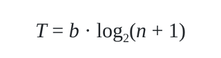

〔席克定律表明：一个人做出决策所需的时间随着选项数量和复杂性的增加而对数增长。减少用户选择路径能显著提升交互吞吐效率。〕

# 一、 定律与原则核心阐述

- [英文维基百科](https://en.wikipedia.org/wiki/Hick%27s_law)

> 决策时间和可供选择的选项数量呈对数增长关系。
>
> _William Edmund Hick and Ray Hyman_

在下方的等式中，`T` 是做出决定所花费的时间，`n` 是选项的数量，`b` 是一个由数据分析所确定的常数。

*(图片参考：Creative Commons Attribution-Share Alike 3.0 Unported, https://en.wikipedia.org/wiki/Hick%27s_law)*

该定律仅适用于选项 _按顺序排列_ 的情况，例如 ABCD。这隐含在以二为底的对数中，也就是说决策者本质上在进行 _二分法查找_。实验表明，如果选项不是按顺序排列的，那么所花费时间与选项个数将会呈线性增长关系。

这在 UI 设计中，该定律也可以有效地确保用户在搜索选项时更轻松愉快地做出决策。

在 [Speed of Information Processing: Developmental Change and Links to Intelligence](https://www.sciencedirect.com/science/article/pii/S0022440599000369) 一文中可见，智商和反应时间之间的相关性也满足席克定律。

参见：

- [费茨法则 (Fitts's Law)](#费茨法则-fittss-law)

# 二、 原文引文与参考出处

- **原始定义出处**: [dwmkerr/hacker-laws (GitHub)](https://github.com/dwmkerr/hacker-laws)
- **权威中文文献源**: [nusr/hacker-laws-zh (GitHub)](https://github.com/nusr/hacker-laws-zh)
- **所属文库分类**: 黑客定律与工程哲学文库 · 人机交互与认知负荷定律
