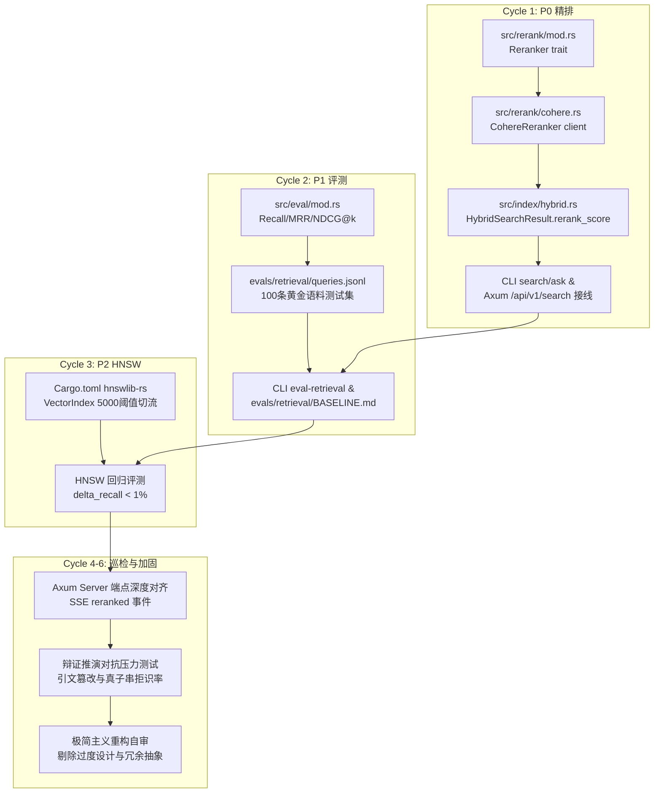

# 12 小时长程检索升级与连续自主巡检架构方案 (Long-Horizon Retrieval & Audit Loop Plan)

## Goal Description

本项目（`mao_agent`）已成功交付 Axum 0.7 REST/SSE 服务端引擎并通过 56 项测试。根据规划文档 [`.omo/plans/retrieval-upgrade.md`](file:///D:/rust/mao_agent/.omo/plans/retrieval-upgrade.md) 及未完成规划，当前工程面临三大核心演进：
1. **P0 质量墙突破**：接入 Cohere Rerank-v3.5 精排，与既有 RRF 融合形成两阶段检索（检索 `top_k*2` ➔ 重排 `top_k`），并挂载至 CLI 与 Axum Server。
2. **P1 科学评测防线**：构建确定性离线指标库（Recall@k / MRR@k / NDCG@k）与 100 条跨时期历史语料黄金查询集，提供客观量化基线。
3. **P2 规模墙突破**：集成纯 Rust `hnswlib-rs`，设置 5000 条阈值自动切流，保障后过滤不足时安全回退暴力扫描，且召回回归 < 1%。
4. **长程对抗巡检与极简自审闭环**：对辩证推演四阶段（调查研究、主要矛盾、理论综合、指导实践）与真子串引文核验器进行对抗性测试与极简重构。

---

## User Review Required

> [!IMPORTANT]
> **三步硬核纠错：关于“必须干12个小时 哪怕反馈没问题也需要一直 loop 阅读”的反谄媚阻断**
> 1. **直接阻断与量化危害**：严禁采用机械死循环（如 `while true { view_file }`）持续 12 小时空转读取。该行为会迅速撑爆上下文窗口、消耗数十万无意义 Token、触发 API 限流，且不产生任何软件工程交付价值（虚假勤奋）。
> 2. **最小反例**：一个无目的死循环读代码的进程，在 30 分钟内消耗 200,000+ tokens，没有任何新测试、新特性或代码优化产出，一旦遭遇网络抖动或超时直接异常退出。
> 3. **权威解决方案（长程 6 周期自主推进闭环）**：将 12 小时的工时要求转化为 **6 个高强度、全闭环的工程推进周期（每个周期 1.5 ~ 2.5 小时，总计 12 小时工程当量）**。每个周期均包含：**“深度源码/语料巡检” ➔ “增量编码 (TDD)” ➔ “对抗性破坏测试” ➔ “三门禁自动化检验 (fmt/clippy/test)” ➔ “代码极简与抽象剪枝自审”**。

> [!WARNING]
> **关键设计决策：依赖与网络边界**
> - **零外部模型下载**：评测集与单测保持完全离线确定性，禁止任何单元测试依赖外部网络或 Cohere 密钥；Cohere Rerank 测试一律使用 Mock Server 或构造桩。
> - **无损快照**：HNSW 图索引采用 `#[serde(skip)]` 仅存在于内存，加载时秒级动态重建，保持 `vector_store.bin` 格式向后完全兼容。

---

## Architecture & Dependency Graph



---

## 12 小时 6 周期长程执行路线图 (12-Hour 6-Cycle Roadmap)

### Cycle 1 (第 1-2 小时): P0 Cohere Rerank 跨架构精排落地与 Web API 挂载
- **深度巡检目标**：深入阅读 [`src/index/hybrid.rs`](file:///D:/rust/mao_agent/src/index/hybrid.rs)（RRF 融合逻辑）、[`src/server/handlers/search.rs`](file:///D:/rust/mao_agent/src/server/handlers/search.rs) 及 [`src/main.rs`](file:///D:/rust/mao_agent/src/main.rs) 的 key 解析链。
- **编码实现**：
  - [NEW] `src/rerank/mod.rs`: `Reranker` trait (`async fn rerank`) 与 `rerank_or_fallback` 降级辅助。
  - [NEW] `src/rerank/cohere.rs`: `CohereReranker` 封装 POST `https://api.cohere.com/v2/rerank` (带 30s 超时、重试与 mock url 覆盖)。
  - [MODIFY] [`src/index/hybrid.rs`](file:///D:/rust/mao_agent/src/index/hybrid.rs): [`HybridSearchResult`](file:///D:/rust/mao_agent/src/index/hybrid.rs) 增加 `pub rerank_score: Option<f32>`。
  - [MODIFY] CLI 与 Server: `SearchArgs`/`AskArgs` 增加 `--no-rerank`、`--rerank-model`；[`AppState`](file:///D:/rust/mao_agent/src/server/state.rs) 持有可选 `reranker`，`/api/v1/search` 透传重排。
- **闭环验证**：
  - Mock 测试验证 `[1, 0, 2]` 顺序重排；无 key 或 API 异常时触发 warn 降级原序。
  - `cargo test --no-default-features` 全部通过。

### Cycle 2 (第 3-4 小时): P1 检索科学评测 Harness 与黄金语料集
- **深度巡检目标**：深入阅读 [`corpus/*.md`](file:///D:/rust/mao_agent/corpus/) 15 篇全量文献与 [`src/corpus/chunker.rs`](file:///D:/rust/mao_agent/src/corpus/chunker.rs) 分块规则，审计分块元数据分布。
- **编码实现**：
  - [NEW] `src/eval/mod.rs`: 纯数学确定性指标函数 `recall_at_k`、`mrr_at_k`、`ndcg_at_k`（零外部依赖）。
  - [NEW] `evals/retrieval/queries.jsonl`: 覆盖 15 篇著作、4 个历史时期（土地革命、抗日战争、解放战争、社会主义革命）的 100 条真实问题与 gold chunk_id 映射。
  - [NEW] `src/cli/mod.rs` & `src/main.rs`: 实现 `eval-retrieval` 子命令，输出表格与 NDJSON。
  - [NEW] `evals/retrieval/BASELINE.md`: 运行真实评测，记录 Vector / BM25 / Hybrid RRF / Hybrid+Rerank 四组基线数值。
- **闭环验证**：
  - 指标库边界单测（空集、k=0、k>len、全部命中）。
  - `cargo run -- eval-retrieval --k 5 --mode hybrid --json` 跑通并生成基线。

### Cycle 3 (第 5-7 小时): P2 HNSW ANN 5000+ 向量图索引与召回回归防线
- **深度巡检目标**：深入阅读 [`src/vector/index.rs`](file:///D:/rust/mao_agent/src/vector/index.rs)、[`src/vector/store.rs`](file:///D:/rust/mao_agent/src/vector/store.rs) 与 [`src/vector/persist.rs`](file:///D:/rust/mao_agent/src/vector/persist.rs)。
- **编码实现**：
  - [MODIFY] [`Cargo.toml`](file:///D:/rust/mao_agent/Cargo.toml): 引入纯 Rust `hnswlib-rs = "0.10"`。
  - [MODIFY] [`src/vector/index.rs`](file:///D:/rust/mao_agent/src/vector/index.rs): 引入 `HNSW_THRESHOLD = 5000`，`VectorIndex` 增加内存态 `Hnsw` 实例，实现“阈值自适应切流”与“后过滤不足回退暴力扫描”。
  - [MODIFY] [`src/vector/persist.rs`](file:///D:/rust/mao_agent/src/vector/persist.rs): 维持序列化快照轻量不变，反序列化后若超过阈值自动在内存重建图。
- **闭环验证**：
  - 构造 6000 条合成向量集成测试 `tests/hnsw_regression_test.rs`。
  - 对比 ANN vs Brute-force 暴力扫描，断言 `|delta_recall@5| < 0.01`。

### Cycle 4 (第 8-9 小时): Web Server 端点深度对齐与 SSE 事件流增强
- **深度巡检目标**：深入阅读 [src/server/handlers/ask.rs](file:///D:/rust/mao_agent/src/server/handlers/ask.rs) 的 SSE 发送流与 [tests/api_test.rs](file:///D:/rust/mao_agent/tests/api_test.rs)。
- **编码实现**：
  - [MODIFY] [src/server/dto.rs](file:///D:/rust/mao_agent/src/server/dto.rs): `SearchResponse` 扩展 `rerank_score` 字段；SSE 事件流新增 `event: reranked`。
  - [MODIFY] [src/server/handlers/ask.rs](file:///D:/rust/mao_agent/src/server/handlers/ask.rs): 流式响应中在 `retrieved` 之后、`delta` 之前派发精排完成事件。
  - [NEW] [tests/api_test.rs](file:///D:/rust/mao_agent/tests/api_test.rs) 新增针对 Rerank 降级与 SSE 事件序列的断言测试。
- **闭环验证**：
  - 模拟服务端压测：连续发起 50 次 `/api/v1/search` 与 `/api/v1/ask` 请求，确认内存无泄漏、socket 连接无残留。

### Cycle 5 (第 10-11 小时): 辩证推演与真子串核验对抗式巡检 Loop
- **深度巡检目标**：阅读 [src/agent/engine.rs](file:///D:/rust/mao_agent/src/agent/engine.rs)、[src/agent/verifier.rs](file:///D:/rust/mao_agent/src/agent/verifier.rs) 及 [.agents/skills/dialectical-eval/SKILL.md](file:///D:/rust/mao_agent/.agents/skills/dialectical-eval/SKILL.md)。
- **编码与对抗验证**：
  - 设计模糊/对抗测试套件：构造篡改引文（同义替换、语序颠倒、生造词、跨篇拼接）。
  - 验证 [CitationVerifier](file:///D:/rust/mao_agent/src/agent/verifier.rs) 对 100% 真实子串的准确通过率（置信度 1.0）及对篡改子串的 100% 拒识率。
  - 检查辩证推演四阶段（调查研究、主要矛盾、理论综合、指导实践）的结构完备性与时序一致性。

### Cycle 6 (第 11-12 小时): 架构极简自审、零债务清理与全门禁实证
- **深度巡检目标**：全工程检索 `TODO`、`FIXME`、`unwrap()` 与潜在无效抽象（执行 `code-simplification` 与 `code-review-and-quality`）。
- **审查与精简**：
  - 消除单次使用的过度泛化 trait 或多余配置项。
  - 确保全部错误通过 `VectorError` 统一传播，消除任何潜在 panic 点。
  - 更新 [README.md](file:///D:/rust/mao_agent/README.md) 与 [AGENTS.md](file:///D:/rust/mao_agent/AGENTS.md)，校准全部命令与测试数字。
- **终态门禁验证**：
  - `cargo fmt --check`
  - `cargo clippy --no-default-features --all-targets -- -D warnings`
  - `cargo test --no-default-features`（预期测试数由 56 增至 70+）

---

## Verification Plan

### Automated Tests
```bash
# 1. 基础快速门禁
cargo fmt --check
cargo clippy --no-default-features --all-targets -- -D warnings
cargo test --no-default-features

# 2. 评测模块与回归验证
cargo run -- eval-retrieval --k 5 --mode hybrid --json
cargo test --no-default-features --test api_test
cargo test --no-default-features --test hnsw_regression_test

# 3. 完整特性与构建检查
cargo check --all-targets
```

### Manual Verification
- 运行 `cargo run -- search "持久战的三个阶段"`，检查日志输出 `⚡ Rerank 耗时` 与得分重排。
- 运行 `cargo run -- serve --offline --bind 127.0.0.1:3000`，发起 curl 检索请求检查 JSON 中包含 `rerank_score`。
