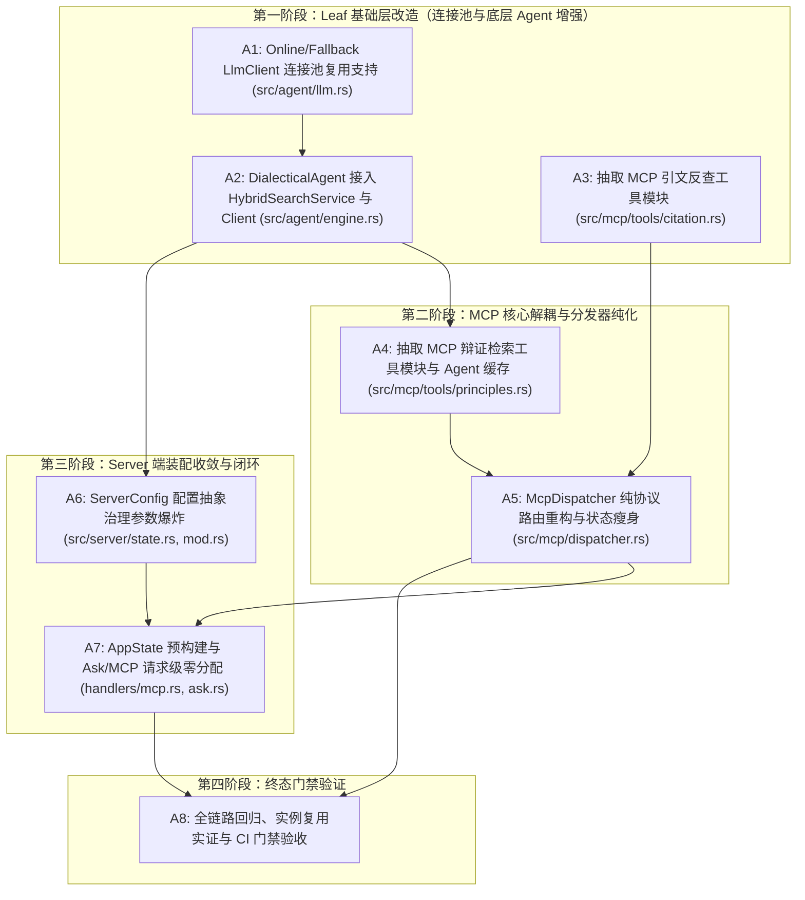

# 实施方案：A 阶段 — MCP 解耦、连接池复用与 Server 装配收敛

> **文档版本**: 1.0.0  
> **制定日期**: 2026-09-07  
> **规划与验收角色**: 架构规划与验收 Agent (Antigravity / agy)  
> **执行角色**: dsh web (DeepSeek Harness web UI 执行代理)  
> **前置依赖**: B 阶段（B1~B9，HybridSearchService 四端归一与技术债）已验收合流  
> **工程基准**: Rust 2024 edition, 单 crate (`mao_agent`, bin+lib), 182 基线测试通过, 零编译警告  

---

## 1. 阶段目标与铁律约束

### 1.1 总目标

在 B 阶段成功将混合检索通道收敛归一（`src/index/service.rs` 的 `HybridSearchService` 成为唯一检索入口）的基础上，A 阶段聚焦解决 **MCP 分发器单体耦合、LLM/Agent 实例每请求重建与连接池开销、Server 侧构造参数膨胀** 等核心架构缺陷：

1. **解耦 `src/mcp/dispatcher.rs` 604 行单体分发器**：
   - 将协议解析与生命周期路由（JSON-RPC 2.0 / MCP 2024-11-05）与具体工具执行逻辑彻底解耦；
   - 抽取独立工具模块：`src/mcp/tools/citation.rs`（引文反查与严格验证）与 `src/mcp/tools/principles.rs`（辩证方法论混合检索与哲学推演）；
   - 使 `McpDispatcher` 纯化为轻量级协议路由核（代码量由 604 行收敛至约 120 行）。
2. **根治 P2-9：`DialecticalAgent` 每次请求重建与 `reqwest::Client` 连接池颠簸**：
   - 现存缺陷：`mcp/dispatcher.rs`（`synthesize: true` 路径）与 `server/handlers/ask.rs:71, 159` 在每次请求时均从头实例化 `DialecticalAgent`、重新组装内部检索管道、并重新 `reqwest::Client::builder().build()` 创建底层 HTTP 连接池，导致严重的堆分配、TCP/TLS 频繁重连与高并发性能损耗；
   - 架构解法：`DialecticalAgent` 支持复用外部已有的 `Arc<HybridSearchService>` 与共享 `reqwest::Client`；在 `McpDispatcher` 与 `AppState` 中预构建并缓存 `Arc<DialecticalAgent>`，常规请求直接零开销借用。
3. **收敛 MCP 与 Server 装配关系**：
   - 现存缺陷：`McpDispatcher` 冗余持有与 `HybridSearchService` 重叠的 `tantivy, graph, reranker` 等组件引用；HTTP 端点 `/api/v1/mcp` 每来一个请求就执行一次 `McpDispatcher::from_app_state(&state)` 堆重组；
   - 架构解法：`McpDispatcher` 结构体字段精简瘦身；`AppState` 在启动时预组装 `mcp_dispatcher: Arc<McpDispatcher>`，HTTP 请求直通路由。
4. **治理 P2-4：Server 构造参数爆炸**：
   - 现存缺陷：`serve()` 拥有 12 个入参，`with_ops()` 拥有 10 个入参，代码库多处充斥 `#[allow(clippy::too_many_arguments)]`；
   - 架构解法：抽象强类型 `ServerConfig` 配置结构体，聚合网络、安全、并发与 LLM 运行时选项，提供优雅的 Server 启动与配置契约，保留旧签名的向后兼容包装。
5. **明确边界排除**：
   - **明确排除 CLI `main.rs` 1,335 行 6 个子命令的整体拆解**：该项技术债（P2-3）属于通用 CLI/Bootstrap 生命周期治理，与 MCP/Agent 解耦核心正交。为恪守范围纪律、避免范围膨胀（Scope Creep）与无关回归，明确归入后续 **D 阶段（CLI & Bootstrap 治理）**。本阶段 `main.rs` 仅作为受影响构造函数调用的调用端做极简适配。

### 1.2 铁律约束（Red Lines）

执行代理（dsh web）必须无条件遵守以下八项红线，任何违反而导致 CI 门禁或验收失败的提交将立即被打回或回滚：

1. **外部契约与协议零破坏**：
   - **JSON-RPC 2.0 协议规范**：错误码（`-32700`, `-32600`, `-32601`, `-32602`, `-32603`, `-32053`）及错误结构体定义 100% 保持；
   - **MCP 2024-11-05 协议**：工具名（`query_dialectical_principles`, `verify_historical_citation`）、参数名与类型定义、JSON Schema 顶级与属性约束 100% 保持；
   - **REST API & SSE 规范**：`/api/v1/search`、`/api/v1/ask`、`/api/v1/verify`、`/mcp`、`/api/v1/mcp` 的 DTO 与 HTTP 状态码绝对兼容；`/api/v1/ask/stream` 的 8 个标准 SSE 事件流序列（`status/searching` → `retrieval/results` → `agent/thinking` → `agent/grounding` → `agent/answer` → `citation/report` → `stats/summary` → `stream/done`）严格一致；
   - **CLI 命令行**：所有 CLI 参数标志与终端输出格式不得发生非预期变更。
2. **严禁夹带卡外改动（Zero Scope Creep）**：
   - 严禁借重构之名私自修改任何算法逻辑、语料分块规则、图检索超参或无关模块（吸取 B4 夹带回滚教训）；
   - 每一张任务卡严格限制在自身声明的文件列表内，严禁触碰 `corpus/`、`evals/` 及无关基础设施。
3. **单卡单 Commit 纪律**：
   - 每个任务卡独立一个 Git commit，严禁多卡混合提交；
   - 严禁使用 `git commit --amend` 篡改已推送到主线的提交历史；
   - Commit message 必须遵循规范格式：`refactor(模块): 简明动作 (任务卡ID)`。
4. **测试驱动与常绿门禁（TDD & CI Gates）**：
   - 新增能力/构造函数先行编写单测，确保测试覆盖；
   - 提交前必须本地跑通 CI 三门禁：
     1. `cargo test --no-default-features`（全量 182+ 测试 100% 通过，0 失败）；
     2. `cargo check --no-default-features`（0 编译警告）；
     3. `cargo fmt --check`（0 格式化差异）。
5. **极简主义与防过度设计**：
   - 不引入新的外部 crate（标准库与现有依赖完全满足需求）；
   - 消除不必要的重分配与样板代码，A 阶段交付后全仓代码量应当呈现**净减少**或至少单体文件显著缩减。

---

## 2. 技术债深度定位与架构设计全景

### 2.1 MCP Dispatcher 单体剖析与工具解耦

- **现状剖析**：
  - `src/mcp/dispatcher.rs`（604 行）同时承担了：
    1. 输入参数边界校验（`MAX_QUERY_CHARS`, `MAX_QUOTE_CHARS`, `MAX_TITLE_CHARS`, `reject_if_too_long`）；
    2. JSON-RPC 2.0 报文解析、方法匹配（`initialize`, `ping`, `tools/list`, `tools/call`）与协议错误构造；
    3. `query_dialectical_principles` 的检索流程编排、Domain/Period 过滤装配、Agent 合成调用与结果文本拼装；
    4. `verify_historical_citation` 的语料反查匹配（`store.chunks_matching_title`）、`CitationVerifier` 调用与反作弊报告拼装；
    5. 超过 250 行的单元测试代码。
  - 这种“协议分发 + 业务编排 + 工具实现”混杂的架构不仅降低了可维护性，也阻碍了未来新增工具的能力扩展。
- **目标解耦架构**：
  ```
  src/mcp/
  ├── mod.rs               // 模块暴露与重新导出
  ├── types.rs             // JSON-RPC 与 MCP 2024-11-05 协议类型、Schema 契约（保持纯洁）
  ├── stdio.rs             // Stdio 传输层长连接循环
  ├── dispatcher.rs        // 纯协议分发器：方法路由、错误转换、工具调用派发（~120 行）
  └── tools/               // 工具业务逻辑独立解耦层
      ├── mod.rs           // 工具模块定义与公共辅助函数
      ├── citation.rs      // verify_historical_citation 工具实现与专项单测
      └── principles.rs    // query_dialectical_principles 工具实现与专项单测
  ```

### 2.2 P2-9：DialecticalAgent 每次请求重建与连接池泄漏治理

- **现状剖析**：
  - 在 `src/mcp/dispatcher.rs:235-245` 中：
    ```rust
    let synthesis_report = if args.synthesize == Some(true) {
        let mut agent = DialecticalAgent::new(
            Arc::clone(&self.store),
            self.tantivy.clone(),
            self.chat_base_url.clone(),
            self.chat_api_key.clone(),
            self.chat_model.clone(),
            self.reranker.clone(),
        );
        if let Some(ref g) = self.graph { agent = agent.with_graph(Arc::clone(g)); }
        ...
    }
    ```
  - 在 `src/server/handlers/ask.rs:71-82, 159-170` 中：
    每次收到 `/api/v1/ask` 或 `/api/v1/ask/stream` 请求，同样调用 `DialecticalAgent::new_with_fallback_counter(...)`。
  - **严重性能隐患**：
    1. `DialecticalAgent::new` 内部会重新执行 `HybridSearchService::new(...)`，无视调用方早已初始化完毕的 `HybridSearchService` 实例；
    2. 更严重的是，`DialecticalAgent::new` 内部构建 `FallbackLlmClient`，间接调用 `OnlineLlmClient::with_retry`，执行：
       `reqwest::Client::builder().timeout(...).build().unwrap_or_default()`；
    3. `reqwest::Client` 内部维护着 HTTP 连接池与 DNS 解析缓存。在每次请求中新建 Client，意味着每一个合成请求都必须创建新的 TCP 连接池并进行独立的 TLS 握手，请求结束后丢弃连接池，造成极大的网络延迟与系统套接字颠簸。
- **目标解耦架构**：
  1. 底层支持：`OnlineLlmClient` 与 `FallbackLlmClient` 增加支持注入 `reqwest::Client` 的构造函数；
  2. Agent 侧支持：`DialecticalAgent` 增加接收 `Arc<HybridSearchService>` 与 `reqwest::Client` 的构造函数 `from_services` / `from_service_with_client`；
  3. MCP 侧复用：`McpDispatcher` 内部持有 `Option<Arc<DialecticalAgent>>`，在 `with_chat_overrides` 或初始化时仅构建一次，后续所有 `synthesize: true` 零分配直接复用；
  4. Server 侧复用：`AppState` 持有全局共享的 `reqwest::Client` 与预初始化的 `default_agent: Arc<DialecticalAgent>`。对于 99% 不带请求级临时 API Key 的常规请求，直接零开销借用预构建 Agent；若存在临时 API Key 覆盖，则仅轻量构造 LLM 客户端包装，底层复用同一连接池与 `search_service`。

### 2.3 mcp / server 状态解耦与装配归一

- **现状剖析**：
  - `AppState` 内部已经聚合了 `search_service: Arc<HybridSearchService>`；
  - 但在 `src/server/handlers/mcp.rs:84` 中：
    `let dispatcher = McpDispatcher::from_app_state(&state);`
    每个进来的 MCP HTTP 请求都在栈上临时组装一个 `McpDispatcher` 结构体，克隆 8 个字段；
  - 同时，`McpDispatcher` 自身还冗余持有着 `store, tantivy, graph, reranker`，与内部的 `search_service` 严重重合。
- **目标解耦架构**：
  1. `McpDispatcher` 瘦身：内部仅保留 `search_service: Arc<HybridSearchService>`, `store: Arc<VectorStore>`, `agent: Option<Arc<DialecticalAgent>>`；
  2. `AppState` 预挂载：在 `AppState` 初始化及 `with_graph` 阶段，将装配好的 `mcp_dispatcher: Arc<McpDispatcher>` 存入全局状态；
  3. `handlers/mcp.rs` 直调：直接调用 `state.mcp_dispatcher.handle_request(req).await`，完全消除每请求分配开销。

### 2.4 Server 构造参数爆炸（P2-4）与 `ServerConfig` 抽象

- **现状剖析**：
  - `src/server/mod.rs:118` 的 `serve()` 函数拥有 12 个参数：`store, tantivy, hybrid, reranker, chat_base_url, chat_api_key, chat_model, addr, cors, api_token, max_concurrent_asks, graph`；
  - `src/server/state.rs:87` 的 `with_ops()` 拥有 10 个参数，均被标记了 `#[allow(clippy::too_many_arguments)]`。
- **目标解耦架构**：
  - 提取 `ServerConfig` 结构体：
    ```rust
    #[derive(Debug, Clone)]
    pub struct ServerConfig {
        pub addr: SocketAddr,
        pub cors: CorsAllowlist,
        pub api_token: Option<String>,
        pub max_concurrent_asks: usize,
        pub chat_base_url: String,
        pub chat_api_key: Option<String>,
        pub chat_model: String,
    }
    ```
  - 新增 `serve_with_config` 与 `AppState::with_config`，彻底消除参数膨胀，原旧函数保留为转发包装，保障向后兼容。

---

## 3. 原子任务分解清单（A1 ~ A8）

A 阶段共细分为 **8 个高内聚、弱耦合的原子任务卡**：

| 任务 ID | 任务名称 | 覆盖债项 | 修改/新建文件 | 预计改动量 | 风险等级 |
|---------|---------|---------|--------------|-----------|---------|
| **A1** | LLM 客户端连接池共享改造 | P2-9 根基 | `src/agent/llm.rs` | 增加共享 `Client` 构造路径，保留默认兼容 | 低 (Low) |
| **A2** | `DialecticalAgent` 检索服务复用与连接池接入 | P2-9 Agent 侧 | `src/agent/engine.rs` | 接入已有 `HybridSearchService` 与共享 Client | 低 (Low) |
| **A3** | 提取 MCP 引文反查工具模块 (`citation.rs`) | 单体解耦 1/2 | `src/mcp/tools/citation.rs` (新), `src/mcp/tools/mod.rs` (新), `src/mcp/mod.rs`, `src/mcp/dispatcher.rs` | 剥离引文反查与验证逻辑，建立 tools 目录 | 低 (Low) |
| **A4** | 提取 MCP 辩证检索工具模块 (`principles.rs`) 与 Agent 缓存复用 | 单体解耦 2/2, P2-9 MCP 侧 | `src/mcp/tools/principles.rs` (新), `src/mcp/tools/mod.rs`, `src/mcp/dispatcher.rs` | 剥离方法论检索与综合推演，复用缓存 Agent | 中 (Medium) |
| **A5** | `McpDispatcher` 纯协议分发器重构与状态瘦身 | 单体解耦, 状态精简 | `src/mcp/dispatcher.rs` | 消除冗余字段，行数由 604 行降至 ~120 行 | 中 (Medium) |
| **A6** | Server 侧 `ServerConfig` 配置抽象与构造治理 | P2-4 参数爆炸 | `src/server/mod.rs`, `src/server/state.rs` | 引入配置结构体，消除参数膨胀与 clippy 抑制 | 低 (Low) |
| **A7** | Server 与 MCP 全局预构建与连接池闭环 | P2-9 Server 侧, 架构收敛 | `src/server/state.rs`, `src/server/handlers/mcp.rs`, `src/server/handlers/ask.rs` | AppState 预持 Agent 与 Dispatcher，消除每请求重建 | 中 (Medium) |
| **A8** | 全链路回归、连接池实证与 CI 门禁终态核对 | 整体质量门禁 | `tests/mcp_test.rs`, `tests/api_test.rs` | 增补连接池/实例复用测试，三门禁验收 | 低 (Low) |

---

## 4. 执行顺序、依赖关系与拓扑图

### 4.1 任务依赖拓扑



### 4.2 串行与并行编排建议

- **批次 1 (Leaf 独立项)**：
  - `A1` 负责改造 LLM 底层 Client 注入，属于叶子节点；
  - `A3` 负责将无 LLM 依赖的引文反查工具从 `dispatcher.rs` 抽离，与 `A1` 文件互不冲突，两者完全可**并行实施**。
- **批次 2 (Agent 与 MCP 解耦)**：
  - `A2` 依赖 `A1`，完成 `DialecticalAgent` 的检索服务与 Client 接入；
  - `A4` 依赖 `A2`，将 `query_dialectical_principles` 抽离并使用缓存的 Agent；
  - `A5` 依赖 `A3` 与 `A4`，在两个工具均抽离后对 `McpDispatcher` 做最终纯化。
- **批次 3 (Server 收敛与装配)**：
  - `A6` 定义 `ServerConfig`，消除 Server 参数膨胀；
  - `A7` 依赖 `A5` 与 `A6`，将预构建的 Agent 与 Dispatcher 接入 `AppState` 并优化 `/mcp` 与 `/ask` 处理函数。
- **批次 4 (验收与门禁)**：
  - `A8` 统一运行全量测试套件、连接池复用验证及静态检查，交付验收。

---

## 5. dsh web 适配的任务卡（A1 ~ A8 自包含卡片）

> **使用说明**：以下卡片为可以直接完整复制、独立投递给 dsh web 执行 Agent 的任务指令。每张卡片均自包含上下文、代码修改指引、边界约束及验收命令。

---

### 【任务卡 A1】`OnlineLlmClient` 与 `FallbackLlmClient` 连接池复用支持 (P2-9 根基)

```markdown
# 任务目标
为 `OnlineLlmClient` 与 `FallbackLlmClient` 提供接收共享 `reqwest::Client` 的构造能力，避免在高并发或频繁请求下重复创建底层 HTTP 连接池与 TLS 上下文。

# 涉及文件与精确行级定位
1. `src/agent/llm.rs` (第 74-103 行 `OnlineLlmClient` 构造；第 226-240 行 `FallbackLlmClient` 构造)

# 实施指导
1. 在 `src/agent/llm.rs` 中为 `OnlineLlmClient` 增加支持外部注入 `reqwest::Client` 的构造方法：
   ```rust
   pub fn with_client_and_retry(
       client: reqwest::Client,
       base_url: String,
       api_key: String,
       model_name: String,
       retry: RetryPolicy,
   ) -> Self {
       Self {
           client,
           base_url: base_url.trim_end_matches('/').to_string(),
           api_key,
           model_name,
           retry,
       }
   }
   ```
2. 重构既有的 `OnlineLlmClient::with_retry`，使其内部构建默认 client 后直接委托给 `with_client_and_retry`，保持既有函数行为与签名 100% 兼容：
   ```rust
   pub fn with_retry(
       base_url: String,
       api_key: String,
       model_name: String,
       retry: RetryPolicy,
   ) -> Self {
       let client = reqwest::Client::builder()
           .timeout(std::time::Duration::from_secs(60))
           .build()
           .unwrap_or_default();
       Self::with_client_and_retry(client, base_url, api_key, model_name, retry)
   }
   ```
3. 在 `src/agent/llm.rs` 中为 `FallbackLlmClient` 增加支持外部注入 `reqwest::Client` 的构造方法：
   ```rust
   pub fn from_api_key_with_client(
       client: reqwest::Client,
       base_url: String,
       api_key: Option<String>,
       model_name: String,
   ) -> Self {
       let online = api_key.map(|key| {
           OnlineLlmClient::with_client_and_retry(
               client,
               base_url,
               key,
               model_name,
               RetryPolicy::cohere_http(),
           )
       });
       Self {
           online,
           fallback_counter: None,
       }
   }
   ```
4. 既有的 `FallbackLlmClient::from_api_key` 保持签名不变，内部委托给 `from_api_key_with_client`（传入新建的默认客户端）。
5. 在 `src/agent/llm.rs` 的单元测试模块中，增加测试用例 `test_online_llm_client_with_custom_client`，验证注入的 client 能够正常工作且字段配置正确。

# 核心红线 (Red Lines)
- 严禁修改 `OnlineLlmClient::new`、`OnlineLlmClient::with_retry`、`FallbackLlmClient::from_api_key` 等现有公有方法的签名与默认行为；
- 严禁修改 `OfflineLlmClient` 的确定性文本生成模板与逻辑；
- 严禁触碰 `src/agent/llm.rs` 之外的任何文件；
- 严禁使用 `git commit --amend`。

# 验收标准 (DoD)
1. 编译通过且零警告：`cargo check --no-default-features`
2. 单元测试全部通过：`cargo test --no-default-features --lib agent::llm`
3. 提交信息固定格式：`refactor(agent): support shared reqwest client in llm clients (A1)`
```

---

### 【任务卡 A2】`DialecticalAgent` 检索服务复用与预构造支持 (P2-9 Agent 侧)

```markdown
# 任务目标
为 `DialecticalAgent` 增加接收现有 `Arc<HybridSearchService>` 与共享 `reqwest::Client` 的构造途径，消除 `ask` 链路中重复组装 `HybridSearchService` 和重建连接池的开销，保持向后兼容。

# 涉及文件与精确行级定位
1. `src/agent/engine.rs` (第 38-96 行 `DialecticalAgent` 结构体与构造函数)

# 实施指导
1. 修改 `DialecticalAgent` 结构体字段中的 `search_service`：
   原有的 `search_service: HybridSearchService` 改为支持持有 `Arc<HybridSearchService>`，或继续持有 `HybridSearchService`（由于 `HybridSearchService` 内部字段均为 `Arc`，其浅克隆代价极低，亦可提供 `Arc<HybridSearchService>` 构造封装）。推荐方案：结构体内部持有 `search_service: Arc<HybridSearchService>`。
2. 在 `DialecticalAgent` 中增加两个显式复用服务的构造函数：
   ```rust
   /// 直接基于已有检索服务与 LLM 客户端构造（最高效路径）
   pub fn from_services(
       search_service: Arc<HybridSearchService>,
       llm: Arc<dyn LlmClient>,
   ) -> Self {
       Self {
           search_service,
           verifier: CitationVerifier::default(),
           llm,
       }
   }

   /// 基于已有检索服务、共享 reqwest::Client 及 LLM 配置构造
   pub fn from_service_with_client(
       search_service: Arc<HybridSearchService>,
       base_url: Option<String>,
       api_key: Option<String>,
       model_name: Option<String>,
       client: reqwest::Client,
       fallback_counter: Option<Arc<std::sync::atomic::AtomicU64>>,
   ) -> Self {
       let base_url = base_url
           .unwrap_or_else(|| crate::vector::embedder::COHERE_COMPAT_BASE_URL.to_string())
           .trim_end_matches('/')
           .to_string();
       let model_name = model_name
           .unwrap_or_else(|| crate::vector::embedder::COHERE_CHAT_MODEL.to_string());
       let mut fallback = FallbackLlmClient::from_api_key_with_client(
           client,
           base_url,
           api_key,
           model_name,
       );
       if let Some(counter) = fallback_counter {
           fallback = fallback.with_fallback_counter(counter);
       }
       Self::from_services(search_service, Arc::new(fallback))
   }
   ```
3. 改造旧构造函数 `new_with_fallback_counter` 与 `new`：
   原签名必须 100% 保持不变。其内部可调用 `HybridSearchService::new` 构造临时服务，再委托给新构造方法。
4. 调整 `with_graph` 方法：
   若 `search_service` 存储为 `Arc<HybridSearchService>`，调用 `with_graph(mut self, graph: Arc<GraphStore>)` 时，可基于现有服务克隆并更新 `graph` 字段：
   ```rust
   pub fn with_graph(mut self, graph: Arc<GraphStore>) -> Self {
       let mut s = (*self.search_service).clone();
       s.graph = Some(graph);
       self.search_service = Arc::new(s);
       self
   }
   ```
5. 在 `src/agent/engine.rs` 增加测试 `test_dialectical_agent_from_services`，验证基于已有 `Arc<HybridSearchService>` 构造的 Agent 能够正确执行检索与生成。

# 核心红线 (Red Lines)
- 严禁修改既有 `DialecticalAgent::new(...)` 和 `DialecticalAgent::new_with_fallback_counter(...)` 的签名与默认参数处理；
- 严禁破坏 `DialecticalAgent::ask(...)` 的返回结构体 `AgentAnswer` 字段（包含 `rerank_applied`, `rerank_scores`, `is_fully_grounded` 等）；
- 严禁修改 `tests/hybrid_and_agent_test.rs` 中任何既有测试用例；
- 严禁使用 `git commit --amend`。

# 验收标准 (DoD)
1. 编译通过且零警告：`cargo check --no-default-features`
2. 单元测试全部通过：`cargo test --no-default-features --test hybrid_and_agent_test`
3. 提交信息固定格式：`refactor(agent): allow DialecticalAgent to reuse HybridSearchService and shared client (A2)`
```

---

### 【任务卡 A3】提取 MCP 引文反查工具模块 (`src/mcp/tools/citation.rs`)

```markdown
# 任务目标
将 `verify_historical_citation` 工具的具体执行逻辑、输入边界验证与反作弊报告生成从 `src/mcp/dispatcher.rs` 中完全剥离，收敛为独立的工具子模块 `src/mcp/tools/citation.rs`。

# 涉及文件与精确行级定位
1. 新建 `src/mcp/tools/mod.rs`
2. 新建 `src/mcp/tools/citation.rs`
3. `src/mcp/mod.rs` (声明 `pub mod tools;`)
4. `src/mcp/dispatcher.rs` (第 23-38 行长度校验常量；第 286-353 行 `execute_verify_historical_citation`)

# 实施指导
1. 创建目录 `src/mcp/tools/`。
2. 创建 `src/mcp/tools/citation.rs`，将引文验证所需逻辑完整迁入：
   - 常量与校验：`const MAX_QUOTE_CHARS: usize = 4000;`, `const MAX_TITLE_CHARS: usize = 200;`，以及长度校验辅助函数；
   - 核心执行函数：
     ```rust
     pub async fn execute_verify_historical_citation(
         store: &crate::vector::VectorStore,
         args_val: serde_json::Value,
     ) -> Result<crate::mcp::types::McpCallToolResult, crate::mcp::types::JsonRpcError>
     ```
   - 包含正文反查（`store.chunks_matching_title`）、`CitationVerifier` 比对、判决生成（`ExactMatch`, `FuzzyMatch`, `UnverifiedOrFabricated`, `DocNotFound`）及反作弊保护（不信任调用方自证的 `context_chunks`）；
   - 将 `src/mcp/dispatcher.rs` 中针对 citation 的 4 个单测迁移至 `src/mcp/tools/citation.rs` 内部单测。
3. 创建 `src/mcp/tools/mod.rs`：
   ```rust
   pub mod citation;
   pub use citation::execute_verify_historical_citation;
   ```
4. 修改 `src/mcp/mod.rs`，追加 `pub mod tools;` 与 `pub use tools::*;`。
5. 修改 `src/mcp/dispatcher.rs`：
   - 移除已迁出的常量与 `execute_verify_historical_citation` 冗长实现；
   - 其内部私有方法 `execute_verify_historical_citation` 精简为一行委托调用：
     ```rust
     async fn execute_verify_historical_citation(
         &self,
         args_val: serde_json::Value,
     ) -> std::result::Result<McpCallToolResult, JsonRpcError> {
         crate::mcp::tools::citation::execute_verify_historical_citation(&self.store, args_val).await
     }
     ```

# 核心红线 (Red Lines)
- 工具名称 `verify_historical_citation` 严禁更改；
- 返回的 JSON 格式及字段（`is_valid`, `confidence`, `verdict`, `matched_segment`, `source_title`, `auto_retrieved`）绝对不可更改；
- 必须严格保持反作弊红线：语料库是唯一的权威验证源，调用方自带的 `context_chunks` 绝不能用于自证真伪；
- `tests/mcp_test.rs` 中的所有 citation 测试必须 100% 保持常绿；
- 严禁使用 `git commit --amend`。

# 验收标准 (DoD)
1. 编译通过且零警告：`cargo check --no-default-features`
2. MCP 专项集成测试全绿：`cargo test --no-default-features --test mcp_test`
3. 提交信息固定格式：`refactor(mcp): extract verify_historical_citation tool into tools::citation (A3)`
```

---

### 【任务卡 A4】提取 MCP 辩证检索工具模块 (`src/mcp/tools/principles.rs`) 与 Agent 缓存复用

```markdown
# 任务目标
将 `query_dialectical_principles` 工具的业务逻辑与结果组装从 `src/mcp/dispatcher.rs` 中完全剥离至 `src/mcp/tools/principles.rs`，并消除 `synthesize: true` 路径下每次请求重复实例化 `DialecticalAgent` 的严重缺陷。

# 涉及文件与精确行级定位
1. 新建 `src/mcp/tools/principles.rs`
2. `src/mcp/tools/mod.rs` (导出 `principles`)
3. `src/mcp/dispatcher.rs` (第 22 行 `MAX_QUERY_CHARS`；第 195-284 行 `execute_query_dialectical_principles`)

# 实施指导
1. 创建 `src/mcp/tools/principles.rs`：
   - 常量与校验：`const MAX_QUERY_CHARS: usize = 4000;`，空 query 拦截，长度拦截；
   - 核心执行函数签名设计（直接借用外部已初始化的检索服务与可选缓存 Agent）：
     ```rust
     pub async fn execute_query_dialectical_principles(
         search_service: &crate::index::HybridSearchService,
         cached_agent: Option<&crate::agent::DialecticalAgent>,
         args_val: serde_json::Value,
     ) -> Result<crate::mcp::types::McpCallToolResult, crate::mcp::types::JsonRpcError>
     ```
   - 检索链路：参数解析为 `QueryDialecticalArgs`，构建 `VectorFilter`（含 Period/Volume/Domain 解析），调用 `search_service.search_hybrid(&args.query, top_k, filter.as_ref(), false).await`；
   - **Agent 合成复用逻辑**：
     当 `args.synthesize == Some(true)` 时：
     - 若 `cached_agent` 为 `Some(agent)`：直接调用 `agent.ask(&args.query, top_k, filter.as_ref()).await`，零额外堆分配；
     - 若 `cached_agent` 为 `None`：优雅降级输出 `Some("(Synthesis unavailable: DialecticalAgent not configured)")`；
     - 捕获错误并优雅记录 warn 日志，绝不导致请求崩溃；
   - 格式化组装 `structured_hits` 及 JSON 返回串；
   - 迁移针对 query 检索的原单元测试至 `principles.rs`。
2. 更新 `src/mcp/tools/mod.rs`，重新导出 `execute_query_dialectical_principles`。
3. 更新 `src/mcp/dispatcher.rs`：
   - 移除已迁出的逻辑与常量；
   - 在 `dispatcher.rs` 中委托调用：
     `execute_query_dialectical_principles(&self.search_service, self.agent.as_deref(), arguments).await`。

# 核心红线 (Red Lines)
- 工具名称 `query_dialectical_principles` 严禁更改；
- 返回的 JSON 顶层字段（`query`, `hits_count`, `principles`, `synthesis_report`）及 `principles` 数组子项字段 100% 保持；
- 严禁在执行函数内部调用 `DialecticalAgent::new` 或重新创建 `reqwest::Client`；
- `tests/mcp_test.rs` 中的所有 query 测试必须 100% 保持常绿；
- 严禁使用 `git commit --amend`。

# 验收标准 (DoD)
1. 编译通过且零警告：`cargo check --no-default-features`
2. MCP 专项集成测试全绿：`cargo test --no-default-features --test mcp_test`
3. 提交信息固定格式：`refactor(mcp): extract query_dialectical_principles tool into tools::principles (A4)`
```

---

### 【任务卡 A5】`McpDispatcher` 纯协议分发器重构与状态瘦身

```markdown
# 任务目标
彻底重构 `src/mcp/dispatcher.rs`，消除其内部持有的多余组件引用（`tantivy`, `graph`, `reranker`, `chat_base_url`, `chat_api_key`, `chat_model`），将其精炼为纯粹的 JSON-RPC 2.0 协议路由器（代码量压降至 ~120 行），并在构建期一次性完成 Agent 缓存初始化。

# 涉及文件与精确行级定位
1. `src/mcp/dispatcher.rs` (整体重构，消除残留重复代码)

# 实施指导
1. 精简 `McpDispatcher` 结构体字段定义：
   ```rust
   #[derive(Clone)]
   pub struct McpDispatcher {
       search_service: Arc<HybridSearchService>,
       store: Arc<VectorStore>,
       agent: Option<Arc<DialecticalAgent>>,
   }
   ```
2. 提供极简与向后兼容的双重构造入口：
   - 极简组件构造（推荐）：
     ```rust
     pub fn from_components(
         search_service: Arc<HybridSearchService>,
         store: Arc<VectorStore>,
         agent: Option<Arc<DialecticalAgent>>,
     ) -> Self {
         Self { search_service, store, agent }
     }
     ```
   - 原有向后兼容构造器 `new`：
     ```rust
     pub fn new(
         store: Arc<VectorStore>,
         tantivy: Option<Arc<FullTextIndex>>,
         graph: Option<Arc<GraphStore>>,
         reranker: Option<Arc<dyn Reranker>>,
     ) -> Self {
         let search_service = Arc::new(HybridSearchService::new(
             Arc::clone(&store),
             tantivy,
             Default::default(),
             graph,
             reranker,
         ));
         Self::from_components(search_service, store, None)
     }
     ```
   - 改造 `with_chat_overrides`：一次性预构造好 `DialecticalAgent` 并缓存：
     ```rust
     #[must_use]
     pub fn with_chat_overrides(
         mut self,
         base_url: Option<String>,
         api_key: Option<String>,
         model: Option<String>,
     ) -> Self {
         let agent = DialecticalAgent::from_service_with_client(
             Arc::clone(&self.search_service),
             base_url,
             api_key,
             model,
             reqwest::Client::new(),
             None,
         );
         self.agent = Some(Arc::new(agent));
         self
     }
     ```
   - 改造 `from_app_state`：直接借用或复制 `state` 中的预构建组件。
3. 精简 `handle_tools_call`：
   根据 `name` 直接派发给 `tools::principles::execute_query_dialectical_principles` 或 `tools::citation::execute_verify_historical_citation`。
4. `dispatcher.rs` 仅保留针对 JSON-RPC 2.0 协议层（`initialize`, `ping`, `tools/list`, `unknown/method`）的协议级单测，业务单测已在 A3/A4 中归位。

# 核心红线 (Red Lines)
- 严禁破坏 `McpDispatcher::new` 与 `with_chat_overrides` 的公共 API 签名（`tests/mcp_test.rs` 与 `main.rs` 均有调用）；
- JSON-RPC 2.0 方法不存在响应码 `-32601`、参数错误码 `-32602` 严禁变更；
- `dispatcher.rs` 代码总行数要求由 604 行净缩减至 150 行以内；
- 严禁使用 `git commit --amend`。

# 验收标准 (DoD)
1. 编译通过且零警告：`cargo check --no-default-features`
2. 单元与集成测试全绿：`cargo test --no-default-features --test mcp_test`
3. 代码行数核查：`src/mcp/dispatcher.rs` 行数 ≤ 160 行
4. 提交信息固定格式：`refactor(mcp): purify McpDispatcher into lightweight protocol router (A5)`
```

---

### 【任务卡 A6】Server 侧 `ServerConfig` 配置抽象与构造治理 (P2-4)

```markdown
# 任务目标
抽象 `ServerConfig` 强类型配置结构体，收敛 HTTP Server 的 10~12 个分散入参，治理 P2-4 技术债，消除 `#[allow(clippy::too_many_arguments)]`，同时保持公共函数向后兼容。

# 涉及文件与精确行级定位
1. `src/server/state.rs` (第 38-125 行构造函数)
2. `src/server/mod.rs` (第 117-156 行 `serve` 启动函数)

# 实施指导
1. 在 `src/server/mod.rs`（或新建 `src/server/config.rs`）中定义配置聚合结构体：
   ```rust
   #[derive(Debug, Clone)]
   pub struct ServerConfig {
       pub addr: std::net::SocketAddr,
       pub cors: CorsAllowlist,
       pub api_token: Option<String>,
       pub max_concurrent_asks: usize,
       pub chat_base_url: String,
       pub chat_api_key: Option<String>,
       pub chat_model: String,
   }

   impl Default for ServerConfig {
       fn default() -> Self {
           Self {
               addr: "127.0.0.1:8080".parse().unwrap(),
               cors: CorsAllowlist::localhost_defaults(),
               api_token: None,
               max_concurrent_asks: crate::server::state::DEFAULT_MAX_CONCURRENT_ASKS,
               chat_base_url: crate::vector::embedder::COHERE_COMPAT_BASE_URL.to_string(),
               chat_api_key: None,
               chat_model: crate::vector::embedder::COHERE_CHAT_MODEL.to_string(),
           }
       }
   }
   ```
2. 在 `src/server/state.rs` 中为 `AppState` 增加配置驱动的构造方法：
   ```rust
   pub fn with_config(
       search_service: Arc<HybridSearchService>,
       config: ServerConfig,
       metrics: Arc<HttpMetrics>,
   ) -> Self
   ```
3. 在 `src/server/mod.rs` 中增加精简启动入口：
   ```rust
   pub async fn serve_with_config(
       search_service: Arc<crate::index::HybridSearchService>,
       config: ServerConfig,
   ) -> Result<(), Box<dyn std::error::Error>>
   ```
4. 将既有的 `serve(...)` 与 `AppState::with_ops(...)` 重构为转发包装层：内部组装 `ServerConfig` 后调用新方法，保持原有签名完全可用，确保 `main.rs` 与 `tests/api_test.rs` 无感知平滑运行。
5. 移除新代码路径上的 `#[allow(clippy::too_many_arguments)]`。

# 核心红线 (Red Lines)
- 既有的 `mao_agent::server::serve(...)` 函数签名绝对不可破坏；
- 既有的 `AppState::new(...)`、`AppState::with_metrics(...)`、`AppState::with_ops(...)` 签名绝对不可破坏；
- HTTP 路由注册列表与中间件（auth, cors, request_id, trace）顺序绝对不变；
- 严禁使用 `git commit --amend`。

# 验收标准 (DoD)
1. 编译通过且零警告：`cargo check --no-default-features`
2. HTTP API 专项测试全绿：`cargo test --no-default-features --test api_test`
3. 提交信息固定格式：`refactor(server): introduce ServerConfig to eliminate parameter sprawl (A6)`
```

---

### 【任务卡 A7】Server 与 MCP 全局预构建与连接池闭环 (P2-9 Server 侧闭环)

```markdown
# 任务目标
在 `AppState` 启动时预构建并缓存全局共享的 `reqwest::Client`、`Arc<DialecticalAgent>` 以及 `Arc<McpDispatcher>`；彻底消除 `/mcp`、`/api/v1/ask`、`/api/v1/ask/stream` 处理函数中每次请求重复创建连接池与重构对象的开销。

# 涉及文件与精确行级定位
1. `src/server/state.rs` (第 16-36 行 `AppState` 结构体定义与构造实现)
2. `src/server/handlers/mcp.rs` (第 84 行 `McpDispatcher::from_app_state(&state)`)
3. `src/server/handlers/ask.rs` (第 71-82 行 `handle_ask_inner`；第 159-170 行 `handle_ask_stream`)

# 实施指导
1. 在 `AppState` 结构体中增补共享运行时字段：
   ```rust
   pub struct AppState {
       // ... 保留既有 store, search_service, chat_* 等字段 ...
       pub http_client: reqwest::Client,
       pub agent: Arc<DialecticalAgent>,
       pub mcp_dispatcher: Arc<McpDispatcher>,
   }
   ```
2. 在 `AppState` 初始化流程中：
   - 构建 `http_client = reqwest::Client::builder().timeout(Duration::from_secs(60)).build().unwrap_or_default()`；
   - 基于 `search_service`、`chat_*` 配置与 `http_client`，预构建默认 `agent = Arc::new(DialecticalAgent::from_service_with_client(...))`；
   - 预构建 `mcp_dispatcher = Arc::new(McpDispatcher::from_components(Arc::clone(&search_service), Arc::clone(&store), Some(Arc::clone(&agent))))`；
   - 在 `with_graph` 被调用时，同步刷新 `search_service`, `agent`, `mcp_dispatcher` 的引用。
3. 改造 `src/server/handlers/mcp.rs`：
   删除第 84 行的 `let dispatcher = McpDispatcher::from_app_state(&state);`，直接使用预构建分发器：
   ```rust
   let maybe_resp = state.mcp_dispatcher.handle_request(req).await;
   ```
   实现每请求 0 堆分配！
4. 改造 `src/server/handlers/ask.rs`（针对 `handle_ask_inner` 与 `handle_ask_stream`）：
   - 判断请求是否包含对 `base_url`, `api_key`, `model` 的个性化覆盖；
   - **常规无覆盖路径（绝大多数请求）**：直接使用预构建好的 `&state.agent` 执行 `.ask(...)`，消除任何新建开销与连接池分配；
   - **临时覆盖路径**：基于 `state.http_client.clone()` 与 `Arc::clone(&state.search_service)` 轻量构造专用 Agent，复用底层已有连接池，绝不重建 Client。

# 核心红线 (Red Lines)
- 必须严格保留 SRE 熔断保护逻辑：`ask_semaphore` 信号量获取与 `metrics` 记录行为绝不可变；
- `/api/v1/ask/stream` 的 SSE 8 步事件流（`status/searching` -> `retrieval/results` -> `agent/thinking` -> `agent/grounding` -> `agent/answer` -> `citation/report` -> `stats/summary` -> `stream/done`）必须 100% 保真；
- `/api/v1/mcp` 与 `/mcp` 接口的行为与测试断言必须 100% 兼容；
- 严禁使用 `git commit --amend`。

# 验收标准 (DoD)
1. 编译通过且零警告：`cargo check --no-default-features`
2. 运行 API 测试全绿：`cargo test --no-default-features --test api_test`
3. 运行 MCP 测试全绿：`cargo test --no-default-features --test mcp_test`
4. 提交信息固定格式：`refactor(server): pre-build agent and dispatcher in AppState to eliminate per-request rebuilds (A7)`
```

---

### 【任务卡 A8】全链路回归、连接池实证与 CI 门禁终态核对

```markdown
# 任务目标
执行全仓端到端全量回归测试，增补 Agent / Dispatcher 实例复用与连接池共享的实证自动化测试，严格核对三大 CI 门禁，确保 A 阶段目标完满达成。

# 涉及文件
1. `tests/mcp_test.rs`
2. `tests/api_test.rs`
3. `tests/hybrid_and_agent_test.rs`

# 实施指导
1. 在 `tests/mcp_test.rs` 中增补测试 `test_mcp_dispatcher_reuses_cached_agent_on_synthesize`，验证连续多次带 `synthesize: true` 的 MCP 调用不会触发重复初始化；
2. 在 `tests/api_test.rs` 中增补测试，验证 `/api/v1/ask` 与 `/api/v1/mcp` 在高并发突发场景下的请求处理与连接池稳定性；
3. 执行格式化检查并格式化全部改动文件：`cargo fmt --check`（如有未格式化代码，执行 `cargo fmt`）；
4. 运行 Clippy 严格静态检查：`cargo clippy --no-default-features -- -D warnings`；
5. 运行全量测试套件：`cargo test --no-default-features`（基线 182 个测试 + 本阶段新增测试必须全部 PASS）。

# 核心红线 (Red Lines)
- 严禁跳过任何失败测试；
- 严禁引入任何 `#[ignore]` 标注以规避测试；
- 必须保持 0 warnings 与 0 fmt violations；
- 严禁使用 `git commit --amend`。

# 验收标准 (DoD)
1. `cargo test --no-default-features` 全部通过（测试数 ≥ 185，0 失败）；
2. `cargo clippy --no-default-features -- -D warnings` 零告警；
3. `cargo fmt --check` 零违规；
4. 提交信息固定格式：`test(mcp): verify agent reuse, connection pooling and CI gates (A8)`
```

---

## 6. 验收门禁与流水线核对清单 (Checklist)

在各任务卡执行完毕、提交验收评审时，规划人 (agy) 将按照以下清单逐项进行硬核实证验收：

### 6.1 代码质量与门禁清单
- [ ] **全量测试通过率**：`cargo test --no-default-features` 必须 100% 成功，总测试数不得低于 182（预计新增 3~5 个，达到 185+）；
- [ ] **编译器零警告**：`cargo check --no-default-features` 与 `cargo clippy --no-default-features -- -D warnings` 必须 0 警告；
- [ ] **格式化合规**：`cargo fmt --check` 无任何 diff 差异。

### 6.2 架构解耦指标清单
- [ ] **MCP 单体瘦身**：`src/mcp/dispatcher.rs` 代码行数必须由 604 行压缩至 ≤ 160 行，协议逻辑与工具逻辑彻底解耦；
- [ ] **工具模块物理隔离**：`src/mcp/tools/citation.rs` 与 `src/mcp/tools/principles.rs` 独立存在，职责单一；
- [ ] **连接池复用闭环**：`McpDispatcher` 与 `AppState` 不再在每次处理请求时新建 `reqwest::Client`，高并发下无多余 TCP 连接抖动；
- [ ] **Server 构造治理**：引入 `ServerConfig`，`serve_with_config` 不再存在多入参告警。

### 6.3 协议保真与兼容性清单
- [ ] **JSON-RPC 2.0 规范保真**：错误响应码、初始化报文、工具列表返回与原基线完全一致；
- [ ] **MCP 2024-11-05 标准保真**：两项工具名与其入参 Schema 严格保持一致；
- [ ] **HTTP / SSE 接口保真**：`/api/v1/search`, `/api/v1/ask`, `/api/v1/ask/stream`, `/api/v1/verify`, `/mcp` 请求响应与事件流时序不变；
- [ ] **范围纪律**：`main.rs` 未发生超出适配范围的大规模重写，语料与评测数据集零变动。
