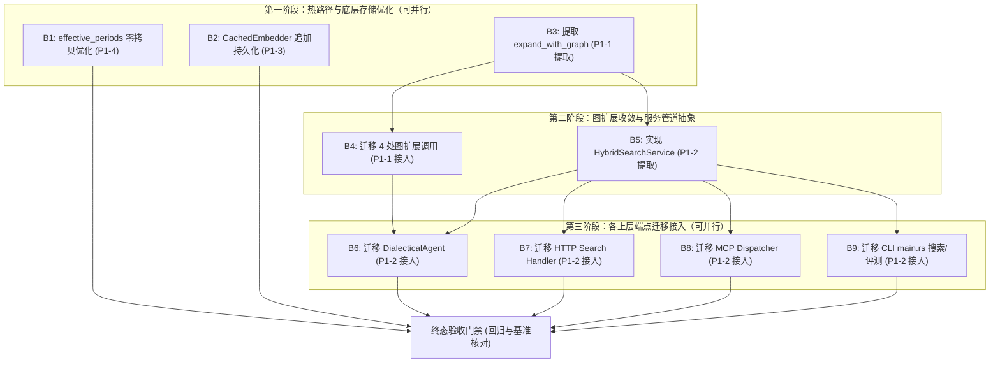

# 实施方案：B 阶段 — P1 技术债治理与架构归一

> **文档版本**: 1.0.0  
> **制定日期**: 2026-09-07  
> **规划与验收角色**: 架构规划与验收 Agent (Antigravity)  
> **执行角色**: dsh web (DeepSeek Harness web UI 执行代理)  
> **前置依赖**: C 阶段（语料治理：raw/ 排除、作者默认值移除、Domain 枚举、--domain 过滤）已完成并合流  
> **工程基准**: Rust 2024 edition, 单 crate (`mao_agent`, bin+lib), 165 基线测试 + C 阶段新增测试全绿  

---

## 1. 阶段目标与铁律约束

### 1.1 总目标
消除前序技术调研已定性的 **P1 级四项高危技术债**：
1. **P1-1 图扩展代码 4 处重复**：`src/agent/engine.rs`、`src/mcp/dispatcher.rs`、`src/server/handlers/search.rs`、`src/main.rs` 存在几乎一致的 2-hop 展开与解析循环，逻辑已出现微小分歧隐患。
2. **P1-2 混合检索管道组装 4 处重复**：上述 4 处独立组装 `Vector + BM25 -> RRF fuse -> Graph expand -> Rerank`，维护成本极高，调参无法全局收敛。
3. **P1-3 Embed cache 持久化 $O(N^2)$ 写入放大**：`src/vector/embedder/cache.rs` 在每次 miss 批次后全量覆写全量缓存文件，千级语料摄入产生几十万次无谓向量序列化。
4. **P1-4 `effective_periods()` 热路径频繁 clone**：`src/model.rs:310-318` 在每次 chunk 匹配的紧凑循环中反复执行 `Vec::clone`，产生严重堆分配开销。

### 1.2 铁律约束（Red Lines）
1. **测试全绿铁律**：重构全程及完成交付时，`cargo test --no-default-features` 必须 100% 通过（当前 165+ 个测试一个不挂）。
2. **外部接口零破坏**：
   - CLI 参数及输出格式 100% 保持不变；
   - REST API（`/api/search`, `/api/ask` 等）Request/Response DTO 100% 兼容；
   - MCP 工具调用协议及参数 100% 保持不变。
3. **C 阶段资产与特性保护**：
   - 严禁触碰 `corpus/` 与 `corpus_sample15/` 目录下任何语料文件；
   - 必须保持 C 阶段新增的 `Domain` 枚举（`src/corpus/domain.rs`）及 `--domain` 过滤链路（`tests/domain_filter_test.rs` 必须常绿）。
4. **极简主义与手术式修改**：
   - 不引入新的外部 crate（如无需额外第三方库）；
   - 严禁顺手修改无关模块或随意调整命名格式；
   - 消除代码重复，重构后全仓代码行数应呈现**净减少**。

---

## 2. 技术债深度定位与架构设计全景

### 2.1 P1-4: `effective_periods()` 零拷贝切片优化
- **现状定位**：
  - `src/model.rs:310-318`：
    ```rust
    pub fn effective_periods(&self) -> Option<Vec<HistoricalPeriod>> {
        if let Some(ref periods) = self.periods {
            if periods.is_empty() { return None; }
            return Some(periods.clone()); // 堆克隆
        }
        self.period.map(|p| vec![p]) // 堆分配
    }
    ```
  - `src/model.rs:338`：在 `matches(&self, chunk: &DocumentChunk)` 内被每个候选 chunk 调用。
  - `src/index/fulltext.rs:269-285`：在 BM25 过滤子句拼装时被调用。
  - `src/model.rs:606, 622`：单测断言。
- **架构解法**：
  将签名优化为借用切片：`pub fn effective_periods(&self) -> Option<&[HistoricalPeriod]>`。
  利用标准库函数 `std::slice::from_ref` 将 `Option<HistoricalPeriod>` 零拷贝包装为长度为 1 的切片借用；对 `Option<Vec<HistoricalPeriod>>` 直接调用 `as_slice()`。生命周期绑定至 `&self`，堆分配次数彻底降为 **0**。

### 2.2 P1-3: `CachedEmbedder` 持久化优化（消除 $O(N^2)$ 写入）
- **现状定位**：
  - `src/vector/embedder/cache.rs:130-142`：每当 `miss_idx` 非空，完成当前批次嵌入后，立即在持有互斥锁的情况下调用 `Self::persist(&self.path, ..., &cache)`。
  - `src/vector/embedder/cache.rs:50-66`：`persist` 每次均 `entries.clone()`、`bincode::serialize` 并调用 `atomic_replace` 写完整文件。
  - 摄入 $M$ 个批次（共 $N$ 条），第 $k$ 批写入 $k \times B$ 条，累计写入量为 $\frac{N(N/B + 1)}{2} = O(N^2)$。
- **架构解法**：
  改造持久化策略为**增量追加模式（Append-only WAL / Delta Entry）**或**带阈值的 Dirty 缓冲批量刷新 + Clean Flush on Drop**：
  - 推荐方案（增量记录）：文件头记录 Magic 与元数据；每次 miss 批次只将本次新生成的 `Vec<(String, Vec<f32>)>` 追加至文件尾部（调用 `std::fs::OpenOptions::new().append(true)`），单次写入量从 $O(\text{total})$ 降为 $O(B)$，全流程总写入量严格为 $O(N)$。
  - 启动加载时支持全量读取及容忍意外中断造成的尾部脏块；兼容现有 `EmbedCacheFile` 二进制格式。

### 2.3 P1-1: 图扩展逻辑统一提取 (`src/graph/expand.rs`)
- **现状定位**：4 处完全相同的异步图查询与 SourceRef 展开循环：
  1. `src/agent/engine.rs:103-130` (`expand_fused`)
  2. `src/mcp/dispatcher.rs:244-268`
  3. `src/server/handlers/search.rs:144-169`
  4. `src/main.rs:411-436` (`expand_hybrid_with_graph`)
- **架构解法**：
  在 `src/graph/expand.rs` 中新增统一异步函数：
  ```rust
  pub async fn expand_with_graph(
      graph: Option<&GraphStore>,
      store: &crate::vector::VectorStore,
      fused: Vec<HybridSearchResult>,
      query: &str,
      final_top_k: Option<usize>,
  ) -> Vec<HybridSearchResult>
  ```
  若 `graph` 为 `None`，直接原样返回 `fused`；若存在，执行 `graph.expand(query, 2)`，通过 `store.chunks_matching_ref(r).await` 解析实体对应文档分块，最后调用现有的 `union_graph_bonus`。

### 2.4 P1-2: 混合检索管道服务抽象 (`src/index/service.rs`)
- **现状定位**：4 处重复组装双路检索：
  1. `src/agent/engine.rs:154-190`
  2. `src/mcp/dispatcher.rs:220-273`
  3. `src/server/handlers/search.rs:125-177`
  4. `src/main.rs:610-655` (search) 及 `src/main.rs:1205-1218` (eval)
- **架构解法**：
  创建新模块 `src/index/service.rs`，定义 `HybridSearchService`：
  - 聚合组件引用/所有权：`VectorStore`、`FullTextIndex`、`HybridSearchCoordinator`、`GraphStore`、`Reranker`。
  - 暴露标准检索流水线：
    ```rust
    pub async fn search_hybrid(
        &self,
        query: &str,
        top_k: usize,
        filter: Option<&VectorFilter>,
        skip_rerank: bool,
    ) -> Result<Vec<HybridSearchResult>, VectorError>
    ```
  - 流水线内部按序完成：
    1. Vector Search（召回 `top_k * 2`，携带 `VectorFilter`）
    2. BM25 Search（召回 `top_k * 2`，携带 `VectorFilter`，失败静默降级为 Vector-only）
    3. RRF Fusion（通过 `HybridSearchCoordinator` 计算 RRF 倒数排名融合得分）
    4. Graph Expansion（调用 `expand_with_graph`，未开启 rerank 时保留 reserved 尾槽）
    5. Reranking（调用 `rerank_or_fallback` 重排序并截断至 `top_k`）
  - 同时提供轻量辅助方法：`search_vector` 与 `search_bm25`，满足 HTTP 模式分支与评测场景需求。

---

## 3. 原子任务分解清单（B1 ~ B9）

整个 B 阶段拆分为 **9 个高度内聚的原子任务**：

| 任务 ID | 任务名称 | 覆盖债项 | 修改文件 | 预计产出/改动量 | 风险等级 |
|---------|---------|---------|---------|----------------|---------|
| **B1** | `effective_periods` 零拷贝借用优化 | P1-4 | `src/model.rs`, `src/index/fulltext.rs` | 签名改为借用切片，去除了无谓堆分配 | 低 (Low) |
| **B2** | `CachedEmbedder` 追加式持久化 | P1-3 | `src/vector/embedder/cache.rs` | 消除每批全量重写，持久化复杂度 $O(N^2) \to O(N)$ | 中 (Medium) |
| **B3** | 提取公共 `expand_with_graph` 函数 | P1-1 | `src/graph/expand.rs`, `src/graph/mod.rs`, `src/lib.rs` | 新增公共图展开 helper 并暴露 | 低 (Low) |
| **B4** | 迁移 4 处调用方至 `expand_with_graph` | P1-1 | `src/agent/engine.rs`, `src/mcp/dispatcher.rs`, `src/server/handlers/search.rs`, `src/main.rs` | 删除 4 处手写的图展开代码，接入 B3 函数 | 中 (Medium) |
| **B5** | 实现 `HybridSearchService` 核心检索管道 | P1-2 | `src/index/service.rs` (新), `src/index/mod.rs`, `src/lib.rs` | 封装全链路检索管道服务，实现独立单测 | 低 (Low) |
| **B6** | 迁移 `DialecticalAgent` 接入统一检索服务 | P1-2 | `src/agent/engine.rs` | `ask` 链路精简，消除检索流程内联实现 | 中 (Medium) |
| **B7** | 迁移 HTTP 服务端 (`search.rs`) 接入统一检索服务 | P1-2 | `src/server/handlers/search.rs`, `src/server/state.rs` | HTTP 搜索接口委托给统一服务 | 中 (Medium) |
| **B8** | 迁移 MCP 分发器 (`dispatcher.rs`) 接入统一检索服务 | P1-2 | `src/mcp/dispatcher.rs` | MCP 检索工具委托给统一服务，保证 Domain 过滤 | 中 (Medium) |
| **B9** | 迁移 CLI (`main.rs`) 检索与评测链路 | P1-2 | `src/main.rs` | `search` 与 `eval-retrieval` 接入统一管道，清理孤立 helper | 中 (Medium) |

---

## 4. 执行顺序、依赖关系与拓扑图

### 4.1 任务依赖拓扑



### 4.2 串行与并行编排建议
- **批次 1 (并行可做)**：`B1`、`B2`、`B3` 彼此完全解耦，文件互不重叠，可并行发派或按 `B1 -> B2 -> B3` 顺序顺畅执行。
- **批次 2 (前置依赖)**：`B4` 依赖 `B3`；`B5` 依赖 `B3`（管道内部使用 `expand_with_graph`）。建议顺序：先完成 `B4` 验证图扩展功能完全等价，再完成 `B5` 建立检索服务。
- **批次 3 (并行迁移)**：`B6`、`B7`、`B8`、`B9` 依赖 `B5`。由于 4 个调用端位于完全独立的文件（`agent/engine.rs`, `server/handlers/search.rs`, `mcp/dispatcher.rs`, `main.rs`），可以在 `B5` 验收后并行发起，互不产生 git 冲突。

---

## 5. dsh web 适配的任务卡（B1 ~ B9 自包含卡片）

> **使用说明**：以下卡片为可以直接完整复制、独立投递给 dsh web 执行 Agent 的任务指令。每张卡片均自包含上下文、代码修改指引、边界约束及验收命令。

---

### 【任务卡 B1】`VectorFilter::effective_periods` 零拷贝借用优化 (P1-4)

```markdown
# 任务目标
优化 `VectorFilter::effective_periods()` 避免在向量过滤热路径（每个候选 chunk 匹配）上反复 clone Vec，实现零堆分配借用。

# 涉及文件与精确行级定位
1. `src/model.rs` (第 310-318 行，第 338 行，第 606、622 行测试)
2. `src/index/fulltext.rs` (第 268-285 行)

# 实施指导
1. 修改 `src/model.rs` 中的 `effective_periods` 签名与实现：
   ```rust
   /// Periods allowed by this filter.
   ///
   /// If both `period` and `periods` are set, **`periods` wins** (Scout Rule: one source of truth).
   pub fn effective_periods(&self) -> Option<&[HistoricalPeriod]> {
       if let Some(ref periods) = self.periods {
           if periods.is_empty() {
               return None;
           }
           return Some(periods.as_slice());
       }
       self.period.as_ref().map(std::slice::from_ref)
   }
   ```
2. 检查 `src/model.rs` 中的 `matches(&self, chunk: &DocumentChunk)` 方法，确认调用方式：`allowed` 现在是 `&[HistoricalPeriod]`，`!allowed.contains(&chunk.period)` 保持不变，无需修改。
3. 检查 `src/model.rs` 内的单元测试（约第 606、622 行）：
   将 `assert_eq!(f.effective_periods(), Some(vec![...]))` 调整为对借用切片的断言：
   `assert_eq!(f.effective_periods(), Some(&[HistoricalPeriod::MayFourth][..]));`
4. 检查 `src/index/fulltext.rs` (约第 269-285 行)：
   在 `if let Some(allowed) = f.effective_periods()` 中：
   - 当 `allowed.len() == 1` 时，`allowed[0].as_str()` 保持有效；
   - 当 `else` 分支时，将原有的 `allowed.into_iter()` 修改为 `allowed.iter()`（因为现在是切片借用）。

# 边界红线
- 严禁修改 `VectorFilter` 的字段结构及公有构造器；
- 严禁影响 C 阶段在 `src/model.rs` 中新增的 `domain` 过滤字段及逻辑；
- 严禁修改 `corpus/` 目录下任何文件。

# 验收标准 (DoD)
1. 运行单测验证：`cargo test --no-default-features --lib model` 全绿。
2. 运行全文检索单测验证：`cargo test --no-default-features --lib index::fulltext` 全绿。
3. 全库回归验证：`cargo test --no-default-features` 全绿。
```

---

### 【任务卡 B2】`CachedEmbedder` 追加式/增量持久化改造 (P1-3)

```markdown
# 任务目标
消除 `CachedEmbedder` 在每次 miss 批次持久化时重写全量缓存文件的 $O(N^2)$ 写入放大，改造为增量追加式或批量刷新模式，同时保持已有缓存文件的兼容性。

# 涉及文件与精确行级定位
1. `src/vector/embedder/cache.rs` (第 45-90 行，第 130-145 行，第 210-280 行测试)

# 实施指导
1. 观察现有结构：
   - 现有点对：`EmbedCacheFile { model: String, dimension: usize, entries: HashMap<String, Vec<f32>> }`
   - 每次写入全量覆盖：`atomic_replace(path, &encoded)`。
2. 优化方案（推荐：轻量追加与按需压实）：
   - 保留首次创建缓存文件时的标准头写入（包含 model 与 dimension）；
   - 新增单个增量项序列化定义（例如 `(String, Vec<f32>)`）；
   - 在 `embed_batch` 中当检测到 `miss_vecs` 时，不再对全部 `cache` 调用 `atomic_replace`，而是仅对本次新生成的键值对，使用 `std::fs::OpenOptions::new().create(true).append(true)` 流式写入新增 entries；
   - 或者采用 Dirty 门限策略：维护内存 `dirty_count`，仅当累计新增条目达到阈值（如 256 条）或显式调用持久化时才刷新整库；并且为 `CachedEmbedder` 实现 `Drop` 自动触发刷盘。
   - 注意：`test_embed_batch_cache_hit_skips_inner` 测试中会在同一进程内连续实例化两个 `CachedEmbedder`，因此如果采用追加模式，新的 `CachedEmbedder::new` 加载时不仅读初始 snapshot，还应追加读取后续记录；或者在写完 miss 时确保持久化已同步至磁盘，但只序列化新增部分。
3. 确保现有单元测试全部通过：
   - `test_embed_batch_cache_hit_skips_inner`
   - `test_cache_model_or_dim_mismatch_is_discarded`

# 边界红线
- 缓存失效逻辑不能变：若 model 或 dimension 不匹配，必须丢弃并重建；
- 严禁改变 `CachedEmbedder` 外部公有方法签名；
- 严禁破坏现有使用 `create_embedder_arc(CachedEmbedder::new(...))` 的调用点。

# 验收标准 (DoD)
1. 运行缓存单测：`cargo test --no-default-features --lib vector::embedder::cache` 全绿。
2. 运行向量库集成测试：`cargo test --no-default-features --test vector_store_test` 全绿。
3. 全库回归验证：`cargo test --no-default-features` 全绿。
```

---

### 【任务卡 B3】在 `src/graph/expand.rs` 中提取统一的 `expand_with_graph` 函数 (P1-1 提取)

```markdown
# 任务目标
将散落在 4 处的图候选扩展与 `source_refs` 展开逻辑抽象为一个公共的、健壮的异步函数 `expand_with_graph`。

# 涉及文件与精确行级定位
1. `src/graph/expand.rs` (末尾新增)
2. `src/graph/mod.rs` (第 5-7 行 re-export)
3. `src/lib.rs` (第 25-28 行 re-export)

# 实施指导
1. 在 `src/graph/expand.rs` 中新增函数：
   ```rust
   use crate::graph::store::GraphStore;
   use crate::vector::store::VectorStore;

   /// Unified asynchronous graph expansion for hybrid search results.
   ///
   /// If `graph` is `None`, returns `fused` untouched.
   /// Otherwise, expands query up to 2 hops, resolves matching chunks from `store`,
   /// and merges them using `union_graph_bonus` with the specified `final_top_k`.
   pub async fn expand_with_graph(
       graph: Option<&GraphStore>,
       store: &VectorStore,
       fused: Vec<HybridSearchResult>,
       query: &str,
       final_top_k: Option<usize>,
   ) -> Vec<HybridSearchResult> {
       let Some(graph) = graph else {
           return fused;
       };
       let hits = graph.expand(query, 2);
       let mut resolved = Vec::new();
       for hit in &hits {
           for r in &hit.source_refs {
               for chunk in store.chunks_matching_ref(r).await {
                   resolved.push(ResolvedGraphChunk {
                       chunk,
                       paths: hit.paths.clone(),
                   });
               }
           }
       }
       union_graph_bonus(fused, &resolved, final_top_k)
   }
   ```
2. 在 `src/graph/mod.rs` 中将其 re-export：
   `pub use expand::{expand_with_graph, ...};`
3. 在 `src/lib.rs` 的 `pub use graph::{...}` 中添加 `expand_with_graph`。
4. 在 `tests/graph_expand_test.rs` 或 `src/graph/expand.rs` 内编写一个单元测试验证：
   当 `graph` 为 `None` 时，输入输出完全一致；当 `graph` 为 `Some` 时，正常注入关联 chunk 并赋予 graph_paths。

# 边界红线
- 不要修改现有 `union_graph_bonus`、`resolve_graph_chunks` 的原有签名；
- 严禁引入多余的外部依赖。

# 验收标准 (DoD)
1. 运行图模块单测：`cargo test --no-default-features --test graph_expand_test` 全绿。
2. 编译检查：`cargo check --no-default-features` 零警告通过。
```

---

### 【任务卡 B4】迁移 4 处调用方至统一的 `expand_with_graph` (P1-1 接入)

```markdown
# 任务目标
消除 4 处重复手写的图扩展逻辑，全部替换为调用 Task B3 提取的 `expand_with_graph`。

# 涉及文件与精确行级定位
1. `src/agent/engine.rs` (第 103-130 行：删除私有方法 `expand_fused`，并在 `ask` 中调用)
2. `src/mcp/dispatcher.rs` (第 244-268 行：替换内联图展开逻辑)
3. `src/server/handlers/search.rs` (第 144-169 行：替换内联图展开逻辑)
4. `src/main.rs` (第 411-436 行：删除私有函数 `expand_hybrid_with_graph`，改用新函数)

# 实施指导
1. `src/agent/engine.rs`：
   - 删除 `async fn expand_fused(&self, ...)`；
   - 在 `ask` 方法原调用处（约第 170 行）替换为：
     ```rust
     let final_k = if self.reranker.is_some() { None } else { Some(top_k) };
     let fused = crate::graph::expand_with_graph(
         self.graph.as_deref(),
         &self.store,
         fused,
         question,
         final_k,
     ).await;
     ```
2. `src/mcp/dispatcher.rs`：
   - 在 `execute_query_dialectical_principles`（第 244-268 行）替换为：
     ```rust
     let final_k = if self.reranker.is_none() { Some(top_k) } else { None };
     let fused = crate::graph::expand_with_graph(
         self.graph.as_deref(),
         &self.store,
         fused,
         &args.query,
         final_k,
     ).await;
     ```
3. `src/server/handlers/search.rs`：
   - 在 `handle_search_inner`（第 144-169 行）替换为：
     ```rust
     let skip = req.no_rerank.unwrap_or(false);
     let final_k = if skip || state.reranker.is_none() { Some(top_k) } else { None };
     let fused = crate::graph::expand_with_graph(
         state.graph.as_deref(),
         &state.store,
         fused,
         &req.query,
         final_k,
     ).await;
     ```
4. `src/main.rs`：
   - 删除原有的私有函数 `async fn expand_hybrid_with_graph(...)`；
   - 在 `handle_search_hybrid`（约第 632-640 行）改为调用：
     ```rust
     let graph = try_load_graph(&args.graph_file);
     let final_k = if reranker.is_some() { None } else { Some(args.top_k) };
     let fused = mao_agent::expand_with_graph(
         graph.as_ref(),
         &store,
         fused,
         &args.query,
         final_k,
     ).await;
     ```

# 边界红线
- 4 处调用方对 `final_k` 的判定分支逻辑（rerank 开启与否）必须严格等价保持；
- 严禁改动任何非图扩展相关的检索代码。

# 验收标准 (DoD)
1. 运行代理测试：`cargo test --no-default-features --test hybrid_and_agent_test` 全绿。
2. 运行 API 测试：`cargo test --no-default-features --test api_test` 全绿。
3. 运行 MCP 测试：`cargo test --no-default-features --test mcp_test` 全绿。
4. 全库回归验证：`cargo test --no-default-features` 全绿。
```

---

### 【任务卡 B5】实现 `HybridSearchService` 核心检索管道 (P1-2 提取)

```markdown
# 任务目标
创建 `src/index/service.rs`，将混合检索全链路（向量搜索 + BM25 搜索 + RRF 融合 + 图扩展 + Rerank 降级）封装为单一职责的高内聚服务。

# 涉及文件与精确行级定位
1. `src/index/service.rs` (新建文件)
2. `src/index/mod.rs` (re-export `HybridSearchService`)
3. `src/lib.rs` (re-export `HybridSearchService`)

# 实施指导
1. 新建 `src/index/service.rs`，核心实现骨架：
   ```rust
   use std::sync::Arc;
   use crate::error::VectorError;
   use crate::graph::{expand_with_graph, GraphStore};
   use crate::index::fulltext::{FullTextIndex, FullTextSearchResult};
   use crate::index::hybrid::{HybridSearchCoordinator, HybridSearchResult};
   use crate::model::{VectorFilter, VectorSearchResult};
   use crate::rerank::{rerank_or_fallback, Reranker};
   use crate::vector::VectorStore;

   /// Unified orchestration service for Dense Vector, BM25, and Hybrid RRF Retrieval.
   #[derive(Clone)]
   pub struct HybridSearchService {
       pub store: Arc<VectorStore>,
       pub fulltext: Option<Arc<FullTextIndex>>,
       pub coordinator: Arc<HybridSearchCoordinator>,
       pub graph: Option<Arc<GraphStore>>,
       pub reranker: Option<Arc<dyn Reranker>>,
   }

   impl HybridSearchService {
       pub fn new(
           store: Arc<VectorStore>,
           fulltext: Option<Arc<FullTextIndex>>,
           coordinator: Arc<HybridSearchCoordinator>,
           graph: Option<Arc<GraphStore>>,
           reranker: Option<Arc<dyn Reranker>>,
       ) -> Self {
           Self {
               store,
               fulltext,
               coordinator,
               graph,
               reranker,
           }
       }

       /// Execute pure vector search.
       pub async fn search_vector(
           &self,
           query: &str,
           top_k: usize,
           filter: Option<&VectorFilter>,
       ) -> Result<Vec<VectorSearchResult>, VectorError> {
           self.store.search(query, top_k, filter).await
       }

       /// Execute pure BM25 search.
       pub fn search_bm25(
           &self,
           query: &str,
           top_k: usize,
           filter: Option<&VectorFilter>,
       ) -> Result<Vec<FullTextSearchResult>, VectorError> {
           if let Some(ref ft) = self.fulltext {
               ft.search(query, top_k, filter)
           } else {
               Ok(Vec::new())
           }
       }

       /// Execute full hybrid search pipeline:
       /// 1. Vector Search (top_k * 2)
       /// 2. BM25 Search (top_k * 2, graceful fallback to empty on error)
       /// 3. RRF Fusion (HybridSearchCoordinator)
       /// 4. Knowledge Graph Expansion (expand_with_graph)
       /// 5. Cross-Encoder Rerank (rerank_or_fallback, optional)
       pub async fn search_hybrid(
           &self,
           query: &str,
           top_k: usize,
           filter: Option<&VectorFilter>,
           skip_rerank: bool,
       ) -> Result<Vec<HybridSearchResult>, VectorError> {
           let fetch_k = top_k * 2;

           // 1. Dense vector search
           let vec_results = self.store.search(query, fetch_k, filter).await?;

           // 2. BM25 fulltext search
           let bm25_results = if let Some(ref ft) = self.fulltext {
               match ft.search(query, fetch_k, filter) {
                   Ok(hits) => hits,
                   Err(e) => {
                       tracing::warn!("BM25 search failed in hybrid service: {e}, falling back to vector-only");
                       Vec::new()
                   }
               }
           } else {
               Vec::new()
           };

           // 3. RRF Fusion
           let fused = self.coordinator.fuse(vec_results, bm25_results, fetch_k);

           // 4. Graph expansion
           let effective_reranker = if skip_rerank { None } else { self.reranker.as_deref() };
           let final_k = if effective_reranker.is_some() { None } else { Some(top_k) };
           let fused = expand_with_graph(
               self.graph.as_deref(),
               &self.store,
               fused,
               query,
               final_k,
           ).await;

           // 5. Rerank or fallback
           let results = rerank_or_fallback(fused, effective_reranker, query, top_k).await;
           Ok(results)
       }
   }
   ```
2. 在 `src/index/mod.rs` 中声明 `pub mod service;` 并 `pub use service::HybridSearchService;`。
3. 在 `src/lib.rs` 中 re-export `HybridSearchService`。
4. 在 `src/index/service.rs` 底部补充基本单元测试，验证双路检索及 fallback 路径。

# 边界红线
- 检索管道中的 `filter: Option<&VectorFilter>` 必须原生透传给 `store.search` 与 `ft.search`，确保 C 阶段的 `Domain` 过滤不受影响；
- 严禁修改 `HybridSearchCoordinator` 的数学融合公式与权重。

# 验收标准 (DoD)
1. 运行 index 模块测试：`cargo test --no-default-features --lib index` 全绿。
2. 运行 domain 过滤回归测试：`cargo test --no-default-features --test domain_filter_test` 全绿。
```

---

### 【任务卡 B6】迁移 `DialecticalAgent` (`src/agent/engine.rs`) 接入统一检索服务 (P1-2 接入 1/4)

```markdown
# 任务目标
将 `DialecticalAgent::ask` 中手写的混合检索管道组装替换为调用 `HybridSearchService::search_hybrid`。

# 涉及文件与精确行级定位
1. `src/agent/engine.rs` (第 35-65 行构造器，第 150-192 行 `ask` 函数)

# 实施指导
1. 在 `DialecticalAgent` 结构体中，可新增或组合 `search_service: HybridSearchService`，或者将原有的 `store, fulltext_index, hybrid_coordinator, reranker, graph` 封装为 `HybridSearchService` 实例。
2. 保持现有的公有构造函数签名完全兼容：
   - `pub fn new(...)`
   - `pub fn new_with_fallback_counter(...)`
   - `pub fn with_graph(mut self, graph: Arc<GraphStore>) -> Self`
   在构造内部组装 `HybridSearchService::new(...)`。
3. 简化 `ask` 方法中的检索段（约第 154-190 行）：
   ```rust
   // 1. Retrieve evidence chunks via unified HybridSearchService
   let results = self.search_service.search_hybrid(question, top_k, filter, false).await?;
   let rerank_applied = results.iter().any(|r| r.rerank_score.is_some());
   let rerank_scores = if rerank_applied {
       Some(results.iter().map(|r| r.rerank_score.unwrap_or(0.0)).collect())
   } else {
       None
   };
   let retrieved_chunks: Vec<DocumentChunk> = results.into_iter().map(|r| r.chunk).collect();
   ```
4. 如果检索结果为空，原有的未检索到文献分支保持原逻辑原句输出。

# 边界红线
- `DialecticalAgent::new(...)` 的公共参数列表严禁破坏（已有多个集成测试依赖）；
- `ask` 返回的 `AgentAnswer` 字段（`rerank_applied`, `rerank_scores`, `citation_reports`）必须语义完全一致。

# 验收标准 (DoD)
1. 运行代理测试：`cargo test --no-default-features --test hybrid_and_agent_test` 全绿。
2. 运行问答集成测试：`cargo test --no-default-features --test api_test` 全绿。
```

---

### 【任务卡 B7】迁移 HTTP 服务端 (`search.rs` & `state.rs`) 接入统一检索服务 (P1-2 接入 2/4)

```markdown
# 任务目标
在 `AppState` 中初始化 `HybridSearchService`，并将 HTTP 搜索路由处理函数 `handle_search_inner` 中的向量、BM25 和混合检索分支切换为统一服务。

# 涉及文件与精确行级定位
1. `src/server/state.rs` (第 15-35 行结构体，第 36-120 行构造与 builder)
2. `src/server/handlers/search.rs` (第 90-178 行)

# 实施指导
1. `src/server/state.rs`：
   - 在 `AppState` 中新增公共字段 `pub search_service: Arc<HybridSearchService>`；
   - 在 `AppState::with_ops` 中初始化 `search_service`；在 `with_graph` 时同步更新 `search_service.graph`（或使用 builder 重建）；
   - 保留原有的 `pub store, pub tantivy, pub hybrid, pub reranker, pub graph` 字段，以防其他未动路由受影响。
2. `src/server/handlers/search.rs`：
   - 优化 `handle_search_inner`：
     - `SearchMode::Vector` 分支：调用 `state.search_service.search_vector(&req.query, top_k, filter.as_ref()).await?`；
     - `SearchMode::Bm25` 分支：调用 `state.search_service.search_bm25(&req.query, top_k, filter.as_ref())?`；
     - `SearchMode::Hybrid` 分支：调用 `state.search_service.search_hybrid(&req.query, top_k, filter.as_ref(), req.no_rerank.unwrap_or(false)).await?`。
   - 保留后续 `SearchHit` DTO 的组装与返回逻辑。

# 边界红线
- REST API 的 JSON 响应结构（`SearchHit` 字段：`chunk_id`, `rrf_score`, `bm25_score`, `vector_score`, `rerank_score`, `graph_paths` 等）严禁任何变动；
- 严禁影响 HTTP 中间件与权限校验（ADR 0005）。

# 验收标准 (DoD)
1. 运行 API 自动化测试套件：`cargo test --no-default-features --test api_test` 全绿。
2. 全库回归验证：`cargo test --no-default-features` 全绿。
```

---

### 【任务卡 B8】迁移 MCP 分发器 (`src/mcp/dispatcher.rs`) 接入统一检索服务 (P1-2 接入 3/4)

```markdown
# 任务目标
将 `McpDispatcher::execute_query_dialectical_principles` 中的混合检索管道组装替换为统一服务。

# 涉及文件与精确行级定位
1. `src/mcp/dispatcher.rs` (第 40-70 行结构体与构造，第 220-275 行检索执行)

# 实施指导
1. 在 `McpDispatcher` 中持有 `search_service: Arc<HybridSearchService>`，在 `new(...)` 中构建；保留原签名与必要的字段。
2. 在 `execute_query_dialectical_principles` 中：
   - 保留第 200-218 行关于 `period`, `volume`, `category`, `domain` 的过滤参数构造；
   - 将第 220-273 行手写的 Vector + BM25 + Fuse + Graph + Rerank 替换为：
     ```rust
     let final_hits = self.search_service.search_hybrid(
         &args.query,
         top_k,
         filter.as_ref(),
         false, // MCP 默认不 skip_rerank
     ).await.map_err(|e| JsonRpcError::internal_error(format!("Hybrid search failed: {e}")))?;
     ```
   - 后续的 `synthesis_report` 及 `ToolCallResult` 封装保持原状。

# 边界红线
- 保证 C 阶段新增的 `Domain::parse` 与 `filter.with_domain(...)` 逻辑完好无损；
- MCP JSON-RPC 2.0 协议规范和工具响应格式严禁发生变动。

# 验收标准 (DoD)
1. 运行 MCP 协议测试套件：`cargo test --no-default-features --test mcp_test` 全绿。
2. 运行领域过滤测试：`cargo test --no-default-features --test domain_filter_test` 全绿。
```

---

### 【任务卡 B9】迁移 CLI (`src/main.rs`) 检索与评测流水线 (P1-2 接入 4/4)

```markdown
# 任务目标
将 `src/main.rs` 中的 CLI `search` 和 `eval-retrieval` 命令接入 `HybridSearchService`，清理重复的临时检索管道代码。

# 涉及文件与精确行级定位
1. `src/main.rs` (第 610-655 行 `handle_search_hybrid`，第 1205-1218 行 `handle_eval_retrieval`)

# 实施指导
1. 在 `handle_search_hybrid` 中：
   - 使用已加载的 `store, tantivy, graph, reranker` 构建局部 `HybridSearchService`；
   - 一行调用 `service.search_hybrid(&args.query, args.top_k, filter, args.no_rerank).await?`；
   - 保留耗时打印（`print_hybrid_results`）和终端美化输出。
2. 在 `handle_eval_retrieval` 中：
   - 在 `SearchMode::Hybrid` 分支下，同样通过 `HybridSearchService` 执行检索，获取 `chunk_id` 列表；
   - 保留 `--force-brute` 向量暴力扫描相关分支不受破坏。
3. 清理已无引用的单体内部死代码。

# 边界红线
- CLI 的所有标志（`--query`, `--top-k`, `--domain`, `--period`, `--volume`, `--no-rerank`, `--offline`）解析与行为严禁变化；
- 严禁修改任何终端输出的文本提示（防止破坏外部可能存在的脚本断言）。

# 验收标准 (DoD)
1. 编译无任何 unused 代码警告：`cargo check --no-default-features`。
2. 运行端到端摄入与检索测试：`cargo test --no-default-features --test e2e_ingest_test` 全绿。
3. 运行检索硬度评测门控：`cargo test --no-default-features --test retrieval_hard_eval_test` 全绿。
4. 全仓全量测试回归：`cargo test --no-default-features` 全绿。
```

---

## 6. 规划与验收角色核对清单（Checklist）

作为规划与验收方，执行代理（dsh web）交付每个任务后，我将严格按照以下维度**逐项审查，不通过直接打回**：

### 6.1 代码 Diff 审查（Read Diff）
- [ ] **审查 1（零连带修改）**：`git diff --stat` 显示修改仅限于任务卡声明的目标文件，绝对没有修改 `corpus/`、`corpus_sample15/` 或无关模块。
- [ ] **审查 2（代码净减少）**：B4 与 B9 完成后，全仓代码应净删除约 100~150 行重复组装逻辑，无任何复制粘贴的冗余。
- [ ] **审查 3（零堆分配实证）**：审查 `src/model.rs` 的 diff，确认 `effective_periods` 返回类型是 `Option<&[HistoricalPeriod]>`，且函数体内无任何 `.clone()` 或 `vec![...]`。
- [ ] **审查 4（无臆想配置）**：检查 `src/index/service.rs`，确认无未要求的复杂抽象模式或冗余工厂类。

### 6.2 编译与工具链实证（Run Command）
- [ ] **审查 5（全量测试铁律）**：执行 `cargo test --no-default-features`，所有 165+ 个测试必须全部 PASS，耗时无异常飙升。
- [ ] **审查 6（零 Clippy 告警）**：执行 `cargo clippy --no-default-features -- -D warnings`，无任何未使用的导入、死代码或生命周期警告。
- [ ] **审查 7（C 阶段领域隔离回归）**：执行 `cargo test --no-default-features --test domain_filter_test` 与 `cargo test --no-default-features --test domain_test`，确认历史与工程域隔离 100% 生效。

### 6.3 功能与行为对齐（Behavior Parity）
- [ ] **审查 8（图扩展保留槽一致性）**：当未配置 reranker（或 `skip_rerank=true`）时，`union_graph_bonus` 的 `final_top_k` 是否准确截断且保留尾部 `GRAPH_RESERVED=2` 个图特有候选。
- [ ] **审查 9（Rerank 降级一致性）**：当 reranker 调用超时或异常时，是否严格回退为 RRF 融合顺序，而不抛出 panic。
- [ ] **审查 10（Embed Cache 命中率一致性）**：运行 `cargo test --no-default-features --lib vector::embedder::cache`，确认命中缓存时真实计算调用次数为 0。

---

## 7. 回滚方案与故障自愈

在任一任务实施过程中，若出现编译器不可解报错、测试回归失败或性能劣化，立即按照以下指令单步或全量恢复：

### 7.1 单任务故障单步回滚
```bash
# 若当前正在执行的任务 BX 出现异常且无法自愈：
# 1. 放弃当前工作区中对修改文件的更改（以 B1 为例）
git restore src/model.rs src/index/fulltext.rs

# 2. 若新增了未跟踪文件（以 B5 为例）
git clean -f src/index/service.rs

# 3. 校验工作区是否已恢复纯净
git status
```

### 7.2 阶段检查点安全隔离策略
在进入每一批次前，建议执行代理创建临时校验点分支或 stash：
```bash
# 进入 B 阶段前打本地 tag 作为基线
git tag phase-b-baseline

# 若后续任何步骤发生不可逆错乱，一条命令无损撤回至基线
git reset --hard phase-b-baseline
```

---

## 8. 执行准备与交接确认

- **当前状态**：C 阶段语料治理已封板，工作区代码基座健康；
- **下一步行动**：请人类调度员将上述任务卡逐张粘贴至 dsh web，推荐第一轮派发 `【任务卡 B1】` 与 `【任务卡 B2】`；
- **交付闭环**：每一卡片执行完成后，由 Antigravity 运行对照审查清单，确认合格后再推进下一卡片。