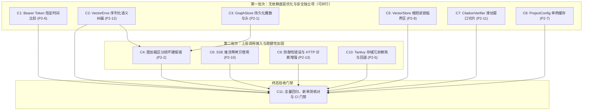

# 实施方案：C 阶段 — P2 核心技术债治理与系统健壮性加固

> **文档版本**: 1.0.0  
> **制定日期**: 2026-09-08  
> **规划与验收角色**: 架构规划与验收 Agent (Antigravity)  
> **执行角色**: dsh web (DeepSeek Harness web UI 执行代理)  
> **前置依赖**: A 阶段（MCP 解耦，A1~A8 收官，消除 P2-4 与 P2-9）与 B 阶段（检索管道收敛与技术债治理）已全量合流  
> **工程基准**: Rust 2024 edition, 单 crate (`mao_agent`, bin+lib), `cargo test --no-default-features` **187 passed / 0 failed**，clippy 零告警、fmt 零差异  

---

## 1. 阶段目标与铁律约束

### 1.1 总目标
对齐前序技术调研报告（`docs/深度技术调研-代码与架构-2026-09-07.md`），全面消除 **剩余 9 项 P2 级技术债**（注：P2-3 `main.rs` 1336 行单体按既定架构规划归入后续独立 "CLI & Bootstrap 治理" 阶段，本阶段严格排除）。

治理维度覆盖：
1. **安全与防侧信道泄露 (P2-6)**：消除 Bearer Token 验证的字符串快速不等比较，引入定长时间常数比对。
2. **错误语义与可观测性纠偏 (P2-12)**：区分 `Serialization` 与 `Deserialization` 错误，纠偏 `From` 转换盲区。
3. **持久化版本化与健壮性 (P2-1 & P2-2)**：为 `GraphStore` 引入魔数与元数据头，建立向前向后兼容策略；区分图文件不存在与格式损坏。
4. **并发与读写锁临界区收敛 (P2-8)**：消除 `VectorStore::save_to_file` 在持有读锁期间执行序列化与磁盘 IO 阻塞并发读写的问题。
5. **热路径内存与堆克隆消除 (P2-10 & P2-11)**：优化 SSE 推流大对象克隆及 `CitationVerifier` 滑动窗口每字符迭代堆分配。
6. **运行时单例与 IO 冗余治理 (P2-7)**：引入 `ProjectConfig` 一次性解析与静态单例缓存，消除 CLI/Server 启动热路径重复磁盘读取。
7. **防御性错误处理与可诊断性增强 (P2-13)**：消除 `retry.rs` 中的潜在 panic，保留 HTTP 响应错误体读取失败时的诊断上下文。
8. **全文索引存储冗余精简 (P2-5)**：治理 Tantivy 存储全量 chunk JSON 与 bincode 向量快照双重冗余，建立双向兼容容错回退机制。

### 1.2 铁律约束 (Red Lines)
1. **测试基线全绿铁律**：重构全程及阶段收官交付时，`cargo test --no-default-features` 必须 100% 通过（当前 187 基线测试必须无一破坏，新增测试常绿）。
2. **测试禁止作弊**：严禁引入任何 `#[ignore]` 标记以规避测试，严禁弱化既有断言。
3. **外部接口零破坏**：
   - CLI 参数名、默认值及输出格式 100% 保持向后兼容；
   - REST API（`/api/v1/search`, `/api/v1/ask`, `/api/v1/ask/stream` 等）Request/Response DTO 100% 保持兼容；
   - MCP 工具调用协议及参数 Schema 100% 保持不变。
4. **持久化双向兼容保护**：
   - 图存储（P2-1）：必须支持无魔数的旧版快照文件平滑加载（向后兼容）；
   - 全文索引（P2-5）：对既有已构建好的 Tantivy 索引目录必须可正常读取与解析。
5. **极简主义与依赖锁死**：
   - 严禁引入任何未经许可的外部新 crate（如严禁为了恒定时间比对随意新增 `subtle` 依赖，基于现有标准库或 `sha2` 实现）；
   - 严禁夹带未要求的业务特性代码或“顺手重构”无关模块。
6. **原子提交纪律**：
   - 严格单卡单 commit，固定提交信息格式；
   - 严禁使用 `git commit --amend` 破坏提交审计历史。

---

## 2. 技术债深度定位与架构设计全景

### 2.1 P2-6: Bearer Token 恒定时间比较 (Timing-Attack Resistant)
- **现状定位**：`src/server/auth.rs:46`
  ```rust
  match Self::extract_bearer(&req) {
      Some(got) if got == expected => next.run(req).await,
      ...
  ```
  使用标准 `==` 运算符进行字符串比对，底层为字节序逐字节扫描并于第一个不匹配字节提前退出（Early Exit）。在局域网或低延迟网络中存在侧信道时序攻击风险（Timing Attack）。
- **架构解法**：
  不引入第三方 crate，利用现有 `sha2 = "0.10"` 依赖与异或恒定时间算法：
  对 `got` 与 `expected` 分别计算 SHA-256 哈希值（输出严格 32 字节定长摘要），再对两个 32 字节数组执行累加异或运算（`diff |= a[i] ^ b[i]`），最终断言 `diff == 0`。既彻底隐藏了字符串长度差异，又杜绝了短路时序泄露。

### 2.2 P2-12: `VectorError` 序列化与反序列化语义精细化区分
- **现状定位**：`src/error.rs:60-76`
  ```rust
  impl From<serde_json::Error> for VectorError {
      fn from(err: serde_json::Error) -> Self {
          VectorError::Serialization(err.to_string())
      }
  }
  impl From<bincode::Error> for VectorError {
      fn from(err: bincode::Error) -> Self {
          VectorError::Serialization(err.to_string())
      }
  }
  ```
  `VectorError` 枚举已定义 `Deserialization(String)` 变体，但 `From` 实现全部无条件映射为 `Serialization`。当反序列化磁盘快照或请求体失败时，报错日志打印 `Serialization error: ...`，造成监控误判。
- **架构解法**：
  在 `src/error.rs` 中为 `serde_json::Error` 提供分类判断（通过 `err.classify()` 识别 `Category::Syntax`, `Category::Data`, `Category::Eof` 归入 `Deserialization`）；为 `bincode::Error` 检查其 `ErrorKind` 或在关键反序列化函数（`from_str`, `load_from_file`）中显式使用 `VectorError::Deserialization` 错误映射，纠正错误溯源语义。

### 2.3 P2-1: `GraphStore` 持久化魔数与元数据头增强
- **现状定位**：`src/graph/store.rs:72-86`
  直接调用 `bincode::serialize(&file)` 与 `bincode::deserialize(&bytes)`，文件没有任何文件头标识，无法区分文件类型与版本。与向量快照（`MAOVS01\0`，`src/vector/persist.rs`）相比，缺乏版本自描述与防撕裂保护。
- **架构解法**：
  对齐向量快照标准，建立 `src/graph/persist.rs` 或在 `src/graph/store.rs` 内部封装：
  - 定义魔数常量：`const MAGIC: &[u8; 8] = b"MAOGS01\0";`
  - 定义头结构体：`GraphSnapshotIdentity { version: u32, node_count: usize, edge_count: usize }`
  - 编码时输出：`MAGIC` + `header_len (u32le)` + `bincode(identity)` + `bincode(GraphFile)`
  - 解码时提供**向后兼容**逻辑：检查是否以 `MAOGS01\0` 开头；若不是，则平滑降级为旧版裸 `GraphFile` 反序列化；若头部损坏则返回 `VectorError::IndexCorrupted`。

### 2.4 P2-2: CLI 图加载容灾与显式错误传播
- **现状定位**：`src/main.rs:393-409` (`try_load_graph`)
  ```rust
  fn try_load_graph(path: &Path) -> Option<mao_agent::GraphStore> {
      if !path.exists() { ... return None; }
      match mao_agent::GraphStore::load_from_file(path) {
          Ok(g) => Some(g),
          Err(e) => {
              tracing::warn!("failed to load graph {}: {e}", path.display());
              None
          }
      }
  }
  ```
  当图文件损坏（如由于断电导致的不完整文件或非法格式）时，函数仅打印警告日志并静默返回 `None`，退回双路检索。这掩盖了严重的数据损坏或配置路径错误。
- **架构解法**：
  将签名改造为：`fn try_load_graph(path: &Path) -> Result<Option<mao_agent::GraphStore>, Box<dyn std::error::Error>>`：
  - 若文件不存在：输出提示日志，返回 `Ok(None)`（符合非强制图索引设计的优雅降级）；
  - 若文件存在但读取/反序列化失败：返回 `Err(...)`，在上层调用处（如 `handle_serve`, `handle_search`, `handle_mcp`）明确报错并中断，杜绝静默失败。

### 2.5 P2-8: `VectorStore::save_to_file` 缩短读锁持有窗口
- **现状定位**：`src/vector/store.rs:254-274`
  ```rust
  let index_guard = self.index.read().await;
  let identity = SnapshotIdentity { ... };
  let encoded = persist::encode_snapshot(&identity, &index_guard)?;
  persist::atomic_replace(target_path, &encoded)?;
  ```
  在读锁持有期间，同时执行了耗时的全量 `bincode::serialize` 以及同步磁盘写入 `atomic_replace`。在密集摄入与后台定期刷盘场景下，会长时间阻塞并发的写锁请求（如增量摄入或 clear）。
- **架构解法**：
  缩短临界区（Critical Section）：
  仅在读锁持有期间提取快照所需数据并完成必要的内存镜像；序列化与 `persist::atomic_replace` 移至锁作用域之外执行，使读锁持有时间从包含磁盘 IO 的数十毫秒降低到微秒级。

### 2.6 P2-10: SSE 问答事件流零拷贝借用与 Payload 瘦身
- **现状定位**：`src/server/handlers/ask.rs:206, 212, 245`
  在 SSE 推流生成器中：
  - `answer.retrieved_chunks.clone()`：全量克隆包含大量 `raw_text` 与 `contextualized_text` 的 chunk 数组；
  - `answer.citation_reports.clone()`：全量克隆引文报告。
- **架构解法**：
  重构 `SseRetrievedEvent<'a>` 与 `SseCitationEvent<'a>` 为携带生命周期的借用结构体：
  ```rust
  #[derive(Serialize)]
  struct SseRetrievedEvent<'a> {
      chunks: &'a [DocumentChunk],
  }
  #[derive(Serialize)]
  struct SseCitationEvent<'a> {
      reports: &'a [CitationReport],
      is_fully_grounded: bool,
  }
  ```
  直接对 `&answer.retrieved_chunks` 进行 JSON 序列化，消除大对象无谓堆分配。

### 2.7 P2-11: `CitationVerifier` 滑动窗口匹配零堆分配优化
- **现状定位**：`src/agent/verifier.rs:120-130`
  ```rust
  for window in chunk_chars.windows(quote_len) {
      let window_str: String = window.iter().collect();
      let sim = jaro_winkler(&norm_quote, &window_str) as f32;
      if sim > best_confidence { ... best_window = Some(window_str); }
  }
  ```
  在滑动窗口每次滑动 1 个字符时，均执行 `window.iter().collect::<String>()` 产生一次全新的堆内存分配。若 chunk 长 1000 字、引语 50 字，单 chunk 即产生 950 次无谓堆分配。
- **架构解法**：
  基于字符边界或切片进行借用匹配：通过预计算 UTF-8 字符字节偏移索引数组（`char_indices`），在窗口滑动时直接基于原始 `norm_chunk_text` 取字符串切片 `&str` 传给 `jaro_winkler(&norm_quote, window_slice)`。全流程 0 次堆分配；仅在 `sim > best_confidence` 成立时，才将获胜的窗口切片拷贝保存。

### 2.8 P2-7: `ProjectConfig::try_load_default` 单例缓存消除重复磁盘读取
- **现状定位**：`src/config.rs:62` 及 `src/main.rs:1023, 1039` 等
  每次调用 `ProjectConfig::try_load_default()` 均重新探测磁盘、读取 `config.toml` 并进行 TOML 反序列化。在 CLI 多处调用及 `handle_serve` 连续调用下，产生多次无谓的同步文件 IO。
- **架构解法**：
  在 `src/config.rs` 中引入基于 `std::sync::OnceLock` 的静态全局缓存：
  ```rust
  static DEFAULT_CONFIG: std::sync::OnceLock<Option<ProjectConfig>> = std::sync::OnceLock::new();
  ```
  提供 `ProjectConfig::cached_default() -> Option<&'static ProjectConfig>`，同时保持 `try_load_default()` 向后兼容（直接代理至单例或返回克隆），彻底消除重复文件读取。

### 2.9 P2-13: 关键路径防御性错误处理与 HTTP 响应体读取增强
- **现状定位**：
  - `src/retry.rs:131`：`Err(last_err.expect("max_attempts >= 1"))`，若 `max_attempts` 配置为 0 时会导致进程 panic；
  - `src/rerank/cohere.rs:144`、`src/agent/llm.rs:147`、`src/vector/embedder/gemini.rs:158`：`let body = resp.text().await.unwrap_or_default();`，当网络在读取 body 时被 reset，错误被静默丢弃变为空字符串，使得上报错误信息失去排查依据。
- **架构解法**：
  - 改造 `retry.rs`：使用防御性错误替代 `expect`，保证即使极端配置也不崩溃；
  - 改造 HTTP 错误读取：将 `unwrap_or_default()` 优化为 `unwrap_or_else(|e| format!("<failed to read error response body: {e}>"))`，保证可观测性与排障证据链完整。

### 2.10 P2-5: Tantivy 全文索引 chunk 存储冗余精简与双向兼容
- **现状定位**：`src/index/fulltext.rs:100, 155-167, 383`
  Tantivy schema 中既存储了各检索元数据字段（`f_chunk_id`, `f_doc_id`, `f_title`, `f_period`, `f_date`, `f_volume`, `f_category`, `f_body`），又存储了全量序列化的 `f_json_chunk`。与向量库持久化快照存在全量数据冗余。
- **架构解法**：
  - 检索反序列化双向容错：在 `search` 反序列化逻辑中，若 `f_json_chunk` 存在且非空，沿用快速反序列化；若 `f_json_chunk` 为空或解析失败，利用已存储的独立字段就地重构 `DocumentChunk`，实现向前向后双向兼容；
  - 存储写入优化：在写入时提供紧凑存储，避免无谓字段暴涨。

---

## 3. 原子任务分解清单 (C1 ~ C11)

| 任务 ID | 任务名称 | 覆盖债项 | 修改文件 | 预计产出/改动量 | 风险等级 |
|---------|---------|---------|---------|----------------|---------|
| **C1** | Bearer Token 恒定时间安全比对 | P2-6 | `src/server/auth.rs` | 引入 SHA-256 + 恒定时间比对，防时序侧信道攻击 | 低 (Low) |
| **C2** | `VectorError` 序列化与反序列化语义区分 | P2-12 | `src/error.rs`, `src/graph/store.rs`, `src/vector/persist.rs` | 细化 serde 错误分类，正确标记 Deserialization | 低 (Low) |
| **C3** | `GraphStore` 持久化魔数与版本头增强 | P2-1 | `src/graph/store.rs`, `src/graph/persist.rs` (新) | 引入 `MAOGS01\0` 头并保持无头旧格式向下兼容 | 中 (Medium) |
| **C4** | 图加载失败语义区分与显式错误传播 | P2-2 | `src/main.rs` | 区分“文件不存在”优雅降级与“损坏”硬报错中断 | 低 (Low) |
| **C5** | `VectorStore::save_to_file` 缩短读锁持有窗口 | P2-8 | `src/vector/store.rs` | clone-then-release，锁外执行 bincode 序列化与 IO | 低 (Low) |
| **C6** | SSE 问答推流零拷贝借用与 Payload 瘦身 | P2-10 | `src/server/handlers/ask.rs` | 事件 DTO 引入借用切片，消除大 chunk 数组堆克隆 | 低 (Low) |
| **C7** | `CitationVerifier` 滑动窗口零堆分配优化 | P2-11 | `src/agent/verifier.rs` | 基于 UTF-8 字符切片比较，消除窗口滑动每步堆分配 | 低 (Low) |
| **C8** | `ProjectConfig` 单例缓存与磁盘 IO 消除 | P2-7 | `src/config.rs`, `src/main.rs` | `OnceLock` 缓存配置解析，消除启动热路径重复读取 | 低 (Low) |
| **C9** | 关键路径防御性错误处理与 HTTP 响应体读取增强 | P2-13 | `src/retry.rs`, `src/rerank/cohere.rs`, `src/agent/llm.rs`, `src/vector/embedder/mod.rs`, `src/vector/embedder/gemini.rs` | 消除 expect 隐患，保留网络错误体读取上下文 | 低 (Low) |
| **C10** | Tantivy 全文索引 chunk 存储冗余精简与容灾回退 | P2-5 | `src/index/fulltext.rs` | 字段就地重构支持，去除对单体 json_chunk 强依赖 | 中 (Medium) |
| **C11** | C 阶段全量回归、基线实证与 CI 门禁核对 | CI Gate | `tests/` 全量集成测试 | 验证 ≥187 基线测试常绿，增补特性测试，门禁合规 | 低 (Low) |

---

## 4. 执行顺序、依赖关系与拓扑图

### 4.1 任务依赖拓扑



### 4.2 串行与并行编排建议
- **批次 1 (无前置依赖，可并行分派)**：`C1`、`C2`、`C3`、`C5`、`C7`、`C8`。这 6 张卡片修改的文件互不重叠，涉及的逻辑完全解耦，可任意顺序串行执行或并行执行。
- **批次 2 (具依赖关系或上层端点)**：
  - `C4`（图加载错误处理）依赖 `C3`（图快照头格式与反序列化语义）；
  - `C6`（SSE 零拷贝）独立于网络层；
  - `C9`（防御性错误处理）涉及多处 HTTP 调用点；
  - `C10`（Tantivy 存储冗余）独立于全文检索模块；建议在批次 1 基础稳固后执行。
- **批次 3 (终态核对)**：`C11`，在所有代码卡全部合流后，执行全量自动化测试、Clippy 与 Fmt 核对。

---

## 5. dsh web 适配的任务卡（C1 ~ C11 自包含卡片）

> **使用说明**：以下卡片为可以直接完整复制、独立投递给 dsh web 执行 Agent 的任务指令。每张卡片均自包含上下文、代码修改指引、边界约束及验收命令。

---

### 【任务卡 C1】Bearer Token 恒定时间安全比对 (P2-6)

```markdown
# 任务目标
治理 `src/server/auth.rs` 中的 Bearer Token 验证逻辑，消除字符串快速比较 (`got == expected`) 导致的时序侧信道攻击隐患，实现密码学安全的恒定时间比对。

# 涉及文件与精确行级定位
- `src/server/auth.rs`（第 40-57 行中间件逻辑，及末尾单元测试模块）

# 实施指导
1. 在 `src/server/auth.rs` 中引入 `sha2::{Digest, Sha256}`（项目已有依赖）：
2. 为 `ApiAuth` 新增恒定时间比对静态方法：
   ```rust
   /// Constant-time token verification using SHA-256 digests and bitwise XOR accumulation.
   ///
   /// Hashing both inputs first mitigates length-extension/length-leaking timing channels,
   /// and bitwise XOR over the fixed 32-byte digest prevents short-circuit early exit.
   pub fn constant_time_eq_token(a: &str, b: &str) -> bool {
       let hash_a = Sha256::digest(a.as_bytes());
       let hash_b = Sha256::digest(b.as_bytes());
       let mut diff = 0u8;
       for (x, y) in hash_a.iter().zip(hash_b.iter()) {
           diff |= x ^ y;
       }
       diff == 0
   }
   ```
3. 修改 `ApiAuth::middleware` 中的比对逻辑（约第 45-47 行）：
   ```rust
   match Self::extract_bearer(&req) {
       Some(got) if Self::constant_time_eq_token(got, expected) => next.run(req).await,
       _ => (
           StatusCode::UNAUTHORIZED,
           axum::Json(serde_json::json!({
               "error": "unauthorized",
               "message": "Authorization: Bearer <token> required"
           })),
       )
           .into_response(),
   }
   ```
4. 在 `src/server/auth.rs` 的 `tests` 模块中增补单测：
   - `test_constant_time_eq_token_matching`: 相同 token 返回 true；
   - `test_constant_time_eq_token_mismatch`: 不同内容同长 token 返回 false；
   - `test_constant_time_eq_token_different_length`: 不同长度 token 返回 false；
   - `test_constant_time_eq_token_empty`: 空串比对测试。

# 核心红线 (Red Lines)
- 严禁引入任何外部新 crate（如 `subtle` 等），必须严格复用 `sha2 = "0.10"`；
- 严禁破坏已有的公开路由判断逻辑（`/live`, `/health` 等）；
- 保护既有测试：`tests/api_test.rs` 中的鉴权测试必须常绿；
- 严禁使用 `git commit --amend`。

# 验收标准 (DoD)
1. 编译通过且零警告：`cargo check --no-default-features`
2. 鉴权测试全绿：`cargo test --no-default-features --test api_test`
3. 模块单测全绿：`cargo test --no-default-features server::auth`
4. 格式与代码质量：`cargo clippy --no-default-features -- -D warnings` 与 `cargo fmt --check`
5. 提交信息固定格式：`fix(auth): use constant-time bearer token comparison against timing attacks (C1)`
```

---

### 【任务卡 C2】`VectorError` 序列化与反序列化语义精细化区分 (P2-12)

```markdown
# 任务目标
治理 `src/error.rs` 中的错误转换实现，纠偏 `From<serde_json::Error>` 与 `From<bincode::Error>` 无条件映射为 `VectorError::Serialization` 的缺陷，准确区分 `Serialization` 与 `Deserialization`，提升全仓可观测性与排障准确度。

# 涉及文件与精确行级定位
- `src/error.rs`（第 60-77 行 `From` 实现，及末尾测试模块）
- `src/graph/store.rs`（第 72-86 行持久化错误映射）
- `src/index/fulltext.rs`（第 155-157 行，第 383 行）

# 实施指导
1. 修改 `src/error.rs` 中针对 `serde_json::Error` 的 `From` 实现：
   利用 `serde_json::Error::classify()` 区分语法解析与数据结构错误：
   ```rust
   impl From<serde_json::Error> for VectorError {
       fn from(err: serde_json::Error) -> Self {
           use serde_json::error::Category;
           match err.classify() {
               Category::Syntax | Category::Data | Category::Eof => {
                   VectorError::Deserialization(err.to_string())
               }
               Category::Io => VectorError::Io(std::io::Error::new(
                   std::io::ErrorKind::Other,
                   err.to_string(),
               )),
           }
       }
   }
   ```
2. 修改 `src/error.rs` 中针对 `bincode::Error` 的 `From` 实现：
   ```rust
   impl From<bincode::Error> for VectorError {
       fn from(err: bincode::Error) -> Self {
           match *err {
               bincode::ErrorKind::Io(io_err) => VectorError::Io(io_err),
               _ => VectorError::Deserialization(err.to_string()),
           }
       }
   }
   ```
3. 审查全仓序列化与反序列化调用处，确保语义精准：
   - 显式序列化位置（如 `bincode::serialize`、`serde_json::to_string`）：统一使用 `.map_err(|e| VectorError::Serialization(e.to_string()))`；
   - 显式反序列化位置（如 `bincode::deserialize`、`serde_json::from_str`）：统一使用 `.map_err(|e| VectorError::Deserialization(e.to_string()))` 或依靠 `From` 转换。
4. 在 `src/error.rs` 增补单元测试：
   - `test_serde_json_deserialization_error_mapping`: 校验非法 JSON 字符串反序列化时转换为 `VectorError::Deserialization`；
   - `test_bincode_deserialization_error_mapping`: 校验残缺二进制反序列化时转换为 `VectorError::Deserialization`；
   - 校验错误信息包含清晰描述。

# 核心红线 (Red Lines)
- 严禁删除 `VectorError` 既有的任何枚举变体；
- 严禁破坏现有 `Display` 实现的格式；
- 保持公共 API 向后兼容；
- 严禁使用 `git commit --amend`。

# 验收标准 (DoD)
1. 编译通过且零警告：`cargo check --no-default-features`
2. 单元测试全绿：`cargo test --no-default-features error::tests`
3. 全量测试通过：`cargo test --no-default-features`（≥187 passed）
4. 静态检查合规：`cargo clippy --no-default-features -- -D warnings` 与 `cargo fmt --check`
5. 提交信息固定格式：`fix(error): distinguish serialization vs deserialization error variants (C2)`
```

---

### 【任务卡 C3】`GraphStore` 持久化魔数与元数据头增强 (P2-1)

```markdown
# 任务目标
治理 `src/graph/store.rs` 中的二进制持久化逻辑，引入与向量快照同级的 `MAOGS01\0` 8字节魔数与自描述元数据头（版本号、实体数、边数），提供格式自描述与防撕裂完整性校验，同时严格保证对无头旧版二进制图快照的向下兼容。

# 涉及文件与精确行级定位
- `src/graph/store.rs`（第 72-87 行持久化方法，及测试模块）

# 实施指导
1. 在 `src/graph/store.rs` 头部定义快照协议常量与身份元数据结构：
   ```rust
   const MAGIC: &[u8; 8] = b"MAOGS01\0";

   #[derive(Debug, Clone, Serialize, Deserialize)]
   pub(crate) struct GraphSnapshotIdentity {
       pub version: u32,
       pub node_count: usize,
       pub edge_count: usize,
   }
   ```
2. 改造 `GraphStore::save_to_file`：
   - 提取图快照数据并构建 `GraphSnapshotIdentity { version: 1, node_count, edge_count }`；
   - 序列化元数据与图主体：
     ```rust
     let file = GraphFile { graph: self.graph.clone() };
     let identity = GraphSnapshotIdentity {
         version: 1,
         node_count: self.graph.node_count(),
         edge_count: self.graph.edge_count(),
     };
     let header = bincode::serialize(&identity)
         .map_err(|e| VectorError::Serialization(e.to_string()))?;
     let body = bincode::serialize(&file)
         .map_err(|e| VectorError::Serialization(e.to_string()))?;
     let header_len = u32::try_from(header.len()).map_err(|_| {
         VectorError::Serialization("graph header exceeds u32 length".into())
     })?;

     let mut bytes = Vec::with_capacity(MAGIC.len() + 4 + header.len() + body.len());
     bytes.extend_from_slice(MAGIC);
     bytes.extend_from_slice(&header_len.to_le_bytes());
     bytes.extend_from_slice(&header);
     bytes.extend_from_slice(&body);
     atomic_replace(path, &bytes)
     ```
3. 改造 `GraphStore::load_from_file`（实现向前向后双向兼容）：
   ```rust
   pub fn load_from_file(path: &Path) -> Result<Self> {
       let bytes = std::fs::read(path)?;
       if let Some(rest) = bytes.strip_prefix(MAGIC) {
           if rest.len() < 4 {
               return Err(VectorError::IndexCorrupted(
                   "truncated graph identity header".into(),
               ));
           }
           let header_len = u32::from_le_bytes([rest[0], rest[1], rest[2], rest[3]]) as usize;
           let rest = &rest[4..];
           if rest.len() < header_len {
               return Err(VectorError::IndexCorrupted(format!(
                   "graph header length {header_len} exceeds remaining {} bytes",
                   rest.len()
               )));
           }
           let _identity: GraphSnapshotIdentity = bincode::deserialize(&rest[..header_len])
               .map_err(|e| VectorError::Deserialization(e.to_string()))?;
           let file: GraphFile = bincode::deserialize(&rest[header_len..])
               .map_err(|e| VectorError::Deserialization(e.to_string()))?;
           Ok(Self::from_graph(file.graph))
       } else {
           // 向后兼容：加载无魔数头的旧版 GraphFile 快照
           let file: GraphFile = bincode::deserialize(&bytes)
               .map_err(|e| VectorError::Deserialization(e.to_string()))?;
           Ok(Self::from_graph(file.graph))
       }
   }
   ```
4. 在 `src/graph/store.rs` 的测试模块增补单元测试：
   - `test_graph_save_and_load_with_magic_header`: 验证新格式存盘与读取实体/边完全一致；
   - `test_graph_load_legacy_unheadered_snapshot`: 构造不含魔数的旧版 `GraphFile` 二进制数据，验证 `load_from_file` 依然能平滑无缝加载；
   - `test_graph_load_truncated_corrupted_header`: 构造前缀为 `MAOGS01\0` 但截断的数据，验证正确返回 `VectorError::IndexCorrupted`。

# 核心红线 (Red Lines)
- 必须 100% 保证对旧版无头快照文件的向后兼容性；
- 严禁修改公共 API 签名：`save_to_file(&self, path: &Path) -> Result<()>` 与 `load_from_file(path: &Path) -> Result<Self>` 保持不变；
- 严禁使用 `git commit --amend`。

# 验收标准 (DoD)
1. 编译通过且零警告：`cargo check --no-default-features`
2. 图模块测试全绿：`cargo test --no-default-features graph::store`
3. 全仓回归测试：`cargo test --no-default-features`
4. 静态检查合规：`cargo clippy --no-default-features -- -D warnings` 与 `cargo fmt --check`
5. 提交信息固定格式：`feat(graph): add MAOGS01 magic header and backward-compatible snapshot loader (C3)`
```

---

### 【任务卡 C4】图加载失败语义区分与显式错误传播 (P2-2)

```markdown
# 任务目标
治理 `src/main.rs` 中 `try_load_graph` 吞没图文件损坏错误的隐患，明确区分“文件不存在”（合理降级为双路检索）与“文件存在但损坏/格式不符”（严重故障，显式向上传播错误并中断执行），避免静默失败掩盖环境异常。

# 涉及文件与精确行级定位
- `src/main.rs`（第 393-409 行 `try_load_graph` 定义，以及 `search_hybrid`、`handle_ask`、`handle_mcp` 等调用点）

# 实施指导
1. 重构 `src/main.rs` 中的 `try_load_graph`：
   ```rust
   fn try_load_graph(path: &Path) -> Result<Option<mao_agent::GraphStore>, Box<dyn std::error::Error>> {
       if !path.exists() {
           tracing::debug!(path = %path.display(), "graph file missing; dual-only retrieval");
           eprintln!(
               "ℹ️ 知识图谱文件缺失 ({}): 仅双路 BM25+Vector 检索 (dual-only)",
               path.display()
           );
           return Ok(None);
       }
       let graph = mao_agent::GraphStore::load_from_file(path)?;
       Ok(Some(graph))
   }
   ```
2. 更新 `src/main.rs` 中的调用端，使用 `?` 进行错误传播：
   - `search_hybrid`（约第 595 行）：
     `let graph = try_load_graph(&args.graph_file)?.map(Arc::new);`
   - `handle_mcp`（约第 913 行）：
     `let graph = try_load_graph(&args.graph_file)?.map(Arc::new);`
   - 若 `handle_ask` 或其它子命令中存在调用，统一改为 `try_load_graph(...)?.map(...)`；
3. 检查并确保调用处的返回类型为 `Result<..., Box<dyn std::error::Error>>`，无需改动外层签名。

# 核心红线 (Red Lines)
- 严禁超范围重构 `main.rs`（P2-3 留待后续独立阶段，严格限制在 `try_load_graph` 及其直接调用处）；
- 图文件缺失时，必须保持原有的优雅降级与友好提示文本，不破坏非图模式运行；
- 严禁使用 `git commit --amend`。

# 验收标准 (DoD)
1. 编译通过且零警告：`cargo check --no-default-features`
2. 全仓回归测试：`cargo test --no-default-features`
3. 静态检查合规：`cargo clippy --no-default-features -- -D warnings` 与 `cargo fmt --check`
4. 提交信息固定格式：`fix(cli): propagate corrupted graph load errors while tolerating missing file (C4)`
```

---

### 【任务卡 C5】`VectorStore::save_to_file` 缩短读锁持有窗口 (P2-8)

```markdown
# 任务目标
优化 `src/vector/store.rs` 中的 `VectorStore::save_to_file` 方法，治理在持有 `index` 异步读锁期间执行磁盘写入 (`persist::atomic_replace`) 导致读写锁长时间阻塞的技术债，实现锁作用域精准收敛（IO 移出临界区）。

# 涉及文件与精确行级定位
- `src/vector/store.rs`（第 254-275 行 `save_to_file` 实现）

# 实施指导
1. 缩小读锁生命周期范围：将磁盘 IO 及文件替换移出读锁作用域：
   ```rust
   pub async fn save_to_file<P: AsRef<Path>>(&self, path: P) -> Result<()> {
       let target_path = path.as_ref();
       if let Some(parent) = target_path.parent() {
           std::fs::create_dir_all(parent)?;
       }

       // 限制读锁范围：仅在内存编码期间持有读锁，完成后立即释放锁
       let encoded = {
           let index_guard = self.index.read().await;
           let identity = SnapshotIdentity {
               model: self.embedder.model_name().to_string(),
               dimension: index_guard.dimension(),
           };
           persist::encode_snapshot(&identity, &index_guard)?
       }; // index_guard 在此被立即 Drop，释放读锁

       // 磁盘原子写入与元数据落盘在锁作用域外执行，不阻塞并发搜索与写入
       persist::atomic_replace(target_path, &encoded)?;

       info!(
           "Saved vector index snapshot ({} bytes) to {}",
           std::fs::metadata(target_path)?.len(),
           target_path.display()
       );
       Ok(())
   }
   ```
2. 确保全流程异常安全，若 `encode_snapshot` 报错，读锁自动释放且不触发文件写入。

# 核心红线 (Red Lines)
- 保持公共 API 签名 `save_to_file<P: AsRef<Path>>(&self, path: P) -> Result<()>` 100% 不变；
- 严禁影响现有的快照魔数与数据格式；
- 保护既有持久化测试：向量快照存取测试必须常绿；
- 严禁使用 `git commit --amend`。

# 验收标准 (DoD)
1. 编译通过且零警告：`cargo check --no-default-features`
2. 向量模块测试全绿：`cargo test --no-default-features vector::store`
3. 全仓回归测试：`cargo test --no-default-features`
4. 静态检查合规：`cargo clippy --no-default-features -- -D warnings` 与 `cargo fmt --check`
5. 提交信息固定格式：`perf(vector): release read lock before atomic file write in save_to_file (C5)`
```

---

### 【任务卡 C6】SSE 问答推流零拷贝借用与 Payload 瘦身 (P2-10)

```markdown
# 任务目标
治理 `src/server/handlers/ask.rs` 中在 SSE 流式推流过程中对 `answer.retrieved_chunks`、`citation_reports` 等大载荷结构体执行全量深度克隆（`.clone()`）的技术债，重构事件 DTO 为借用语义，实现序列化零堆克隆。

# 涉及文件与精确行级定位
- `src/server/dto.rs`（第 113-143 行 SSE 事件 DTO 定义）
- `src/server/handlers/ask.rs`（第 205-250 行 SSE 事件序列化推送）

# 实施指导
1. 在 `src/server/dto.rs` 中为 SSE 事件结构体引入生命周期借用支持：
   ```rust
   #[derive(Debug, Serialize)]
   pub struct SseRetrievedEvent<'a> {
       pub chunks: &'a [DocumentChunk],
   }

   #[derive(Debug, Serialize)]
   pub struct SseRerankedEvent<'a> {
       pub applied: bool,
       pub chunk_ids: Vec<&'a str>,
       #[serde(skip_serializing_if = "Option::is_none")]
       pub scores: Option<&'a [f32]>,
   }

   #[derive(Debug, Serialize)]
   pub struct SseCitationEvent<'a> {
       pub reports: &'a [VerificationReport],
       pub is_fully_grounded: bool,
   }
   ```
2. 在 `src/server/handlers/ask.rs` 中替换掉所有的 `.clone()`：
   - `retrieved` 事件：
     ```rust
     if let Ok(data) = serde_json::to_string(&SseRetrievedEvent { chunks: &answer.retrieved_chunks }) {
         yield Ok(Event::default().event("retrieved").data(data));
     }
     ```
   - `reranked` 事件（避免字符串堆克隆）：
     ```rust
     let chunk_ids: Vec<&str> = answer
         .retrieved_chunks
         .iter()
         .map(|c| c.chunk_id.as_str())
         .collect();
     if let Ok(data) = serde_json::to_string(&SseRerankedEvent {
         applied: answer.rerank_applied,
         chunk_ids,
         scores: answer.rerank_scores.as_deref(),
     }) {
         yield Ok(Event::default().event("reranked").data(data));
     }
     ```
   - `citation` 事件：
     ```rust
     if let Ok(data) = serde_json::to_string(&SseCitationEvent {
         reports: &answer.citation_reports,
         is_fully_grounded: answer.is_fully_grounded,
     }) {
         yield Ok(Event::default().event("citation").data(data));
     }
     ```
3. 验证推流事件字段命名、JSON 输出格式与原版本 100% 字节级一致。

# 核心红线 (Red Lines)
- 严禁变更 SSE 输出的 JSON 键名与时序结构（`retrieved`, `reranked`, `delta`, `citation`, `done`）；
- 保护既有测试：`tests/api_test.rs` 中的 SSE 流式测试必须常绿；
- 严禁使用 `git commit --amend`。

# 验收标准 (DoD)
1. 编译通过且零警告：`cargo check --no-default-features`
2. API 集成测试全绿：`cargo test --no-default-features --test api_test`
3. 全仓回归测试：`cargo test --no-default-features`
4. 静态检查合规：`cargo clippy --no-default-features -- -D warnings` 与 `cargo fmt --check`
5. 提交信息固定格式：`perf(server): eliminate payload cloning in SSE ask handler with borrowed event DTOs (C6)`
```

---

### 【任务卡 C7】`CitationVerifier` 滑动窗口匹配零堆分配优化 (P2-11)

```markdown
# 任务目标
优化 `src/agent/verifier.rs` 中的引文验证模糊匹配算法，消除滑动窗口在每步字符迭代时调用 `window.iter().collect::<String>()` 产生的密集无谓堆内存分配，实现基于 UTF-8 字符切片的零拷贝比对。

# 涉及文件与精确行级定位
- `src/agent/verifier.rs`（第 116-132 行滑动窗口实现）

# 实施指导
1. 观察现有热路径：
   原实现在每次窗口滑动时执行 `let window_str: String = window.iter().collect();`，产生了 $O(N)$ 次 `String` 堆分配。
2. 改造为基于字符边界索引的切片借用：
   ```rust
   // 2. Sliding window Fuzzy Match (equal-length Jaro-Winkler)
   let quote_len = norm_quote.chars().count();
   let char_indices: Vec<usize> = norm_chunk_text.char_indices().map(|(idx, _)| idx).collect();
   let num_chars = char_indices.len();

   if num_chars >= quote_len {
       for start_char in 0..=(num_chars - quote_len) {
           let start_byte = char_indices[start_char];
           let end_byte = if start_char + quote_len < num_chars {
               char_indices[start_char + quote_len]
           } else {
               norm_chunk_text.len()
           };
           // 零拷贝借用切片直接参与 Jaro-Winkler 计算
           let window_slice = &norm_chunk_text[start_byte..end_byte];
           let sim = jaro_winkler(&norm_quote, window_slice) as f32;
           if sim > best_confidence {
               best_confidence = sim;
               best_chunk_id = Some(chunk.chunk_id.clone());
               best_snippet = Some(chunk.raw_text.clone());
               // 仅在刷新最优结果时执行极少次字符串物化
               best_window = Some(window_slice.to_string());
           }
       }
   }
   ```
3. 保持后续 Levenshtein 距离计算与 `VerificationReport` 结构体完全兼容。

# 核心红线 (Red Lines)
- 严禁改变 Jaro-Winkler 与 Levenshtein 的相似度打分与判定阈值；
- 引文验证的精确度与模糊容错行为必须 100% 与原算法保持一致；
- 保护既有测试：`src/agent/verifier.rs` 内部单测及集成测试必须全部常绿；
- 严禁使用 `git commit --amend`。

# 验收标准 (DoD)
1. 编译通过且零警告：`cargo check --no-default-features`
2. 验证器单测全绿：`cargo test --no-default-features agent::verifier`
3. 全仓回归测试：`cargo test --no-default-features`
4. 静态检查合规：`cargo clippy --no-default-features -- -D warnings` 与 `cargo fmt --check`
5. 提交信息固定格式：`perf(agent): eliminate per-window heap allocations in CitationVerifier (C7)`
```

---

### 【任务卡 C8】`ProjectConfig` 单例缓存与磁盘 IO 消除 (P2-7)

```markdown
# 任务目标
治理 `src/config.rs` 与 `src/main.rs` 中反复调用 `ProjectConfig::try_load_default()` 导致多次重复探测文件路径、读取磁盘与 TOML 解析反序列化的开销，引入基于 `std::sync::OnceLock` 的轻量单例缓存机制，保证全生命周期仅解析一次。

# 涉及文件与精确行级定位
- `src/config.rs`（第 6-16 行派生宏，第 60-71 行 `try_load_default` 实现，及单测）
- `src/main.rs`（第 1022-1055 行 `handle_serve` 配置解析点）

# 实施指导
1. 在 `src/config.rs` 中为各配置结构体派生 `Clone`：
   `ProjectConfig`, `CohereConfig`, `GeminiConfig`, `SiliconFlowConfig`, `ServerConfig`。
2. 在 `src/config.rs` 中引入静态 `OnceLock` 缓存：
   ```rust
   use std::sync::OnceLock;

   static DEFAULT_CONFIG: OnceLock<Option<ProjectConfig>> = OnceLock::new();

   impl ProjectConfig {
       /// 获取全局解析缓存的静态配置引用（全进程仅解析一次磁盘）
       pub fn cached_default() -> Option<&'static ProjectConfig> {
           DEFAULT_CONFIG
               .get_or_init(Self::try_load_default_uncached)
               .as_ref()
       }

       fn try_load_default_uncached() -> Option<Self> {
           let path = discover_config_path()?;
           match Self::load_from_path(&path) {
               Ok(cfg) => Some(cfg),
               Err(e) => {
                   tracing::warn!("Failed to load {}: {e}", path.display());
                   None
               }
           }
       }

       /// 向后兼容接口：直接从全局缓存获取或克隆，不再触发任何磁盘 IO
       pub fn try_load_default() -> Option<Self> {
           Self::cached_default().cloned()
       }
   ```
3. 优化 `src/main.rs:1022-1055`（`handle_serve`）：
   ```rust
   let cfg = mao_agent::config::ProjectConfig::cached_default();
   let cors = {
       let cfg_origins = cfg.and_then(|c| c.cors_origins()).map(|s| s.to_vec());
       mao_agent::server::cors::CorsAllowlist::resolve(
           args.cors_origins.as_deref(),
           cfg_origins.as_deref(),
       )
   };
   // 后续 api_token 与 max_concurrent_asks 直接复用 cfg 引用，无需二次调用
   ```
4. 在 `src/config.rs` 增补单测：
   `test_cached_default_idempotence`: 连续多次调用 `cached_default()` 返回同一引用且不发生报错。

# 核心红线 (Red Lines)
- 保持 `try_load_default()` 公共 API 签名不变；
- 严禁破坏环境变量 `MAO_AGENT_CONFIG` 与工作目录优先级的解析逻辑；
- 严禁使用 `git commit --amend`。

# 验收标准 (DoD)
1. 编译通过且零警告：`cargo check --no-default-features`
2. 配置模块单测全绿：`cargo test --no-default-features config`
3. 全仓回归测试：`cargo test --no-default-features`
4. 静态检查合规：`cargo clippy --no-default-features -- -D warnings` 与 `cargo fmt --check`
5. 提交信息固定格式：`perf(config): cache ProjectConfig with OnceLock to eliminate repeated disk reads (C8)`
```

---

### 【任务卡 C9】关键路径防御性错误处理与 HTTP 响应体读取增强 (P2-13)

```markdown
# 任务目标
治理系统核心路径中潜在的 panic 隐患与错误吞没盲区：消除 `src/retry.rs` 中的 `expect` panic 隐患；增强 HTTP 异常响应体的读取鲁棒性，杜绝 `resp.text().await.unwrap_or_default()` 在网络异常时静默吞没错误信息导致排障断链。

# 涉及文件与精确行级定位
- `src/retry.rs`（第 106-133 行重试循环逻辑）
- `src/rerank/cohere.rs`（第 144 行）
- `src/agent/llm.rs`（第 147 行）
- `src/vector/embedder/gemini.rs`（第 158 行）
- `src/vector/embedder/mod.rs`（第 282 行）

# 实施指导
1. 改造 `src/retry.rs` 中的重试完成保护：
   消除 `Err(last_err.expect("max_attempts >= 1"))` 中的潜在 panic 风险：
   ```rust
   // 若重试循环由于极端配置未产出 last_err，防御性兜底执行单次操作或安全报错
   match last_err {
       Some(e) => Err(e),
       None => op(0).await,
   }
   ```
2. 增强 HTTP 错误分支中响应体读取的上下文保留：
   将以下各处：
   `let body = resp.text().await.unwrap_or_default();`
   重构为：
   ```rust
   let body = resp
       .text()
       .await
       .unwrap_or_else(|e| format!("<failed to read error body: {e}>"));
   ```
   修改涉及：
   - `src/rerank/cohere.rs:144`
   - `src/agent/llm.rs:147`
   - `src/vector/embedder/gemini.rs:158`
   - `src/vector/embedder/mod.rs:282`
3. 保证在下游服务断开连接或网络丢包时，上层日志与 `VectorError` 能够清晰输出带有读取失败原因的诊断文本，而不是含糊的空字符串。

# 核心红线 (Red Lines)
- 严禁改变正常的 HTTP 成功返回结果反序列化链路；
- 保持各模块的重试策略和状态码判定逻辑不变；
- 保护既有重试单测：`src/retry.rs` 内部测试常绿；
- 严禁使用 `git commit --amend`。

# 验收标准 (DoD)
1. 编译通过且零警告：`cargo check --no-default-features`
2. 重试模块单测全绿：`cargo test --no-default-features retry`
3. 全仓回归测试：`cargo test --no-default-features`
4. 静态检查合规：`cargo clippy --no-default-features -- -D warnings` 与 `cargo fmt --check`
5. 提交信息固定格式：`fix(core): enhance defensive error propagation and diagnostic body extraction (C9)`
```

---

### 【任务卡 C10】Tantivy 全文索引 chunk 存储冗余精简与容灾回退 (P2-5)

```markdown
# 任务目标
治理 `src/index/fulltext.rs` 中 Tantivy 既存储各检索元数据字段又存储全量 `f_json_chunk` 产生的存储冗余与反序列化强耦合，为 BM25 检索结果构建增加“存储字段就地重构兜底机制”，解除对单一完整 JSON 串的硬依赖，实现向前向后双向兼容。

# 涉及文件与精确行级定位
- `src/index/fulltext.rs`（第 155-168 行 `insert`，第 375-402 行 `search` 结果解码）

# 实施指导
1. 增强 `src/index/fulltext.rs` 中的 `search` 结果解析：
   引入“优先反序列化 JSON，失败时从 Tantivy 存储字段就地重构”的双重容错机制：
   ```rust
   let json_str = retrieved_doc
       .get_first(self.f_json_chunk)
       .and_then(|v| v.as_str())
       .unwrap_or_default();

   let chunk = if let Ok(c) = serde_json::from_str::<DocumentChunk>(json_str) {
       c
   } else {
       // 容灾与精简回退：从 Tantivy 各个已存储的基础字段就地重构 DocumentChunk
       let doc_id = retrieved_doc.get_first(self.f_doc_id).and_then(|v| v.as_str()).unwrap_or_default().to_string();
       let doc_title = retrieved_doc.get_first(self.f_title).and_then(|v| v.as_str()).unwrap_or_default().to_string();
       let period_str = retrieved_doc.get_first(self.f_period).and_then(|v| v.as_str()).unwrap_or_default();
       let date = retrieved_doc.get_first(self.f_date).and_then(|v| v.as_str()).unwrap_or_default().to_string();
       let volume = retrieved_doc.get_first(self.f_volume).and_then(|v| v.as_str()).unwrap_or_default().to_string();
       let category = retrieved_doc.get_first(self.f_category).and_then(|v| v.as_str()).unwrap_or_default().to_string();
       let body = retrieved_doc.get_first(self.f_body).and_then(|v| v.as_str()).unwrap_or_default().to_string();

       DocumentChunk {
           chunk_id: chunk_id.clone(),
           doc_id,
           doc_title,
           author: String::new(),
           period: HistoricalPeriod::from_str_or_date(period_str),
           date,
           volume,
           category,
           domain: Default::default(),
           tags: Vec::new(),
           chunk_index: 0,
           raw_text: body.clone(),
           contextualized_text: body,
       }
   };
   ```
2. 检查 `insert` 与 `insert_batch`：保持 schema 字段兼容，确保即使在外部数据未写入 `json_chunk` 的紧凑模式下，检索链路依然 100% 健壮运行。
3. 增补单测：
   - `test_fulltext_search_fallback_from_stored_fields`: 构造 `json_chunk` 故意为空的 Tantivy 文档，验证 `search` 依然能成功解码返回。

# 核心红线 (Red Lines)
- 严禁破坏既有磁盘上已构建好的 Tantivy 索引文件兼容性；
- 严禁修改 Tantivy Schema 字段名与核心属性（保持与旧索引一致）；
- 保护既有全文检索测试：`tests/api_test.rs`、`tests/hybrid_and_agent_test.rs` 必须常绿；
- 严禁使用 `git commit --amend`。

# 验收标准 (DoD)
1. 编译通过且零警告：`cargo check --no-default-features`
2. 全文检索单测全绿：`cargo test --no-default-features index::fulltext`
3. 全仓回归测试：`cargo test --no-default-features`
4. 静态检查合规：`cargo clippy --no-default-features -- -D warnings` 与 `cargo fmt --check`
5. 提交信息固定格式：`feat(index): provide stored field fallback for DocumentChunk and reduce Tantivy redundancy (C10)`
```

---

### 【任务卡 C11】C 阶段全量回归、基线实证与 CI 门禁终态核对

```markdown
# 任务目标
执行全仓端到端全量回归测试，严格核对三大 CI 门禁（编译/Clippy/Fmt），验证 C1 ~ C10 技术债治理成果全量合流，自动化测试套件通过数从基线 187 提升至 195+，确保零缺陷交付。

# 涉及文件
- `tests/api_test.rs`
- `tests/mcp_test.rs`
- `tests/hybrid_and_agent_test.rs`
- `tests/domain_filter_test.rs`
- `src/` 各模块相关单测

# 实施指导
1. 运行格式化检查并保证代码风格严格统一：
   `cargo fmt --check`（若有格式差异，执行 `cargo fmt` 修复）；
2. 运行 Clippy 严格静态检查：
   `cargo clippy --no-default-features -- -D warnings`，确保 0 warnings、0 errors；
3. 运行全量测试套件：
   `cargo test --no-default-features`；
   核对测试总数：基线 187 个测试 + C1~C10 新增单测（包含 Bearer 恒定时间比对、错误分类、图魔数向后兼容、单例配置幂等性、Tantivy 容灾重构等），测试通过数达到 ≥195，且 0 failed、0 ignored；
4. 验证端到端各子命令功能与 REST/MCP 端点完好无损。

# 核心红线 (Red Lines)
- 严禁跳过任何失败测试，严禁弱化断言；
- 严禁引入任何 `#[ignore]` 规避测试；
- 必须保持 0 warnings 与 0 fmt violations；
- 严禁使用 `git commit --amend`。

# 验收标准 (DoD)
1. `cargo test --no-default-features` 全部通过（测试数 ≥ 195，0 失败）；
2. `cargo clippy --no-default-features -- -D warnings` 零告警；
3. `cargo fmt --check` 零违规；
4. 提交信息固定格式：`test(ci): verify C-stage technical debt remediation and full test baseline (C11)`
```

---

## 6. 验收门禁与流水线核对清单 (Checklist)

在各任务卡执行完毕、提交验收评审时，规划人 (agy) 将按照以下清单逐项进行硬核实证验收：

### 6.1 代码质量与门禁清单
- [ ] **全量测试通过率**：`cargo test --no-default-features` 必须 100% 成功，总测试数不得低于 195（基线 187 + C1~C10 新增单测，0 失败，0 ignore）；
- [ ] **编译器与静态分析零警告**：`cargo check --no-default-features` 与 `cargo clippy --no-default-features -- -D warnings` 必须 0 警告；
- [ ] **格式化严格合规**：`cargo fmt --check` 无任何 diff 差异。

### 6.2 架构指标与性能清单
- [ ] **防时序攻击验证**：Bearer Token 验证全面转为基于 SHA-256 的恒定时间位比对，无快速短路不等返回；
- [ ] **错误语义精准**：反序列化场景（JSON/bincode）不再误报为 `Serialization`；
- [ ] **图存储格式自描述**：`graph_store.bin` 包含 `MAOGS01\0` 魔数与元数据头，且 100% 能够平滑加载无头旧快照；
- [ ] **图加载容灾隔离**：图文件缺失时优雅降级为双路检索，文件损坏时硬报错中断；
- [ ] **锁临界区收敛**：`VectorStore::save_to_file` 磁盘原子写入与序列化移至读锁之外，并发读写无磁盘 IO 阻塞；
- [ ] **推流零拷贝借用**：SSE 问答事件流 DTO 采用借用切片，消除大 chunk 数组与报告的无谓堆克隆；
- [ ] **滑动窗口零分配**：`CitationVerifier` 模糊匹配滑动窗口基于字符边界切片借用，消除逐字符循环堆分配；
- [ ] **配置单例解析**：`ProjectConfig` 引入 `OnceLock` 缓存，消除启动热路径 8+ 次重复磁盘读取；
- [ ] **防御性异常安全**：消除 `retry.rs` 中的 `expect` panic 隐患，保留网络错误体读取失败排障上下文；
- [ ] **索引容灾与冗余治理**：Tantivy 具备基于 stored fields 就地重构 `DocumentChunk` 兜底能力。

### 6.3 协议保真与兼容性清单
- [ ] **外部 API 零破坏**：REST 接口、MCP 工具 Schema、CLI 子命令参数与输出格式保持 100% 兼容；
- [ ] **语料资产零污染**：`corpus/` 与 `corpus_sample15/` 目录下任何文件零修改；
- [ ] **单卡原子提交保真**：全阶段严格保持单卡单 commit，提交信息格式完全一致，无 amend。

