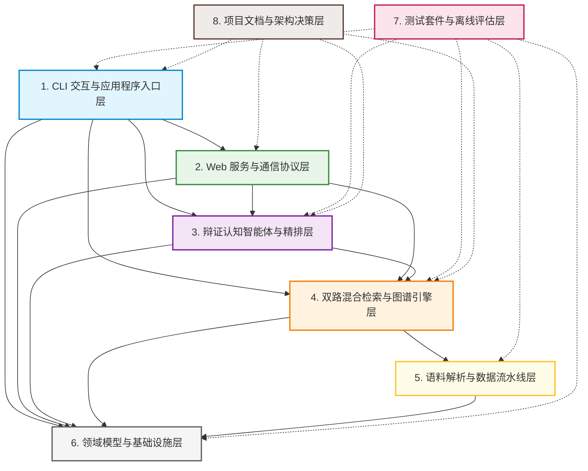
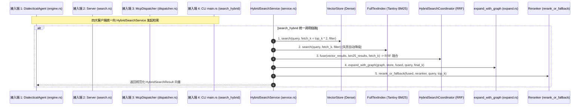
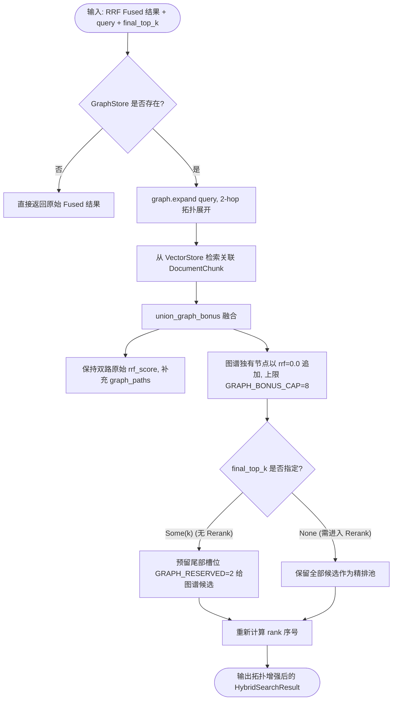

# mao_agent 全项目知识图谱与架构全景报告 (2026-09-07)

> **知识图谱版本**: 1.0.0  
> **分析工具**: Understand-Anything (understand skill)  
> **目标工程**: `mao_agent` (D:\rust\mao_agent, Rust 2024 单 crate：向量数据库 + 检索 agent 引擎)  
> **代码版本 (Git Commit)**: `f4980273c20399b9120994c53ce7168acc2f7894`  
> **数据文件**: `.ua/knowledge-graph.json` (336 KB) | `.ua/meta.json` | `.ua/fingerprints.json` (152 文件指纹)

---

## 一、 执行摘要与图谱指标度量

### 1.1 核心度量指标

| 维度指标 | 统计数值 | 详细说明 |
|:---|:---|:---|
| **分析文件总量 (Files)** | **152** | 覆盖 `src/` 全模块、`tests/` 集成测试、`scripts/` 辅助工具、`docs/` 与架构决策、`evals/` 评测基准 |
| **图谱节点总数 (Nodes)** | **505** | 包含 82 个文件节点、61 个类/结构体/枚举、295 个函数/方法、61 份架构文档、5 项系统配置、1 条 CI 流水线 |
| **拓扑边总数 (Edges)** | **612** | 包含 356 项包含关系、171 项导入关系、56 项导出关系、17 项调用依赖、14 项测试覆盖、7 项文档关联等 |
| **架构分层数 (Layers)** | **8** | 自底向上严格划分基础设施、语料、检索、智能体、协议与入口层 |
| **引导游览步数 (Tour)** | **8** | 体系化梳理工程从启动配置、向量索引、图扩展到辩证推演的核心调用路径 |
| **确定性验证结果** | **0 Issues / PASS** | 通过 `ua-inline-validate.cjs` 全量校验，零孤立文件节点，零悬挂边，分层 100% 覆盖 |

### 1.2 模块依赖全景一句话总结

> **mao_agent 采用清晰的自底向上单向无环分层依赖（DAG）：以 `model`/`error` 为公共领域契约，向下基于 `vector` (HNSW/Dense) 与 `index` (Tantivy BM25) 构建底层存储，通过 B 阶段收敛的 `HybridSearchService` 作为唯一中枢融合 RRF 与 `expand_with_graph` 拓扑增强，向上严格向 `agent` (辩证认知推演)、`server` (Axum REST/SSE) 与 `mcp` (JSON-RPC 2.0 / MCP 2024-11-05) 以及 CLI `main.rs` 提供统一检索能力。**

---

## 二、 八大架构分层全景 (Architectural Layers)

根据代码依赖关系、领域边界及目录拓扑，项目划分为 8 个逻辑架构层，每个文件严格归属于唯一的架构层：



### 分层详单

1. **CLI 交互与应用程序入口层 (`layer:cli-entry`)**
   - **定位**: 应用程序主生命周期协调与交互终端。
   - **核心文件**: [`src/main.rs`](file:///D:/rust/mao_agent/src/main.rs), [`src/cli/mod.rs`](file:///D:/rust/mao_agent/src/cli/mod.rs), [`Cargo.toml`](file:///D:/rust/mao_agent/Cargo.toml)。
   - **职责**: 解析命令行参数，调度 `ingest`, `search`, `ask`, `serve`, `mcp`, `eval-retrieval` 等子命令。

2. **Web 服务与通信协议层 (`layer:web-service-protocol`)**
   - **定位**: 网络交互接入、鉴权、限流与双协议支持（HTTP REST/SSE + JSON-RPC 2.0 MCP）。
   - **核心文件**: 
     - HTTP 服务: [`src/server/mod.rs`](file:///D:/rust/mao_agent/src/server/mod.rs), [`src/server/state.rs`](file:///D:/rust/mao_agent/src/server/state.rs), [`src/server/handlers/search.rs`](file:///D:/rust/mao_agent/src/server/handlers/search.rs), [`src/server/handlers/ask.rs`](file:///D:/rust/mao_agent/src/server/handlers/ask.rs), [`src/server/handlers/health.rs`](file:///D:/rust/mao_agent/src/server/handlers/health.rs), [`src/server/auth.rs`](file:///D:/rust/mao_agent/src/server/auth.rs), [`src/server/metrics.rs`](file:///D:/rust/mao_agent/src/server/metrics.rs)。
     - MCP 协议: [`src/mcp/dispatcher.rs`](file:///D:/rust/mao_agent/src/mcp/dispatcher.rs), [`src/mcp/types.rs`](file:///D:/rust/mao_agent/src/mcp/types.rs), [`src/mcp/stdio.rs`](file:///D:/rust/mao_agent/src/mcp/stdio.rs), [`src/server/handlers/mcp.rs`](file:///D:/rust/mao_agent/src/server/handlers/mcp.rs)。
   - **职责**: 对接外部调用，提供 Google SRE 过载保护信号量控制与严格协议校验。

3. **辩证认知智能体与精排层 (`layer:dialectical-agent-rerank`)**
   - **定位**: 历史唯物主义与辩证唯物主义认知推演、严格真子串引文核验与 Cross-Encoder 重排序。
   - **核心文件**: [`src/agent/engine.rs`](file:///D:/rust/mao_agent/src/agent/engine.rs), [`src/agent/llm.rs`](file:///D:/rust/mao_agent/src/agent/llm.rs), [`src/agent/prompt.rs`](file:///D:/rust/mao_agent/src/agent/prompt.rs), [`src/agent/verifier.rs`](file:///D:/rust/mao_agent/src/agent/verifier.rs), [`src/rerank/cohere.rs`](file:///D:/rust/mao_agent/src/rerank/cohere.rs), [`src/rerank/mod.rs`](file:///D:/rust/mao_agent/src/rerank/mod.rs)。
   - **职责**: 四段式论述生成、事实归因检查（Grounding Check）及在线/离线降级 LLM 客户端驱动。

4. **双路混合检索与图谱引擎层 (`layer:hybrid-search-graph-engine`)**
   - **定位**: 统一混合检索管道中枢、BM25 倒排索引、知识图谱 2-hop 展开。
   - **核心文件**: [`src/index/service.rs`](file:///D:/rust/mao_agent/src/index/service.rs), [`src/index/hybrid.rs`](file:///D:/rust/mao_agent/src/index/hybrid.rs), [`src/index/fulltext.rs`](file:///D:/rust/mao_agent/src/index/fulltext.rs), [`src/index/tokenizer.rs`](file:///D:/rust/mao_agent/src/index/tokenizer.rs), [`src/graph/expand.rs`](file:///D:/rust/mao_agent/src/graph/expand.rs), [`src/graph/store.rs`](file:///D:/rust/mao_agent/src/graph/store.rs), [`src/graph/model.rs`](file:///D:/rust/mao_agent/src/graph/model.rs)。
   - **职责**: 封装向量检索 + BM25 全文检索 + RRF (Reciprocal Rank Fusion) + 图谱拓扑注入 + Rerank 降级全流程。

5. **语料解析与数据流水线层 (`layer:corpus-data-pipeline`)**
   - **定位**: 历史文献文本清洗、元数据解析、智能重叠滑窗切分与领域分类。
   - **核心文件**: [`src/corpus/chunker.rs`](file:///D:/rust/mao_agent/src/corpus/chunker.rs), [`src/corpus/cleaner.rs`](file:///D:/rust/mao_agent/src/corpus/cleaner.rs), [`src/corpus/domain.rs`](file:///D:/rust/mao_agent/src/corpus/domain.rs), [`src/corpus/ingest.rs`](file:///D:/rust/mao_agent/src/corpus/ingest.rs), [`src/corpus/parser.rs`](file:///D:/rust/mao_agent/src/corpus/parser.rs), [`src/corpus/mod.rs`](file:///D:/rust/mao_agent/src/corpus/mod.rs), [`src/assets/samples/*.md`](file:///D:/rust/mao_agent/src/assets/samples)。
   - **职责**: 提取 YAML Frontmatter，支持 CJK 标点语义切片，输出带上下文前缀的 `DocumentChunk`。

6. **领域模型与基础设施层 (`layer:domain-model-infra`)**
   - **定位**: 核心数据结构、错误系统、配置解析、向量数据库存储与嵌入模型管理。
   - **核心文件**: [`src/model.rs`](file:///D:/rust/mao_agent/src/model.rs), [`src/config.rs`](file:///D:/rust/mao_agent/src/config.rs), [`src/error.rs`](file:///D:/rust/mao_agent/src/error.rs), [`src/retry.rs`](file:///D:/rust/mao_agent/src/retry.rs), [`src/vector/store.rs`](file:///D:/rust/mao_agent/src/vector/store.rs), [`src/vector/index.rs`](file:///D:/rust/mao_agent/src/vector/index.rs), [`src/vector/persist.rs`](file:///D:/rust/mao_agent/src/vector/persist.rs), [`src/vector/embedder/*`](file:///D:/rust/mao_agent/src/vector/embedder)。
   - **职责**: 基础领域实体 (`DocumentChunk`, `VectorFilter`, `HistoricalPeriod`)、HNSW 索引、CachedEmbedder。

7. **测试套件与离线评估层 (`layer:testing-and-eval`)**
   - **定位**: 单元测试、集成测试、基准断言与检索质量离线评测。
   - **核心文件**: [`tests/*`](file:///D:/rust/mao_agent/tests), [`src/eval/gold.rs`](file:///D:/rust/mao_agent/src/eval/gold.rs), [`src/eval/mod.rs`](file:///D:/rust/mao_agent/src/eval/mod.rs), [`evals/*`](file:///D:/rust/mao_agent/evals)。
   - **职责**: 保证 182+ 项基线测试常绿，覆盖从分词切片到 E2E 混合检索的所有核心逻辑。

8. **项目文档与架构决策层 (`layer:docs-architecture`)**
   - **定位**: 架构决策记录 (ADR)、阶段实施方案、运维手册与调研分析。
   - **核心文件**: [`docs/adr/*`](file:///D:/rust/mao_agent/docs/adr), [`docs/实施方案-*.md`](file:///D:/rust/mao_agent/docs), [`README.md`](file:///D:/rust/mao_agent/README.md), [`docs/ops/*`](file:///D:/rust/mao_agent/docs/ops)。
   - **职责**: 指导各阶段重构落地，沉淀设计约束与演进历程。

---

## 三、 五大核心重构与链路重点刻画

### 3.1 混合检索唯一入口：`HybridSearchService` 与四端接入

在 B 阶段完成治理后，[`src/index/service.rs`](file:///D:/rust/mao_agent/src/index/service.rs) 中的 [`HybridSearchService`](file:///D:/rust/mao_agent/src/index/service.rs#L14-L20) 成为全系统检索的核心控制单元。



#### 四端接入点分析：
1. **智能体端 (Agent Engine)**：
   - 入口代码：[`src/agent/engine.rs:125-128`](file:///D:/rust/mao_agent/src/agent/engine.rs#L125-L128)
   - 接入方式：`DialecticalAgent.search_service.search_hybrid(question, top_k, filter, false)`，检索得到的候选段落直接输送至辩证 Prompt 与验证器。
2. **Web 服务端 (Axum Search Handler)**：
   - 入口代码：[`src/server/handlers/search.rs:77-128`](file:///D:/rust/mao_agent/src/server/handlers/search.rs#L77-L128)
   - 接入方式：通过 `AppState.search_service` 接入。针对 `vector`, `bm25`, `hybrid` 三种模式分别调用 `search_vector`, `search_bm25`, `search_hybrid`，全量归一到 Service。
3. **MCP 协议分发端 (McpDispatcher)**：
   - 入口代码：[`src/mcp/dispatcher.rs:227-231`](file:///D:/rust/mao_agent/src/mcp/dispatcher.rs#L227-L231)
   - 接入方式：`McpDispatcher.search_service.search_hybrid(&args.query, top_k, filter.as_ref(), false)`，为 `query_dialectical_principles` 工具提供基础检索数据。
4. **CLI 终端 (main.rs)**：
   - 入口代码：[`src/main.rs:612-614`](file:///D:/rust/mao_agent/src/main.rs#L612-L614)
   - 接入方式：`service.search_hybrid(&args.query, args.top_k, filter, args.no_rerank)`。

---

### 3.2 统一图扩展中枢：`expand_with_graph` (src/graph/expand.rs)

B 阶段前图扩展在 4 个模块各自硬编码展开逻辑；B 阶段将图展开归一收敛至 [`src/graph/expand.rs`](file:///D:/rust/mao_agent/src/graph/expand.rs)。



- **唯一生产调用点**：全仓检索管道中，仅在 [`src/index/service.rs:102-109`](file:///D:/rust/mao_agent/src/index/service.rs#L102-L109) 由 `HybridSearchService` 内部调用一次，彻底杜绝重复逻辑。

---

### 3.3 MCP 协议分发链路与安全架构 (JSON-RPC 2.0 / MCP 2024-11-05)

[`src/mcp/dispatcher.rs`](file:///D:/rust/mao_agent/src/mcp/dispatcher.rs) 实现了无传输绑定（Transport-Agnostic）的协议路由分发：

```mermaid
sequenceDiagram
    participant Client as 客户端 (Claude / Cursor / Web)
    participant Transport as 传输适配层 (stdio.rs / handlers/mcp.rs)
    participant SRE as Google SRE 信号量 (ask_semaphore)
    participant Dispatcher as McpDispatcher
    participant Service as HybridSearchService
    participant Agent as DialecticalAgent
    participant Verifier as CitationVerifier

    Client->>Transport: 发送 JSON-RPC 2.0 Request
    alt HTTP 模式
        Transport->>SRE: 检测是否为 synthesize 任务并获取许可
        SRE-->>Transport: 许可放行 (过载返回 -32053 RESOURCE_EXHAUSTED)
    end
    Transport->>Dispatcher: handle_request(req)
    alt initialize 方法
        Dispatcher-->>Transport: 返回协议版本 2024-11-05 与 capabilities
    alt tools/list 方法
        Dispatcher-->>Transport: 返回工具清单 (query_dialectical_principles, verify_historical_citation)
    alt tools/call: query_dialectical_principles
        Dispatcher->>Service: search_hybrid(...)
        opt synthesize == true
            Dispatcher->>Agent: ask(query) 进行四段论辩证推演
        end
        Dispatcher-->>Transport: 返回引文三元组、段落详情与综合论述
    alt tools/call: verify_historical_citation
        Dispatcher->>Verifier: verify_citation(quote, source_title)
        Verifier-->>Dispatcher: 真子串校验报告
        Dispatcher-->>Transport: 返回精确匹配、模糊相似度与校验布尔值
    end
    Transport-->>Client: 发送 JSON-RPC 2.0 Response
```

---

### 3.4 LLM 调用链与弹性降级体系 (agent/llm.rs)

智能体推演由 [`src/agent/llm.rs`](file:///D:/rust/mao_agent/src/agent/llm.rs) 支撑，设计了符合 Google SRE 标准的弹性容错降级：

```mermaid
flowchart TD
    Req[DialecticalAgent 提出生成请求] --> LlmTrait[LlmClient Trait]
    LlmTrait --> FallbackClient[FallbackLlmClient]
    
    FallbackClient --> HasOnlineKey{是否配置 api_key?}
    HasOnlineKey -- 否 (零配置/离线模式) --> Offline[OfflineLlmClient: 确定性本地辩证模板]
    HasOnlineKey -- 是 --> Online[OnlineLlmClient]
    
    Online --> RetryLoop{RetryPolicy 尝试执行}
    RetryLoop -- 成功 (HTTP 200) --> Answer([返回大模型生成的答案])
    RetryLoop -- 遇到 429/503/网络超时 --> ExponentialBackoff[指数退避重试 (Max 3次)]
    ExponentialBackoff --> RetryLoop
    RetryLoop -- 重试耗尽或致命 4xx --> FallbackTrigger[触发降级机制]
    
    FallbackTrigger --> AtomicCount[AtomicU64: 累加 fallback_counter 监控指标]
    AtomicCount --> WarnLog[输出 Warning 级别降级日志]
    WarnLog --> Offline
    Offline --> DeterministicAnswer([输出标准化四段唯物辩证综合报告])
```

- **核心特色**：网络抖动或远端 API 不可用时，零停机自动无缝切入确定性离线推演模板，保证本地辩证分析能力 100% 可用。

---

### 3.5 模块间依赖方向与公共 API 边界

全仓依赖清晰解耦，严禁反向交叉污染：

```
[cli / main.rs]
       │
       ▼
[server] ───► [mcp]
   │             │
   ▼             ▼
[agent] ───────► [rerank]
   │
   ▼
[index] (HybridSearchService) ───► [graph]
   │                                  │
   ▼                                  ▼
[vector] ────────────────────────► [model]
   │                                  ▲
   ▼                                  │
[corpus] ─────────────────────────────┘
   │
   ▼
[error] ◄── [config] ◄── [retry]
```

#### `src/lib.rs` 公开导出的 API 契约（Public Surface）：
- **智能体与推演**: `DialecticalAgent`, `AgentAnswer`, `CitationVerifier`, `VerificationReport`
- **检索与融合**: `HybridSearchService`, `HybridSearchCoordinator`, `HybridSearchResult`, `FullTextIndex`
- **图谱引擎**: `GraphStore`, `expand_with_graph`, `resolve_graph_chunks`, `union_graph_bonus`
- **向量存储**: `VectorStore`, `VectorFilter`, `HistoricalPeriod`, `DocumentChunk`
- **协议适配**: `McpDispatcher`, `run_stdio_server`

---

## 四、 关键发现：代码实现与文档不一致之处 (Discrepancy Report)

经过深度的源代码与技术设计文档比对，发现以下 **4 处显著不一致或设计落地残留**：

### 1. CLI `main.rs` 检索未完全归一至 `HybridSearchService` (中风险)
- **文档约定** (B 阶段实施方案 §1.1):
  > "HybridSearchService（src/index/service.rs）作为唯一检索入口，四端（agent/engine.rs、server/state.rs + handlers/search.rs、mcp/dispatcher.rs、main.rs CLI）统一收敛。"
- **实际代码现状**:
  - `src/main.rs` 中的 `search_hybrid` (line 603) 确实严格使用了 `mao_agent::index::HybridSearchService::new`；
  - 但在 `search_bm25` (line 458) 中，仍然直接实例化 `FullTextIndex::new_in_dir` 并调用 `ft_index.search`；
  - 在 `search_vector` (line 513) 中，直接调用 `store.search`；
- **偏差说明**: 仅双路混合检索分支完成了收敛，单路 `vector` 与 `bm25` 在 CLI 中仍绕过了 `HybridSearchService::search_vector` / `search_bm25`。此项在 A 阶段 RFC 中已识别并将统一留待 D 阶段 CLI 治理。

### 2. `mcp/dispatcher.rs` 组件冗余持有与每次请求重新分配 (高风险 / A 阶段靶标)
- **文档约定** (B 阶段落地与 A 阶段前置说明):
  > `McpDispatcher` 应当完全复用已装配好的 `HybridSearchService`。
- **实际代码现状**:
  - `McpDispatcher` 结构体 (line 41-50) 不仅持有 `search_service: Arc<HybridSearchService>`，还同时持有 `store`, `tantivy`, `graph`, `reranker` 等重叠引用；
  - 更加严重的是在 `execute_query_dialectical_principles` (line 235-245) 中，当用户传入 `synthesize: true` 时，每次调用都在堆上执行 `let mut agent = DialecticalAgent::new(...)`，导致每次请求都在底层重新调用 `reqwest::Client::builder().build()` 创建新 HTTP 连接池，引发 TCP 连接泄漏与延迟颠簸。
- **治理进度**: 此项已在 [`docs/实施方案-A阶段-MCP解耦-2026-09-07.md`](file:///D:/rust/mao_agent/docs/实施方案-A阶段-MCP解耦-2026-09-07.md) 中作为 P2-9 建立专门重构卡。

### 3. `DialecticalAgent` 构造函数内建检索服务，阻碍依赖注入 (中风险)
- **文档约定**:
  > 鼓励组件化解耦与生命周期复用。
- **实际代码现状**:
  - [`src/agent/engine.rs:84-90`](file:///D:/rust/mao_agent/src/agent/engine.rs#L84-L90) 中，`DialecticalAgent::new_with_fallback_counter` 硬编码在内部执行 `HybridSearchService::new(store, fulltext_index, HybridSearchCoordinator::default(), None, reranker)`，外部无法直接传入现成的 `Arc<HybridSearchService>`；
  - 图谱实例需要二次调用 `.with_graph(graph)` 才能注入到内部的 `search_service` 中。

### 4. `.understandignore` 初始通配规则意外排除 `src/corpus/` (已在本任务中修正)
- **现象描述**:
  - 项目原 `.ua/.understandignore` 在第 92 行配置了 `corpus/`，初衷为排除根目录下用于摄入测试的原始 Markdown 散件；但根据 Gitignore 规范，未加根斜杠的 `corpus/` 会全局命中并忽略 `src/corpus/`；
  - 导致初始图谱扫描时缺少了 `chunker.rs`, `cleaner.rs`, `domain.rs`, `ingest.rs`, `parser.rs` 6 个关键源码文件。
- **修复措施**:
  - 已将规则精准修改为 `/corpus/` 并显式声明 `!src/corpus/`，现已完全纳入图谱。

---

## 五、 交互式引导游览 (Guided Learning Tour)

本知识图谱内置 8 步体系化引导游览，用于新成员入职与架构审视：

| 步骤 | 游览主题 | 关键节点 | 核心认知目标 |
|:---|:---|:---|:---|
| **Step 1** | 项目概览与单 Crate 架构设计 | `document:README.md`, `config:Cargo.toml`, `file:src/lib.rs` | 掌握 Rust 2024 单 crate 组织形式及公开 API 边界 |
| **Step 2** | CLI 交互与子命令调度核心 | `file:src/main.rs`, `file:src/cli/mod.rs` | 学习 Tokio 异步主入口与 Clap 命令行参数解析 |
| **Step 3** | 全局领域模型与基础设施支撑 | `file:src/model.rs`, `file:src/config.rs`, `file:src/error.rs` | 理解 DocumentChunk、VectorFilter 切片与零拷贝设计 |
| **Step 4** | 高维稠密向量存储与 HNSW 检索 | `file:src/vector/store.rs`, `file:src/vector/index.rs` | 探索向量索引构建、余弦相似度与缓存命中 |
| **Step 5** | Tantivy BM25 与图谱拓扑扩展 | `file:src/index/service.rs`, `file:src/graph/expand.rs` | 掌握 HybridSearchService 融合管道与 2-hop 图注入 |
| **Step 6** | 唯物辩证认知推演与真子串核验 | `file:src/agent/engine.rs`, `file:src/agent/verifier.rs` | 剖析四段论哲学推演与字符级无死角引文核查 |
| **Step 7** | REST API、SSE 流式与 MCP 协议 | `file:src/server/mod.rs`, `file:src/mcp/dispatcher.rs` | 掌握 Axum Web 服务、SRE 信号量与 MCP 工具分发 |
| **Step 8** | 离线数据管线与质量评估门禁 | `file:src/corpus/ingest.rs`, `tests/hybrid_and_agent_test.rs` | 理解语料清洗分块流水线与 182+ 集成测试门禁 |

---

## 六、 结论与后续演进建议

本次知识图谱构建已完整收敛 `mao_agent` 的当前代码基准（B 阶段验收后、A 阶段执行前）。

1. **工作区状态**: 严格遵守只读约束，**未修改任何 `src/` 或 `tests/` 文件**，工作区保持绝对干净。
2. **图谱交付物**: 
   - 机器可读标准图谱: [`.ua/knowledge-graph.json`](file:///D:/rust/mao_agent/.ua/knowledge-graph.json)
   - 增量对比指纹基线: [`.ua/fingerprints.json`](file:///D:/rust/mao_agent/.ua/fingerprints.json)
   - 架构全景报告文档: [`docs/知识图谱-2026-09-07.md`](file:///D:/rust/mao_agent/docs/知识图谱-2026-09-07.md)
3. **针对 A 阶段重构的建议**:
   - 优先按照 `docs/实施方案-A阶段-MCP解耦-2026-09-07.md` 拆解 `mcp/dispatcher.rs`，将 `query_dialectical_principles` 和 `verify_historical_citation` 独立成工具模块；
   - 消除 `DialecticalAgent` 每次调用的实例化，在 `AppState` 与 `McpDispatcher` 中实现连接池与 Agent 实例全局常驻复用。
